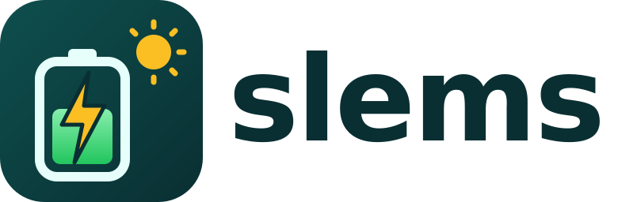
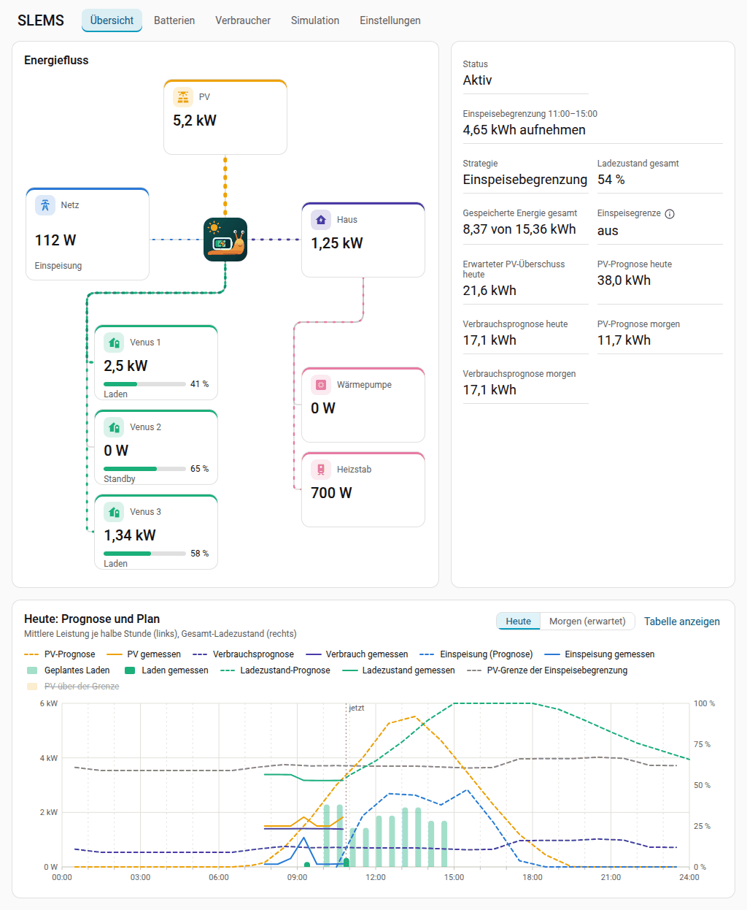
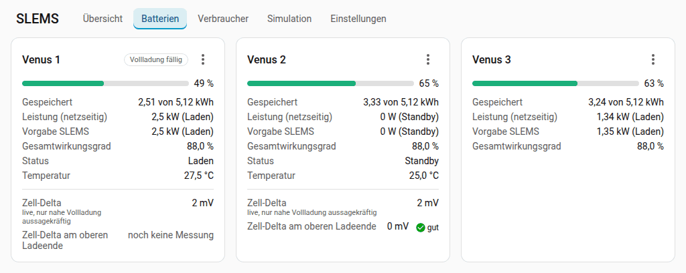
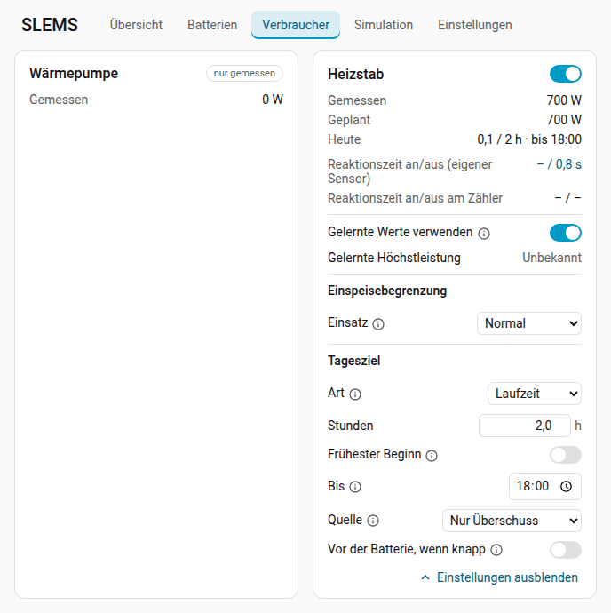
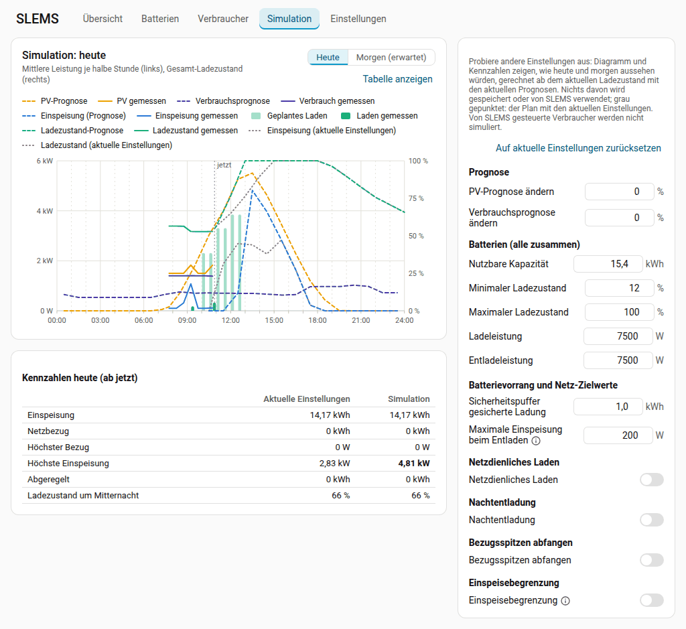
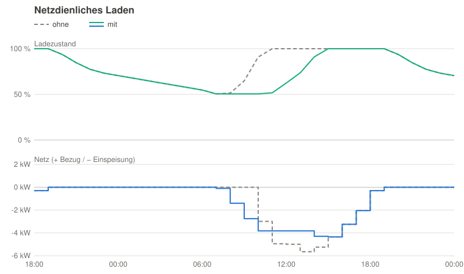
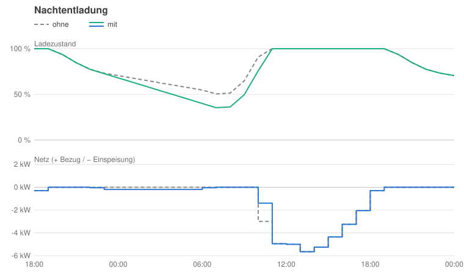
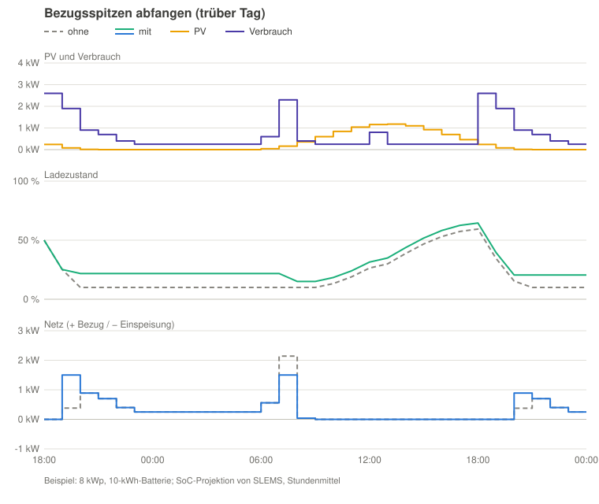
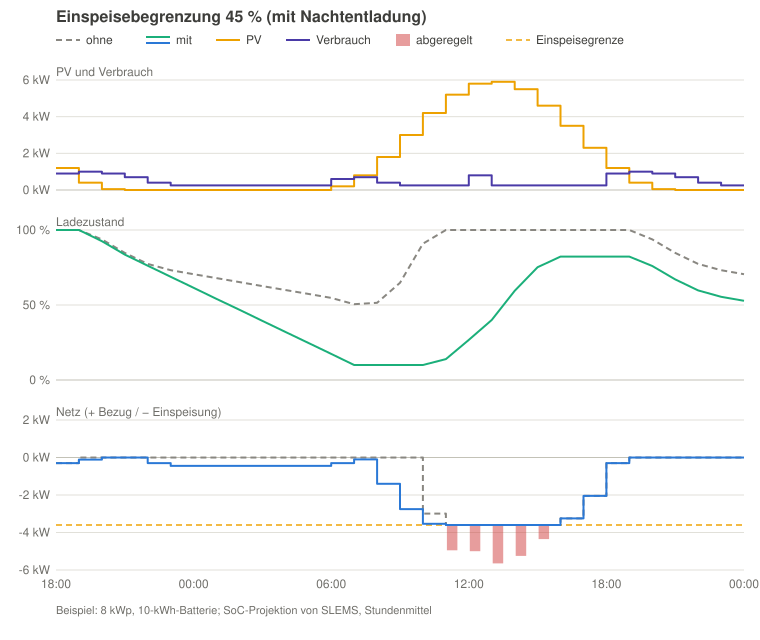

<p align="center"></p>

[English](README.md) | **Deutsch**

# SLEMS

SLEMS ist eine Home-Assistant-Integration, die Heimspeicher und regelbare
Verbraucher steuert. Ziel ist ein netzdienlicher Betrieb der Batterien, z. B.
durch Verschieben des Ladezeitpunkts, damit die tägliche Einspeisespitze
abgefangen wird. Grundlage dafür sind Prognosen für Verbrauch und PV-Ertrag.

Der Name setzt sich aus *[Slug](https://en.wikipedia.org/wiki/Sea_slug)* (ein
lustiges Wort für ein sehr interessantes Tier) und *EMS*
(Energiemanagementsystem) zusammen.



> **Unterstützte Batterien:** SLEMS steuert derzeit die **Marstek Venus E
> 3.0** (Modbus TCP) direkt. Andere Batterien lassen sich über die Entities
> ihrer Home-Assistant-Integration einbinden, nur lesend oder gesteuert
> (experimentell). Wenn du SLEMS mit einer anderen Batterie nutzen möchtest,
> erstelle bitte ein [Issue](https://github.com/gojux/SLEMS/issues) mit dem
> Modell, der Anbindung (Modbus, lokale API, Home-Assistant-Integration) und
> ob du testen könntest.

## Inhalt

- [Warum SLEMS?](#warum-slems)
- [Funktionen](#funktionen)
- [Installation](#installation)
  - [HACS (benutzerdefiniertes Repository)](#hacs-benutzerdefiniertes-repository)
  - [Manuell](#manuell)
- [Einrichtung](#einrichtung)
  - [Smart Meter per Modbus (optional)](#smart-meter-per-modbus-optional)
  - [Tarife (optional)](#tarife-optional)
  - [PV-Prognose](#pv-prognose)
  - [Wetter (optional)](#wetter-optional)
  - [Verbrauchsprognose](#verbrauchsprognose)
- [Batterien](#batterien)
  - [Aufteilung auf die Batterien](#aufteilung-auf-die-batterien)
  - [Verschleißkosten der Batterie](#verschleißkosten-der-batterie)
  - [Wirkungsgrad der Batterie](#wirkungsgrad-der-batterie)
  - [Umstieg von einer anderen Batterie-Integration](#umstieg-von-einer-anderen-batterie-integration)
  - [Zell-Delta und aktiver Zellausgleich](#zell-delta-und-aktiver-zellausgleich)
  - [Firmware-Updates und Batterie-Menü](#firmware-updates-und-batterie-menü)
  - [Grenzen und Schutz der Batterien](#grenzen-und-schutz-der-batterien)
- [Verbraucher](#verbraucher)
  - [Stromvorgabe](#stromvorgabe)
  - [Temperaturfühler des Speichers](#temperaturfühler-des-speichers)
  - [Batterie-Unterstützung](#batterie-unterstützung)
  - [Einsatz in der Einspeisebegrenzung](#einsatz-in-der-einspeisebegrenzung)
  - [Tagesziel](#tagesziel)
- [Dashboard](#dashboard)
  - [Übersicht](#übersicht)
  - [Reiter Batterien](#reiter-batterien)
  - [Reiter Verbraucher](#reiter-verbraucher)
  - [Simulation](#simulation)
  - [Reiter Einstellungen](#reiter-einstellungen)
  - [Bedienung des Dashboards](#bedienung-des-dashboards)
- [Betrieb und Regelung](#betrieb-und-regelung)
  - [Betriebsmodus](#betriebsmodus)
  - [Schlechtwetter-Modus](#schlechtwetter-modus)
  - [So funktioniert die Regelung](#so-funktioniert-die-regelung)
  - [Welche Option wann?](#welche-option-wann)
  - [Netzdienliches Laden](#netzdienliches-laden)
  - [Einspeisebegrenzung](#einspeisebegrenzung)
  - [Gelernte Werte](#gelernte-werte)
  - [Weitere Einstellungen (Entities)](#weitere-einstellungen-entities)
  - [Probleme und Benachrichtigungen](#probleme-und-benachrichtigungen)
- [Sprache](#sprache)
- [Roadmap](#roadmap)
- [Entwicklung](#entwicklung)
- [Lizenz](#lizenz)

## Warum SLEMS?

Die meisten Speichersteuerungen reagieren auf den Moment: Sie halten die
Netzleistung bei null und laden, sobald Überschuss da ist. Die Batterie ist
dann am späten Vormittag voll, und die Mittagsspitze geht trotzdem ins Netz.
SLEMS plant voraus und regelt genau:

- **Netzdienlich statt um 10 Uhr voll.** Aus PV- und Verbrauchsprognose
  berechnet SLEMS eine Einspeisegrenze und lädt die Batterien mit dem
  Überschuss darüber. So fangen sie die Einspeisespitze ab und sind am Abend
  trotzdem voll. Die Grenze wird laufend neu berechnet und sinkt von selbst,
  wenn der Tag schlechter wird als vorhergesagt.
- **Eigene Verbrauchsprognose.** Gelernt aus den Langzeitstatistiken deines
  Hauses, mit Wetter und eigenem Wärmepumpen-Modell; Urlaubsmodus,
  Nachtentladung bis zu einer prognosebasierten Reserve und eine Prognose des
  Ladezustands für heute und morgen.
- **Batterien und Verbraucher in einem Plan.** Der Überschuss wird auf
  Batterien und steuerbare Verbraucher (Heizstab, Wärmepumpe, …) verteilt, mit
  Prioritäten, Batterievorrang bis zur gesicherten Ladung, Mindestlaufzeiten,
  externer Sperre und Thermostat-Pausen.
- **Mehrere Batterien im effizienten Arbeitspunkt.** SLEMS lernt die
  Umwandlungsverluste jeder Batterie, betreibt nur so viele Batterien wie
  sinnvoll und wechselt zwischen ihnen mit sanftem Übergang.
- **Genaue Regelung ohne Schwingen.** Ereignisgesteuert bei jeder Meldung des
  Smart Meters; die gelernte Reaktionszeit der Batterien wird ausgeglichen,
  die Regelverstärkung passt sich selbst an.
- **Batterieschonung und Sicherheit.** Ladezustandsfenster, Leistungsgrenzen
  (z. B. 800 W), Ladebegrenzung nach Temperatur, Überwachung des Zell-Deltas
  mit aktivem Zellausgleich, Erkennung nicht reagierender Batterien,
  Reparatur-Einträge und Benachrichtigungen.
- **Regelmäßige Vollladung ohne verschenkten Überschuss.** LFP-Batterien
  kalibrieren ihren Ladezustand nur bei einer Vollladung neu. SLEMS lädt die
  Batterie mit der ältesten letzten Vollladung zuerst, immer nur eine und nur
  mit dem Überschuss, der ohnehin gespeichert würde, und schont sie beim
  Entladen, damit sie am nächsten Tag höher startet. Es erkennt auch eine
  Vollladung, die das BMS knapp unter 100 % beendet, und misst dabei das
  Zell-Delta am oberen Ladeende.
- **Lernt statt zu fragen.** Neben der Verbrauchsprognose lernt SLEMS die
  Umwandlungsverluste und die Reaktionszeit der Batterien, das Meldeintervall
  des Smart Meters, die Regelverstärkung und die Verbrauchsspitzen; auf Wunsch
  auch die Prognose-Puffer, die Ziel-Netzüberschüsse, die Regelzeiten, die
  nutzbare Kapazität jeder Batterie sowie Leistung und Thermostatverhalten von
  Verbrauchern (siehe *Gelernte Werte*). Jeder gelernte Wert lässt sich wieder
  auf einen festen umstellen.
- **Transparent und lokal.** Ein Dashboard mit Energiefluss, Prognose-Diagramm
  und allen Einstellungen; alles läuft lokal in Home Assistant, ohne Cloud. Im
  Simulationsmodus siehst du, was SLEMS tun würde, bevor es etwas steuert,
  auch neben einer bestehenden Batterie-Integration.
- **Erst ausprobieren, dann ändern.** Die Simulation im Dashboard berechnet
  den Tagesplan mit anderen Einstellungen (netzdienliches Laden,
  Nachtentladung, Einspeisebegrenzung, Grenzen der Batterien, Prognosen ±%)
  und vergleicht Einspeisung, Netzbezug und Ladezustand mit dem aktuellen
  Plan, ohne etwas zu ändern.

**Wann (heute) eine andere Lösung besser passt:** viele verschiedene
Batteriemarken (SLEMS spricht nur die Marstek Venus E 3.0 direkt an; andere
Batterien steuert es über die Entities ihrer Integration, das ist gröber),
Laden aus dem Netz nach dynamischen Tarifen oder das Laden von Elektroautos.
Omnibattery deckt viele Batteriemodelle ab, evcc ist auf das Laden von E-Autos
spezialisiert; evcc ergänzt SLEMS gut (siehe [Roadmap](#roadmap)).

## Funktionen

| Einrichtung | Status |
|---|---|
| Beliebig viele Batterien, jederzeit hinzufügen, bearbeiten, entfernen | ✅ |
| Smart Meter, PV-Leistung und Wetter frei wählbar | ✅ |
| Betriebsmodus *Aus / Simulation (nur lesend) / Aktiv* | ✅ |
| Urlaubsschalter | ✅ |

| Prognosen | Status |
|---|---|
| PV-Prognose aus beliebiger Solarprognose-Integration (Forecast.Solar, Solcast, …) | ✅ |
| Verbrauchsprognose heute/morgen (Historie + Wetter, Wärmepumpe temperaturabhängig) | ✅ |

| Batterien | Status |
|---|---|
| Marstek Venus E 3.0 über Modbus TCP | ✅ |
| Batterie aus vorhandenen Entities: nur lesend (z. B. solange Omnibattery steuert) oder gesteuert über Sollwert, Lade-/Entladeleistung oder Skript, Entities aus dem Gerät vorgeschlagen | ✅ (Steuerung experimentell) |
| Wirkungsgrad der Batterie (Batteriezähler, gelernt oder manuell) | ✅ |
| Aufteilung auf Batterien nach Wirkungsgrad, Wechsel mit sanftem Übergang | ✅ |
| Grenzen je Batterie: minimaler/maximaler Ladezustand, Grenze Lade-/Entladeleistung (z. B. 800 W), Ladebegrenzung nach Temperatur | ✅ |
| Erkennung von Batterien, die die vorgegebene Leistung nicht liefern, Bestätigung der Sollwerte | ✅ |
| Zell-Delta und aktiver Zellausgleich (Marstek Venus E 3.0) | ✅ |
| Regelmäßige Vollladung zur SoC-Kalibrierung der LFP-Zellen (immer eine Batterie, aus dem Überschuss, beim Entladen geschont) | ✅ |

| Verbraucher | Status |
|---|---|
| Verbraucher mit eigenen Leistungs-/Energiesensoren, im oder außerhalb des Smart Meters | ✅ |
| Wärmepumpe als Verbrauchertyp (wetterabhängige Prognose) | ✅ |
| Steuerung von Verbrauchern: Ein/Aus oder Leistungssollwert, Priorität, Mindestlaufzeit/-pause, externe Sperre | ✅ |
| Verbraucher mit eigenem Thermostat: Pausen erkannt, ihre Leistung geht solange an die Batterien | ✅ |
| Temperaturfühler eines Speichers: gelernte Energie pro Grad, noch aufnehmbare Energie | ✅ |
| Einsatz eines Verbrauchers in der Einspeisebegrenzung (unterstützend, normal, nie) | ✅ |
| Tagesziele: Laufzeit, Freigabezeit, Energie oder Temperatur, mit Frist und Quelle (Überschuss, Batterie, Netz) | ✅ |
| Batterie-Unterstützung je Verbraucher (immer, automatisch mit der Energie, die die Batterien übrig haben, nie) | ✅ |
| Wallbox / evcc-Ladepunkt: Stromvorgabe in A mit Phasen, Start/Stopp ([Anleitung](docs/wallbox-evcc.de.md)) | ✅ (noch nicht mit einer echten Wallbox getestet) |

| Planung und Regelung | Status |
|---|---|
| Verteilung des Überschusses auf Batterien und Verbraucher (Priorität, Aufteilung, Mindestlaufzeit/-pause) | ✅ |
| Echtzeit-Regelung von Batterien und Verbrauchern (Betriebsmodus *Aktiv*) | ✅ |
| Gemittelter Netzüberschuss (0–300 s) | ✅ |
| Ziel-Netzüberschuss beim Laden/Entladen, maximale Einspeisung beim Entladen | ✅ |
| Netzdienliches Laden: PV-Einspeisespitzen abfangen | ✅ |
| Einspeisebegrenzung: PV-Energie über einer Einspeisegrenze speichern, rechtzeitig Platz schaffen | ✅ |
| Nachtentladung bis zu einer prognosebasierten Reserve | ✅ |
| Bezugsspitzen abfangen bei niedrigem Ladezustand (manuell aktivierbar) | ✅ |

| Dashboard | Status |
|---|---|
| Dashboard (Seitenleiste): Energiefluss, Kennzahlen, Tagesdiagramm mit Prognose und Plan, Batterien, Verbraucher, Einstellungen | ✅ |
| Simulation im Dashboard: Tagesplan mit anderen Einstellungen im Vergleich zum aktuellen (heute oder morgen) | ✅ |
| Tarife wie auf der Rechnung (Zeitfenster, Umsatzsteuer je Gruppe) mit Prüfung gegen eine Rechnung; Börsenpreise (APG, SMARD, Energy-Charts) nur mit Zustimmung; monatlicher Tarifvergleich | ✅ |
| Preisbewusste Steuerung: gespeicherte Energie für die teuren Stunden halten, Netzanteil der Tagesziele im günstigsten Fenster, optional Laden aus dem Netz und Einspeisen aus den Batterien | ✅ |

## Installation

### HACS (benutzerdefiniertes Repository)

[](https://my.home-assistant.io/redirect/hacs_repository/?owner=gojux&repository=SLEMS&category=integration)

Der Button öffnet SLEMS im HACS deiner Home-Assistant-Instanz und fügt das
benutzerdefinierte Repository hinzu; danach weiter mit Schritt 2. Oder von
Hand:

1. HACS → ⋮ → *Benutzerdefinierte Repositories* →
   `https://github.com/gojux/SLEMS` eintragen, Typ *Integration*.
2. *SLEMS* installieren und Home Assistant neu starten.

### Manuell

`custom_components/slems` in den Ordner `custom_components` deiner
Home-Assistant-Konfiguration kopieren und Home Assistant neu starten.

Voraussetzung: Home Assistant 2026.9 oder neuer.

## Einrichtung

1. *Einstellungen → Geräte & Dienste → Integration hinzufügen → SLEMS*.
2. Die Netzleistungs-Entity deines Smart Meters wählen (positiv = Bezug,
   negativ = Einspeisung; *Vorzeichen umkehren* aktivieren, wenn dein Zähler
   es umgekehrt meldet), optional PV-Leistung, PV-Prognose und Wetter.
3. Auf der Seite der SLEMS-Integration für jede Batterie **Batterie
   hinzufügen** und für jeden Verbraucher, der gemessen oder gesteuert werden
   soll, **Verbraucher hinzufügen** wählen.

### Smart Meter per Modbus (optional)

Die Entity des Smart Meters wird einmal pro Abfragedurchlauf ihrer
Integration aktualisiert, oft nur etwa einmal pro Sekunde, und zeigt dann nur
einen Teil der Zählerwerte. Mit *Smart Meter zusätzlich per Modbus lesen*
liest SLEMS die Netzleistung direkt von einem SunSpec-Zähler, z. B. dem Zähler
am SolarEdge-Wechselrichter, alle 0,5 Sekunden (0,2 bis 5 s). Die Regelung
sieht jeden Wert früher; am meisten bringt das bei schnellen Batterien.

- SLEMS nutzt die geteilte Modbus-Verbindung von Home Assistant. Solange die
  Integration des Wechselrichters dessen einzige Modbus-TCP-Verbindung selbst
  belegt (z. B. SolarEdge Modbus Multi), als Host einen Modbus-Proxy vor dem
  Wechselrichter angeben. Teilt die Wechselrichter-Integration ihre Verbindung
  eines Tages, lässt sich direkt der Wechselrichter eintragen, und der Proxy
  wird nicht mehr gebraucht.
- SLEMS findet die Zähler in der SunSpec-Modellkette; bei mehreren Zählern
  (z. B. Einspeisung/Bezug und Verbrauch) wählst du den am Netzanschlusspunkt,
  die aktuelle Leistung jedes Zählers hilft beim Erkennen.
- Das Vorzeichen findet SLEMS selbst, indem es einige Werte mit der
  Netzleistungs-Entity vergleicht; dafür braucht es etwas Bezug oder
  Einspeisung (mindestens 100 W). Sonst lässt es sich von Hand wählen.
- Die Entity bleibt Pflicht: Sie ist die Historie, die Grundlage der Prognosen
  und die Rückfallebene. Solange kein Modbus-Wert neuer als 3 Intervalle
  (mindestens 5 Sekunden) ist, nutzt SLEMS die Entity; nach 5 Minuten ohne
  Modbus erscheint ein Reparaturhinweis. Der Sensor *Aktualisierungsintervall
  Smart Meter* zeigt die Quelle im Attribut `source`.
- Beim Wechsel der Quelle beginnen die gelernten Reaktionszeiten der
  Batterien neu, weil sie die Verzögerung der alten Quelle enthalten.

### Tarife (optional)

Mit *Tarif hinzufügen* auf der Seite der SLEMS-Integration trägst du deinen
Stromtarif so ein, wie ihn deine Rechnung zeigt; die Werte bleiben in deinem
Home Assistant.

1. Name, Rolle (*aktueller Tarif* oder *Vergleichstarif*) und Umsatzsteuer:
   für die Bezugsrechnung, für die eingespeiste Energie (bei privaten
   PV-Anlagen oft 0 %) und für die anderen Einspeise-Posten.
2. Die Posten der Rechnung einzeln: Name, Seite (*Bezug* oder
   *Einspeisung*), Gruppe (*Energie*, *Netz*, *Abgaben*) und Preis in ct/kWh
   oder €/Jahr (je Tag verrechnet; ein Rabatt ist negativ). Optional nur in
   bestimmten Monaten, an bestimmten Wochentagen oder in einem Zeitfenster
   des Tages, z. B. ein günstigerer Netzpreis zu Mittag im Sommer: Ein Posten
   mit Fenster ersetzt in seinem Fenster den gleichnamigen Posten. Eine
   Preisänderung ist derselbe Posten noch einmal mit *Gültig ab*. Auf der
   Einspeiseseite ist der Energiepreis deine Vergütung.
3. *Mit einer Rechnung vergleichen*: Zeitraum und Beträge der Rechnung
   eingeben; SLEMS rechnet den Zeitraum mit dem Tarif und deinem
   aufgezeichneten Netzbezug und deiner Einspeisung nach und zeigt beide
   Beträge und die Abweichung, je Seite und Gruppe.

Woher die Energie kommt: SLEMS zeichnet Netzbezug und Einspeisung aus jedem
Netzwert selbst je Viertelstunde auf (400 Tage lang), damit sich Bezug und
Einspeisung innerhalb einer Stunde nicht aufheben und dynamische Preise je
Viertelstunde gelten. Für genaue Summen in den SLEMS-Optionen die
Energiezähler des Smart Meters wählen (*Netzbezug (Zähler)* /
*Netzeinspeisung (Zähler)*): Die aufgezeichneten Viertelstunden werden dann auf
den Zähler jeder Stunde skaliert. Stunden vor der Aufzeichnung nutzen die
Zähler, ohne Zähler das Stundenmittel der Netzleistung (ungenauer).

**Dynamische Tarife und Börsenpreise.** Ein Posten kann auch dem
Day-Ahead-Markt folgen: *Börsenpreis (stündlich)* oder *Monatsmarktpreis*,
jeweils als Marktpreis × (1 + Aufschlag in %) + Preis in ct/kWh, z. B.
„Börsenpreis × 1,05 + 1,2 ct“ oder „Monatsmarktpreis − 0,5 ct“ für die
Einspeisung. Veröffentlichte Monatsmarktpreise lassen sich je Monat eintragen
(z. B. „2026-08: 7,1“); Monate ohne Wert nutzen das Mittel der Börsenpreise,
gewichtet mit deiner Einspeisung.

SLEMS ruft Börsenpreise erst aus dem Internet ab, wenn du *Börsenpreise
abrufen* einschaltest (standardmäßig aus). *Preisquelle* wählt woher: APG
(Österreich), SMARD der Bundesnetzagentur (Deutschland/Luxemburg) oder
Energy-Charts des Fraunhofer ISE (beide Zonen); voreingestellt nach dem in
Home Assistant eingestellten Land. SLEMS lädt dann einmal die letzten
12 Monate, speichert sie lokal und holt nach der Day-Ahead-Auktion (ab 13 Uhr)
den nächsten Tag. Der Sensor *Börsenpreis* zeigt den Preis der aktuellen
Viertelstunde in ct/kWh ohne Gebühren und Steuern, mit der Quelle als
Quellenangabe.

**Preisbewusste Steuerung** (Schalter, standardmäßig aus; braucht einen
Tarif): Reicht die gespeicherte Energie nicht für alle Stunden, bis die PV die
Batterien wieder füllt, decken sie die Stunden mit dem höchsten Bezugspreis
des aktuellen Tarifs und halten ihre Energie in Stunden zurück, die um
mindestens den *Mindestgewinn* (Standard 2 ct/kWh) günstiger sind; dort
bezieht das Haus aus dem Netz. Der Netzbezug bleibt gleich, er wandert nur in
günstigere Stunden – kein Laden aus dem Netz und keine Einspeisung aus den
Batterien. Jeder zeitabhängige Preis zählt: Börsenpreise oder Zeitfenster
eines festen Tarifs. Bezugsspitzen abfangen gilt weiter. Die Strategie zeigt
*Für teure Stunden halten* mit den betroffenen Stunden, Tagesdiagramm und
Simulation berücksichtigen es. Tagesziele mit der Quelle *+ Netz*: Reicht der
prognostizierte Überschuss ohnehin nicht, startet der erzwungene Lauf im
Fenster mit dem niedrigsten mittleren Bezugspreis vor der Frist (um
mindestens den Mindestgewinn günstiger als zum spätesten Start); die
Verbraucherkarte zeigt *ab … im günstigsten Fenster*.

**Akku aus dem Netz laden** (Schalter, standardmäßig aus; nur mit
preisbewusster Steuerung): In einem Defizit plant SLEMS bis zur nächsten
PV-Übernahme (höchstens bis zum letzten bekannten Preis), in welchen Stunden
die Batterien decken, halten oder aus dem Netz laden. Laden muss sich nach
Lade- und Entladeverlusten, den
[Verschleißkosten](#verschleißkosten-der-batterie) und dem Mindestgewinn
lohnen; bei gleichen Kosten gewinnt das spätere Laden, weil Heimspeicher vor
allem mit der Zeit bei hohem Ladezustand altern. Grenzen: *Höchster
Ladezustand aus dem Netz* (Standard 90 %), *Höchste Netzladeleistung* (0 =
Ladeleistung der Batterien), die Bezugsgrenze von Bezugsspitzen abfangen und
der Platz, den die Einspeisebegrenzung zur PV-Übernahme braucht. Bei
Überschuss wird nicht aus dem Netz geladen. Der Plan schließt das Halten ein
(auch wenn Preise nur bis Mitternacht bekannt sind); die Strategie zeigt
*Netzladen* mit Energie, Beginn und erwarteter Ersparnis, das Tagesdiagramm
das geplante Laden.

**Akku ins Netz entladen** (Schalter, standardmäßig aus; nur mit
preisbewusster Steuerung): Derselbe Plan darf über den Bedarf des Hauses
hinaus aus den Batterien einspeisen, wenn die Vergütung der Stunde höher ist
als der spätere Wert der Energie plus Mindestgewinn – späterer Netzbezug wird
dafür in Kauf genommen. Nicht unter die Morgenreserve, höchstens die maximale
Einspeisung beim Entladen und die Einspeisebegrenzung. Das lohnt nur mit
einer Einspeisevergütung, die stündlich dem Börsenpreis folgt; mit fester
oder monatlicher Vergütung zeigt die Strategie, dass die Option ohne Wirkung
ist. Vorher Vertrag und Förderung prüfen: Manche erlauben nicht, aus dem Netz
geladene Energie wieder einzuspeisen.

**Gemessene Ersparnis**: Der Sensor *Ersparnis Preissteuerung* summiert je
Monat, was die preisbewusste Steuerung gespart hat: Nach jeder Nacht (oder
anderen Phase bis zur PV-Übernahme), in der sie gehalten, geladen oder
eingespeist hat, vergleicht SLEMS die aufgezeichneten Kosten mit denselben
Stunden *wie üblich*, gerechnet mit dem Batteriemodell ab dem gemessenen
Ladezustand. Nächte ohne solche Aktion zählen nichts. Der Tarifvergleich
zeigt den Wert neben der Schätzung.

### PV-Prognose

Auswählbar ist jede Integration, die eine Solarprognose für das
Energie-Dashboard von Home Assistant liefert, z. B. Forecast.Solar oder
Solcast. Mehrere Einträge (z. B. ein Forecast.Solar-Eintrag je Dachfläche)
werden addiert. SLEMS verwendet die feinste Auflösung, die der Anbieter
liefert (z. B. 15 oder 30 Minuten). Forecast.Solar kennzeichnet jede Periode
mit ihrem Ende; SLEMS berücksichtigt das.

**Empfehlung: [Helios Forecast](https://github.com/ReikanYsora/Helios-Forecast)**
(Open Source, ohne Konto und API-Schlüssel, lokal gerechnet mit Wetterdaten von
Open-Meteo). Es lernt aus der Erzeugung der eigenen PV-Anlage, auch
Abschattung durch Bäume oder Berge, Verschmutzung und eine um ein paar Grad
abweichende Ausrichtung, und nutzt dafür gleich die vorhandenen
Langzeitstatistiken des Energiesensors. Es liefert eine Prognose für das
Energie-Dashboard in 15-Minuten-Schritten und ist in SLEMS direkt auswählbar.

### Wetter (optional)

Die Wetter-Entity verbessert die Verbrauchsprognose, besonders bei einer
Wärmepumpe. Empfehlungen für Vorarlberg bzw. den Alpenraum:

- **GeoSphere Austria AROME**: hochaufgelöstes Modell des österreichischen
  Wetterdienstes, gut geeignet für Alpentäler. In Home Assistant über
  benutzerdefinierte Integrationen wie [GeoSphere Austria
  Plus](https://github.com/coding-pagro/GeoSphere-Austria-Plus) oder
  [GeoSphere Austria Next](https://github.com/slettmayer/ha-geosphere-next)
  (HACS). Die eingebaute Integration *GeoSphere Austria* liefert nur
  Stationsmesswerte, keine Prognose.
- **Open-Meteo** (eingebaute Integration): ohne Konto nutzbar, kombiniert
  mehrere Wettermodelle.
- **Met.no** (Standard in Home Assistant): funktioniert überall, im alpinen
  Gelände weniger detailliert.

### Verbrauchsprognose

SLEMS lernt den Verbrauch aus den Langzeitstatistiken von Home Assistant und
prognostiziert heute und morgen stundenweise. Jüngere Tage zählen mehr als
ältere, Änderungen werden so innerhalb weniger Tage übernommen. Wärmepumpen
werden über die Außentemperatur des Tages prognostiziert, ein warmer Tag in
der Heizsaison ergibt also sofort weniger Heizenergie. Zwei optionale
Einstellungen helfen beim Start:

- **Außentemperatur**: ein Temperatursensor mit Historie. Ohne ihn zeichnet
  SLEMS die Temperatur der Wetter-Entity selbst auf; das Wärmepumpenmodell
  nutzt die Temperatur dann nach etwa einer Woche.
- **Historie Hausverbrauch**: ein Leistungssensor des Hausverbrauchs mit
  vorhandener Historie (z. B. aus einer anderen Batterie-Integration), für die
  Zeit, bevor SLEMS eigene Werte aufgezeichnet hat.

Empfohlene Einrichtung beim Umstieg von einer anderen Batterie-Integration:

1. Den Hausverbrauchssensor dieser Integration als *Historie Hausverbrauch*
   wählen. SLEMS lernt dann sofort aus der gesamten Historie. Ohne ihn leitet
   SLEMS die Historie nur aus Netz und PV ab; die Batterieleistung vor SLEMS
   ist unbekannt, Laden und Entladen würden den gelernten Verbrauch
   verfälschen.
2. Falls vorhanden, einen Außentemperatursensor mit Historie wählen. Sonst
   nutzt die Wärmepumpenprognose den Durchschnitt der letzten Tage, bis SLEMS
   etwa eine Woche Temperaturen aufgezeichnet hat.
3. Feiertage werden derzeit wie Werktage behandelt.

**Prognosegüte** (Karte in der Übersicht, Sensoren *Treffsicherheit
Verbrauchsprognose* und *Treffsicherheit PV-Prognose*):

- Verbrauch: SLEMS rechnet die Prognose jedes der letzten 14 Tage so nach, wie
  sie um Mitternacht mit der Historie bis dahin entstanden wäre, und
  vergleicht sie mit dem gemessenen Verbrauch. Angezeigt werden die
  Treffsicherheit der Tagesenergie (100 % minus mittlere Abweichung), die
  Tendenz (zu hoch oder zu niedrig), die Abweichung pro Stunde (wie gut der
  Tagesverlauf getroffen wird), die Datenbasis (Tage mit Verbrauch, Tage mit
  Wärmepumpe und Temperatur) und die Prognose für morgen mit ihrer erwarteten
  Abweichung. Die Wärmepumpe wird mit der gemessenen Temperatur des Tages
  nachgerechnet; ihr Anteil wirkt dadurch etwas besser, als er war.
- PV: Vergangene Prognosen liefert die Solarprognose-Integration nicht mehr,
  daher speichert SLEMS die Prognose jedes Tages zu Tagesbeginn und vergleicht
  sie abends mit der Erzeugung. Die Karte zeigt Treffsicherheit und erwartete
  Abweichung ab 7 verglichenen Tagen (vorher: *sammelt noch Daten*), weil
  wenige Tage wenig aussagen.

Der Sensor *Hausverbrauch* (Grundlage der Prognose und Anzeige im
Energiefluss) wird als Netz + PV − Batterien berechnet. Der Smart Meter meldet
eine Änderung oft später als PV und Batterien; ein kurzzeitig negatives
Ergebnis wird daher durch den letzten gültigen Wert ersetzt (höchstens 30
Sekunden, danach unbekannt).

## Batterien

- **Marstek Venus E 3.0**: Host/IP, Port (502) und Modbus Unit-ID. Die
  Batterie akzeptiert nur **eine** Modbus-TCP-Verbindung. Lass nie zwei
  Integrationen (z. B. SLEMS und Omnibattery) gleichzeitig mit derselben
  Batterie sprechen. Ihr Sensor *AC-Leistung* ist beim Entladen positiv und
  beim Laden negativ, wie es das Energie-Dashboard von Home Assistant für die
  Batterieleistung erwartet.

  **Fernsteuerung**: Die Venus folgt Sollwerten nur, solange ihre
  Fernsteuerung an ist; die Registerliste von Marstek nennt sie *RS485
  control mode*. Trotz des Namens braucht sie kein RS485-Kabel: SLEMS
  steuert die Venus über das LAN (Modbus TCP) und schaltet die Fernsteuerung
  selbst ein und aus; einzustellen ist nichts.

  **Suche**: Beim Hinzufügen einer Venus sucht SLEMS zuerst im Netz von Home
  Assistant nach Batterien (TCP-Port 502, dann ein Probe-Lesen des
  Ladezustands; wenige Sekunden) und bietet die gefundenen an; bereits
  hinzugefügte fehlen in der Liste. Eine Batterie, deren einzige
  Modbus-Verbindung eine andere Integration hält, kann nicht gefunden werden.

  **IP-Adresse finden**: Modbus TCP gibt es nur am **LAN-Anschluss** der
  Batterie (mit Netzwerkkabel verbinden), nicht über WLAN. Die Marstek-App
  zeigt die LAN-IP-Adresse nicht an; sie steht im Router / Internet-Gateway /
  DHCP-Server (Liste der verbundenen Geräte). Vergib der Batterie dort eine
  feste Adresse (DHCP-Reservierung), damit sie sich später nicht ändert.
  Alternativ lässt sich das Netz nach Geräten mit offenem Modbus-Port
  durchsuchen, z. B. mit [nmap](https://nmap.org) (Netz an deines anpassen):

  ```bash
  nmap -p 502 --open 192.168.0.0/24
  ```

  Jede Adresse mit `502/tcp open` ist ein Modbus-TCP-Gerät (mit `sudo` im
  selben Netz zeigt nmap auch die MAC-Adresse, das hilft bei mehreren
  Batterien). Beim Hinzufügen prüft SLEMS die Verbindung, indem es den
  Ladezustand liest; andere Integrationen, die die Batterie verwenden, vorher
  stoppen.
- **Vorhandene Home-Assistant-Entities** (Steuerung: experimentell): jede
  Batterie, die eine andere Integration in Home Assistant einbindet. Zuerst
  das Gerät der Batterie wählen: SLEMS schlägt seine Entities vor
  (Ladezustand, Leistung, Sollwerte, Modus, optional Temperatur,
  Zellspannungen und Energiezähler); bitte prüfen und korrigieren. Ohne Gerät
  wählst du alles selbst.
  - **Nur lesen**: SLEMS sendet nie Befehle, z. B. um SLEMS im
    Simulationsmodus parallel zu einer bestehenden Batterie-Integration laufen
    zu lassen.
  - **Sollwert**: eine Number-Entity mit der Leistung mit Vorzeichen (+Laden /
    −Entladen, Vorzeichen umkehrbar).
  - **Getrennte Lade- und Entladeleistung**: je eine Number, optional eine
    Modus-Auswahl (Laden / Entladen / Standby / Automatik, die Optionen werden
    im nächsten Schritt zugeordnet).
  - **Skript**: ein eigenes Skript erhält die Leistung als Variable `power_w`
    (W, +Laden / −Entladen, 0 = Standby); optional ein Freigabe-Skript. Damit
    lassen sich auch Batterien steuern, die über Aktionen (Dienste) bedient
    werden. SLEMS wartet, bis das Skript fertig ist (höchstens 10 Sekunden),
    damit Fehler auffallen; es sollte daher kurz sein (ohne Wartezeiten).

  Optional wird ein Schalter oder eine Auswahl für die *Fernsteuerung* (z. B.
  *Manuelle Batteriesteuerung* bei Omnibattery) vor dem ersten Sollwert
  eingeschaltet und bei der Freigabe an die *Automatik* wieder aus, damit die
  Batterie wieder selbst regelt; leer lassen, wenn du sie selbst schaltest.
  Zum Steuern ist der Sensor der
  Batterieleistung Pflicht. *Mindestabstand zwischen Befehlen* passt für
  Integrationen mit begrenzter Befehlsrate (oft über eine Cloud), *Sollwert
  wiederholen alle* für Batterien, die ohne neue Befehle auf ihre eigene Logik
  zurückfallen. Die eigene Regelung der Batterie (z. B. ihre Nulleinspeisung)
  in ihrer Integration ausschalten, sonst regeln beide gleichzeitig. Batterien
  über eine Cloud reagieren langsamer als eine Venus über Modbus; SLEMS lernt
  ihre Reaktionszeit, die Regelung ist aber gröber. Mit Zellspannungen nutzt
  SLEMS sanftes Laden nahe voll, das Zell-Delta und den Zellausgleich wie bei
  einer Venus (LFP-Zellen). Diese Steuerung ist mit simulierten Entities und
  mit einer Marstek Venus E 3.0 über Omnibattery getestet; Erfahrungen mit
  anderen Geräten bitte als [Issue](https://github.com/gojux/SLEMS/issues)
  melden.

  **Beispiel: eine Batterie über Omnibattery.** Für ein Batteriemodell, das
  SLEMS nicht direkt unterstützt, kann
  [Omnibattery](https://github.com/ffunes/Omnibattery) die Kommunikation und
  SLEMS die Regelung übernehmen:
  1. In Omnibattery für die Batterie *Manuelle Batteriesteuerung* einschalten,
     damit ihre eigene Regelung stoppt.
  2. In SLEMS die Batterie als *Vorhandene Home-Assistant-Entities* hinzufügen
     und das Omnibattery-Gerät wählen. SLEMS schlägt die Entities vor
     (Ladezustand, Leistung, Lade- und Entladeleistung, Betriebsmodus,
     Zellspannungen, Zähler); diese prüfen.
  3. Automationen, die die Batterie steuern, ausschalten, damit nur SLEMS
     Sollwerte sendet.

**Zustand bei Freigabe**: in welchem Zustand SLEMS die Batterie lässt, wenn es
die Steuerung beendet, z. B. im Betriebsmodus *Aus*, ohne Werte des Smart
Meters oder wenn die Batterie aus SLEMS entfernt wird. *Automatik* (Standard):
die eigene Logik der Batterie übernimmt wieder (z. B. ihre Nulleinspeisung);
bei einer Batterie aus Entities braucht das eine Fernsteuerungs-Entity, eine
Modus-Option für Automatik oder ein Freigabe-Skript. *Standby*: die Batterie
bleibt bei 0 W stehen, bis etwas anderes sie übernimmt; eine Venus bleibt
dafür in der Fernsteuerung.

### Aufteilung auf die Batterien

Bei mehreren Batterien entscheidet SLEMS, wie viele und welche laufen: Bei
kleiner Leistung ist meist eine einzelne Batterie effizienter, bei großer das
Aufteilen. Beim Entladen läuft die Batterie mit dem höchsten Ladezustand, beim
Laden die mit dem niedrigsten. Entfernt sich die laufende Batterie um mehr als
die *Schwelle Batteriewechsel* (Standard 5 %) von der besten inaktiven, wird
gewechselt, höchstens einmal pro *Mindestabstand Batteriewechsel* (Standard 15
min) und mit sanftem Übergang: Die Leistung wandert mit der *Rampe
Batteriewechsel* (Standard 100 W/s), aber nie länger als die *Maximale
Übergangszeit Batteriewechsel* (Standard 30 s). Die Umwandlungsverluste je
Leistungsbereich lernt SLEMS aus AC- und DC-Leistung der Batterie.

Reagieren die Batterien deutlich unterschiedlich schnell (gelernte
Reaktionszeiten, die langsamste mindestens doppelt und 3 s langsamer als die
schnellste, z. B. eine Venus über Modbus neben einer Batterie über eine
Cloud-Integration), übernimmt die schnellste Änderungen der Gesamtleistung
zuerst; danach wandert die Leistung mit der Reaktionszeit der langsameren zur
effizienten Aufteilung. Keine Batterie arbeitet gegen die Richtung der
Gesamtleistung.

Jede Batterie hat einen Schalter *Aktiviert*. Eine deaktivierte Batterie wird
weiter gemessen (ihre Leistung gehört zur Energiebilanz), aber weder
eingeplant noch gesteuert und zählt nicht zum Gesamt-Ladezustand. Entlädt sie
im Modus *Aktiv* gerade, übernehmen die anderen Batterien innerhalb von 5
Sekunden, bevor sie an ihre eigene Logik zurückgegeben wird.

### Verschleißkosten der Batterie

Optional in der Batterie-Konfiguration: Anschaffungspreis und Zyklen laut
Hersteller. Daraus berechnet SLEMS die Verschleißkosten je kWh, die
eingespeichert und wieder abgegeben wird: Preis ÷ (Zyklen × nutzbare
Kapazität), z. B. 1200 € ÷ (6000 × 5 kWh) = 4 ct/kWh. Preisbewusste Aktionen
mit zusätzlichem Zyklus (Laden aus dem Netz) finden nur statt, wenn sie mehr
einbringen. Ein Preis von 0 bedeutet keine Verschleißkosten: Feldmessungen an
Heimspeichern zeigen, dass sie vor allem mit der Zeit, der Temperatur und dem
Ladezustand altern und oft ihr Lebensende erreichen, bevor ihre Zyklen
aufgebraucht sind. Ohne Angaben nimmt SLEMS einen niedrigen Schätzwert von
1 ct/kWh an; die Batteriekarte weist dann darauf hin. Der Sensor
*Verschleißkosten* zeigt den Wert.

### Wirkungsgrad der Batterie

Gesamtwirkungsgrad (AC zu AC), je Batterie aus
einer von drei Quellen:

- *Batteriezähler* (empfohlen für die Marstek Venus E 3.0 und für Batterien
  aus Entities mit Energiezählern): aus den Gesamtzählern der Batterie für
  Laden und Entladen und ihrem Ladezustand: (entladen + gespeichert) /
  geladen. Die Batterie zählt selbst, schnell und über ihre ganze
  Betriebszeit; der Wert ist daher sofort genau und stabil. Einzige Annahme
  ist eine leere Batterie zu Beginn der Zähler; ihr Einfluss verschwindet nach
  wenigen Zyklen.
- *Gelernt*: SLEMS summiert die gemessene Batterieleistung selbst (alle 5
  Sekunden) ab dem Start von SLEMS. Das zählt erst nach etwa drei vollen
  Ladezyklen (bis dahin gilt der Startwert), und kurze Leistungsspitzen
  zwischen zwei Abfragen gehen verloren. Empfohlen für Batterien ohne eigene
  Zähler.
- *Manuell*: ein fester Wert, z. B. aus dem Datenblatt.

Der Wirkungsgrad wird überall dort verwendet, wo Energie umgerechnet wird: ob
der PV-Überschuss die Batterien füllt (gesicherte Ladung), beim netzdienlichen
Laden, bei der Nachtentladung und in der Ladezustands-Prognose. Er entscheidet
**nicht**, wie viele Batterien laufen: Dafür lernt SLEMS je Batterie eine
eigene Verlustkurve aus dem Unterschied von AC- und DC-Leistung bei jeder
Leistung (fester Verlust eines laufenden Wechselrichters plus mit der Leistung
steigende Verluste). Daraus berechnet die Aufteilung die Anzahl Batterien mit
dem geringsten Gesamtverlust: bei kleiner Leistung eine Batterie, oberhalb des
Break-even-Punkts mehrere (siehe *Aufteilung auf die Batterien*). Das funktioniert mit
jeder Wirkungsgrad-Quelle, aber nur für Batterien, die AC- und DC-Leistung
melden (Marstek Venus E 3.0).

### Umstieg von einer anderen Batterie-Integration

Übernimmt SLEMS eine Batterie von einer anderen Integration (z. B.
Omnibattery), lässt sich der Verlauf der alten Sensoren (z. B. geladene und
entladene Energie im Energie-Dashboard) mit [HA Merge Sensor
History](https://github.com/mayerwin/HA-Merge-Sensor-History) auf die
SLEMS-Sensoren übertragen. Das Werkzeug kopiert Zustände und
Langzeitstatistiken, sodass die Summen im Energie-Dashboard weiterlaufen.

- Vorher ein vollständiges Backup von Home Assistant machen; das Werkzeug
  schreibt direkt in die Datenbank.
- Die Vorschau prüfen: Die Zähler der Venus (Register 33000/33002) haben in
  beiden Integrationen denselben Wert, die Summe läuft also ohne Sprung
  weiter.
- Das Vorzeichen von Leistungssensoren vergleichen: Die *AC-Leistung* von
  SLEMS ist beim Entladen positiv.
- Danach im Energie-Dashboard die alten Sensoren durch die SLEMS-Sensoren
  ersetzen und die alten Entities löschen, wenn alles stimmt.

### Zell-Delta und aktiver Zellausgleich

Für Batterien, die ihre Zellspannungen melden (Marstek Venus E 3.0), zeigt
SLEMS das *Zell-Delta* (höchste minus niedrigste Zellspannung). Bei LFP-Zellen
ist der Live-Wert nur nahe der Vollladung aussagekräftig: In der Mitte ist die
Spannungskurve so flach, dass ungleiche Zellen fast dieselbe Spannung zeigen.
SLEMS erfasst daher das *Zell-Delta am oberen Ladeende*: nachdem die höchste
Zelle 3,60 V erreicht oder das BMS die Ladung bei 100 % beendet hat und die
Batterie danach 60 Sekunden im Standby war (einschließlich der etwa 13 W, die
eine Venus selbst braucht). Gemessen wird einmal pro Ladung: Steht die
Batterie voll, entspannen sich die Zellen, und das Delta sinkt weiter, ohne
dass der Ausgleich besser wird; die nächste Messung folgt daher erst, nachdem
die Batterie aus dem oberen Bereich entladen wurde (höchste Zelle unter 3,49
V), auch nach einem Neustart von SLEMS. Die Kurve ist dort steil;
Marstek-Zellen zeigen ab Werk typischerweise etwa 180 mV, das ist normal.
Status: unter 200 mV gut, unter 230 mV leichtes, unter 250 mV mittleres, sonst
starkes Ungleichgewicht. Ab 230 mV empfiehlt das Dashboard den aktiven
Zellausgleich.

Der aktive Zellausgleich (Schalter *Aktiver Zellausgleich* oder die
Schaltfläche im Dashboard) folgt dem Ausgleichs-Blueprint von Omnibattery. Er
lässt sich nur im Betriebsmodus *Aktiv* starten:

1. Entlädt die Batterie gerade, übergibt sie zuerst sanft (wie beim
   Deaktivieren). Danach verlässt sie die normale Planung; die anderen
   Batterien übernehmen.
2. Sie lädt, bis die höchste Zelle 3,49 V erreicht, mit dem PV-Überschuss (vor
   den anderen Batterien), mindestens mit 95 W. Reicht der Überschuss nicht,
   entladen die anderen Batterien, um die 95 W auszugleichen.
3. Sie lädt mit 95 W, bis die höchste Zelle 3,60 V erreicht, ist 60 Sekunden
   im Standby und misst das Zell-Delta.
4. Sonst entlädt sie mit 200 W bis zur Wiederholspannung (3,49 V) und
   wiederholt ab Schritt 3. Verweigert das BMS das Laden (weniger als 30 W
   statt 95 W, z. B. weil es bei etwa 3,55 V voll meldet), misst sie nicht
   (das Delta unter 3,60 V ist kleiner und nicht vergleichbar), entlädt bis zur
   Wiederholspannung (3,49 V oder 10 mV unter der Spannung, bei der es
   verweigert hat) und versucht es erneut.
5. Sie entlädt mit 200 W bis 3,48 V und endet, wenn das Delta im normalen
   Bereich liegt (höchstens 190 mV), wenn es 6 Stunden lang nicht um 2 mV
   gesunken ist oder nach 24 Stunden.

Das BMS gleicht die hohen Zellen passiv aus, nur wenige mV pro Tag; ein Lauf
senkt ein großes Delta schrittweise, erreicht aber nicht die 0 mV eines
Laborladegeräts. Liegt die letzte Messung schon im normalen Bereich, weist das
Dashboard vor dem Start darauf hin.

Die Entladung der ausgleichenden Batterie wird eingespeist; die anderen
Batterien speichern sie nicht (sie laden nur weiter, wenn sie ohnehin laden).
Ihre erwartete Ladung fließt in den erwarteten PV-Überschuss und das
netzdienliche Laden ein. Mit einem Fehler endet er, wenn die Batterie nicht
gelesen werden kann oder die Abschlussentladung 2 Stunden nach den 24 Stunden
noch nicht fertig ist; außerhalb des Betriebsmodus
*Aktiv* pausiert er, und nach einem Neustart von Home Assistant läuft er
weiter. Zum Ende wird die Batterie an ihre eigene Logik zurückgegeben und
kehrt danach in die normale Planung zurück. Der Sensor *Phase Zellausgleich*
zeigt die Phase und das Ergebnis des letzten Laufs.

### Firmware-Updates und Batterie-Menü

Während eines Firmware-Updates einer Marstek-Batterie darf keinerlei
Modbus-Kommunikation laufen. Das Menü (⋮) einer Batteriekarte bietet
*Kommunikation pausieren (Firmware-Update)*: SLEMS gibt die Batterie an ihre
eigene Logik zurück, trennt die Verbindung und liest und sendet für die *Dauer
Kommunikationspause* (Standard 20 Minuten; Schalter *Kommunikation pausiert*)
nichts. Danach verbindet es sich von selbst wieder; *Fortsetzen* beendet die
Pause früher. Solange wird die Batterie wie eine deaktivierte behandelt.
Meldet die Batterie selbst ein laufendes Firmware-Update (Zustand
*OTA-Update*), pausiert SLEMS automatisch; das fällt erst bei der nächsten
Abfrage auf, daher vor einem Update besser manuell pausieren.

Im selben Menü lässt sich die Batterie aktivieren oder deaktivieren, der
Zellausgleich starten oder abbrechen, und *Details* zeigt Modell, Gerätename,
Firmware-Versionen (EMS, VMS, BMS, Kommunikationsmodul; Sensor *Firmware*),
MAC-Adresse, Kapazität, Ladezyklen, die insgesamt geladene und entladene
Energie, die letzte Vollladung und wann das Zell-Delta zuletzt gemessen wurde.
*Gerät in Home Assistant öffnen* führt zur Geräteseite der Batterie mit allen
ihren Entities.

Die letzte Vollladung (Sensor *Letzte Vollladung*) ist der Zeitpunkt, an dem
die Batterie zuletzt oben angekommen ist: höchste Zelle auf der
Ladeschlussspannung, der Ladezustand, den das BMS bei voll meldet, oder das
BMS beendet die Ladung kurz vor oben (sie nimmt 2 Minuten lang nichts auf,
obwohl SLEMS mindestens 100 W vorgibt, ab 98 % oder 3,45 V), auch wenn sie
gleich danach wieder entladen wurde. Eine neue Vollladung zählt, wenn die
Batterie den oberen Bereich verlassen hat (höchste Zelle unter 3,40 V, ohne
Zellspannungen unter 97 %). LFP-Batterien kalibrieren ihren Ladezustand nur
bei einer Vollladung neu, sie sollte daher regelmäßig vorkommen.

**Regelmäßige Vollladung** (gleichnamige Einstellungsgruppe, standardmäßig
an): Eine Batterie, die länger als *Vollladung spätestens alle* (Standard 7
Tage) nicht voll war oder seit der Aufzeichnung durch SLEMS noch nie, wird
zuerst geladen, bis sie einmal voll war. Immer nur eine Batterie, die mit der
ältesten letzten Vollladung (noch nie voll zuerst, dann nach Namen). Die
Aufteilung zwischen Batterien und Verbrauchern ändert sich nicht; die Batterie
bekommt die Ladeleistung nur vor den anderen Batterien. Dafür darf sie ihren
maximalen Ladezustand einmal überschreiten, danach gilt die Grenze wieder.
Wird sie mangels PV nicht voll, bleibt sie an den nächsten Tagen zuerst dran.
Beim Entladen wird sie geschont, solange alle anderen Batterien über 50 %
haben und die Leistung liefern können; so startet sie am nächsten Tag höher.
Ist sie voll, ruht sie 90 Sekunden, damit das Zell-Delta am oberen Ladeende
gemessen wird. Ihre Karte zeigt solange *Vollladung fällig*; nach 14 Tagen
ohne Vollladung nennt die Übersicht die Batterie.

### Grenzen und Schutz der Batterien

Jede steuerbare Batterie hat diese Einstellungen (Dashboard: *Einstellungen*):

- *Minimaler Ladezustand* (Standard 12 %) und *Maximaler Ladezustand*
  (Standard 100 %): SLEMS entlädt nicht bei oder unter dem Minimum und lädt
  nicht bei oder über dem Maximum (bei 100 % beendet das BMS die Ladung). Nach
  Erreichen einer Grenze wird die Batterie erst 2 % davon entfernt wieder
  genutzt, weil der Ladezustand nach einer Last wieder etwas steigt. Das
  Maximum gilt als „voll“ für das netzdienliche Laden, die gesicherte Ladung
  und die Prognose; das Minimum ist das niedrigste Ziel der Nachtentladung.
  Der aktive Zellausgleich ignoriert diese Grenzen (er braucht das obere
  Ladeende).
- *Grenze Ladeleistung* und *Grenze Entladeleistung* (Standard: das Maximum
  der Batterie), z. B. 800 W für ein Steckergerät.

Die *Ladebegrenzung nach Temperatur* (standardmäßig aus, nach Omnibattery)
begrenzt die Ladeleistung nach der Batterietemperatur: Über der *Temperatur
für Ladeabregelung* (40 °C) sinkt sie linear über den *Bereich der
Ladeabregelung* (10 °C) bis auf die *Ladeleistung bei hoher Temperatur* (40
%); bei oder unter der *Mindesttemperatur zum Laden* (0 °C) wird nicht
geladen, innerhalb von 5 °C darüber steigt die Leistung wieder auf voll. Die
Venus meldet ihre Innentemperatur, nicht die Zelltemperatur; das BMS behält
seinen eigenen Schutz. Die Sensoren *Erlaubte Ladeleistung* und *Erlaubte
Entladeleistung* zeigen die aktuelle Grenze und ihren Grund.

Kurz vor voll lädt SLEMS sanft (immer, nach Omnibattery): Sobald die höchste
Zelle 3,48 V erreicht, lädt eine Batterie mit höchstens 200 W, bis die Zelle
wieder unter 3,44 V fällt. Bei kleinem Strom gleicht das BMS die Zellen passiv
aus, bevor die höchste Zelle die Ladung beendet; so werden die Batterien
wirklich voll, mit kleinerem Zell-Delta, und die Zellen sehen weniger
Spannungsspitze und Wärme. Das betrifft nur das letzte ein bis zwei Prozent;
der Überschuss geht in der Zeit an die anderen Batterien oder die Verbraucher.
Der Sensor *Erlaubte Ladeleistung* hat den Grund `top`; Batterien ohne
Zellspannungen werden nicht begrenzt.

Im Betriebsmodus *Aktiv* prüft SLEMS wie Omnibattery, ob jede Batterie die
vorgegebene Leistung liefert. Liefert eine Batterie bei einer Vorgabe von
mindestens 100 W (nach 30 s in dieser Richtung) dreimal hintereinander weniger
als 10 % davon, werden zuerst alle Steuerregister neu geschrieben; hilft das
nicht, wird sie für 5 Minuten ausgeschlossen (wie eine deaktivierte Batterie,
an ihre eigene Logik übergeben, die anderen übernehmen) und danach wieder
versucht. Eine volle Batterie, die nicht mehr lädt, oder eine Batterie bei
höchstens 20 %, die nicht mehr entlädt, zählt nicht (das BMS schützt sie). Die
Venus liest außerdem nach jedem vollständigen Schreiben (erster Befehl und
alle 60 s) ihre Steuerregister zurück; ein nicht bestätigter Befehl zählt
ebenfalls. Der Binärsensor *Reagiert nicht* und das Dashboard zeigen eine
ausgeschlossene Batterie.

## Verbraucher

Jeder Verbraucher braucht einen eigenen Leistungs- **und** Energiesensor.

- **Im Smart Meter enthalten**: aktivieren, wenn der Verbraucher hinter dem
  Smart Meter hängt (sein Verbrauch ist bereits in der Netzleistung
  enthalten). Für Verbraucher an einer separaten Versorgung deaktivieren.
- **Im Energiefluss anzeigen** (Standard: an): aus blendet die Box des
  Verbrauchers im Energiefluss des Dashboards aus; sein Verbrauch zählt weiter
  im Haus, und die Verbraucherkarte zeigt ihn weiterhin.
- **Typ**: *Wärmepumpe* (Heizung und Warmwasser, wetterabhängige Prognose),
  *Heizpatrone* (z. B. Warmwasser im Sommer), *Wallbox* (Elektroauto) oder
  *Sonstiges*. Wärmepumpe und Heizpatrone dürfen gleichzeitig laufen. Eine
  Wallbox gehört nie zur Prognose des Hausverbrauchs (auch nur gemessen); ihre
  Vorgaben sind Stromvorgabe, 6–16 A, 3 Phasen, 5 Minuten Mindestlaufzeit und
  Mindestpause und Batterie-Unterstützung *Automatisch*.
- **Steuerung**: keine (nur Messung), Ein/Aus über einen Schalter, eine
  Leistungsvorgabe über eine Number-Entity in W oder eine
  [Stromvorgabe](#stromvorgabe) in A. Für gesteuerte Verbraucher
  kann eine Entity für eine externe Sperre gewählt werden (SLEMS steuert den
  Verbraucher nicht, solange ein Schalter oder Binärsensor eingeschaltet ist
  oder ein Water Heater in der Betriebsart *off* steht), dazu eine Priorität
  (1 = höchste) und optional eine Mindestlaufzeit und Mindestpause. Bei
  Ein/Aus-Verbrauchern reicht für die Leistung im eingeschalteten Zustand eine
  grobe Schätzung, wenn *Gelernte Werte verwenden* an ist; lieber zu niedrig
  als zu hoch, weil SLEMS nur lernt, während es den Verbraucher betreibt.
- **Thermostat taktet selbst**: für Verbraucher, die ihr eigener Thermostat
  während der Ansteuerung ein- und ausschaltet (z. B. ein Heizstab, der am
  Heizelement misst). Normalerweise gilt ein Verbraucher, der trotz Vorgabe
  nichts abnimmt, 15 Minuten als gesättigt und behält seine letzte Vorgabe.
  Mit dieser Option steuert SLEMS ihn weiter: In einer Pause (keine Leistung
  für 2 Reaktionszeiten, 10–60 s) bekommen die Batterien seine nicht genutzte
  Leistung, und sobald er wieder abnimmt, bekommt er sie zurück (angezeigt als
  *Thermostat-Pause*).
- **Steuerung aktiv** (Schalter je steuerbarem Verbraucher, auch auf seiner
  Karte im Dashboard): aus bedeutet, SLEMS misst den Verbraucher nur. Beim
  Ausschalten im Betriebsmodus *Aktiv* setzt SLEMS ihn einmal auf 0 W (bzw.
  aus); danach lässt SLEMS ihn in Ruhe und plant ihn wie eine ungesteuerte
  Last.

### Stromvorgabe

Für Wallboxen und evcc-Ladepunkte: SLEMS plant in Watt und sendet ganze
Ampere, abgerundet, damit die Ladung im geplanten Rahmen bleibt.

- **Mindest- / Höchststrom** (Standard 6 / 16 A): unter dem Mindeststrom wird
  der Verbraucher gestoppt. Sein Leistungsbereich ist Strom × Spannung ×
  Phasen (3 Phasen: 4,1–11 kW, 1 Phase: 1,4–3,7 kW); ein Ampere sind 230 W je
  Phase.
- **Phasen** fest (1 oder 3) oder eine **Entity der aktiven Phasen** (1 oder
  3, z. B. einer Wallbox oder eines evcc-Ladepunkts, der selbst umschaltet);
  der Leistungsbereich folgt ihr. SLEMS schaltet die Phasen nicht selbst um.
- **Spannung** (Standard 230 V je Phase).
- **Start/Stopp-Entity** (optional): ein Schalter oder eine Auswahl mit den
  Optionen für ein und aus (im nächsten Schritt abgefragt), z. B. der
  Modus eines evcc-Ladepunkts (*now* / *off*). Ohne sie stoppt SLEMS,
  indem es den kleinsten Strom setzt, den die Steuer-Entity zulässt (0 A,
  wenn erlaubt).
- Die Steuer-Entity ist eine Number-Entity in A oder eine Auswahl mit
  Ampere-Optionen.
- Mit evcc ([ha-evcc](https://github.com/marq24/ha-evcc)): Steuer-Entity ist
  der *Max. Ladestrom* des Ladepunkts (eine Auswahl), Phasen-Entity seine
  aktiven Phasen. Schritt für Schritt mit Screenshots:
  [Wallbox mit evcc anbinden](docs/wallbox-evcc.de.md). Ohne
  Start/Stopp-Entity entscheidet evcc selbst über Start und Stopp (z. B. im
  PV-Modus), und SLEMS begrenzt nur den Strom; mit dem Lademodus als
  Start/Stopp-Entity steuert SLEMS das Laden vollständig, dann entscheiden
  seine Batterie-Unterstützung und Prognosen. Die Karte zeigt die geplante
  Leistung mit Ampere und Phasen, z. B. *4.140 W (6 A, 3 Phasen)*.

### Temperaturfühler des Speichers

Optional, bis zu zwei, z. B. der Fühler eines Boilers am Heizstab und einer
weiter oben.

- SLEMS lernt aus dem Mittel der Fühler (und für jeden Fühler einzeln), wie
  viel Energie der Speicher je Grad aufnimmt, ab welcher Temperatur der
  Thermostat zu takten beginnt, wie hoch die mittlere Leistung beim Takten ist
  und wann er voll ist. Welcher Fühler den Thermostat schaltet und wo sie
  sitzen, spielt keine Rolle.
- Ab drei Heizläufen und zwei Taktbeginnen zeigt die Verbraucherkarte, wie
  viel der Speicher noch aufnehmen kann, und die Einspeisebegrenzung plant den
  Verbraucher nur mit 80 % davon ein.
- Seine Box im Energiefluss zeigt die Temperatur des für das Tagesziel
  gewählten Fühlers (standardmäßig den Mittelwert).

### Batterie-Unterstützung

Auswahl je Verbraucher hinter dem Smart Meter (auch nur gemessene), auf seiner
Karte unter *Einstellungen anzeigen*: wie weit die Batterien ihn decken
dürfen, wenn kein PV-Überschuss da ist.

- **Immer** (Standard): wie jede andere Last.
- **Nie**: Seine Leistung kommt immer aus dem Netz; die Batterien decken nur
  den Rest des Hauses.
- **Automatisch**: Die Batterien decken ihn nur mit der Energie, die sie übrig
  haben, dem *Spielraum*: die niedrigste gespeicherte Energie bis zur nächsten
  Ladung aus PV (aus der Prognose von Hausverbrauch und PV, ohne
  Nachtentladung) minus minimalem Ladezustand, *Morgenreserve* und
  Sicherheitspuffer; mit Bezugsspitzen-Kappung auch deren SoC-Schwelle. „Bis
  zur nächsten Ladung“ heißt nachts bis zum kommenden Morgen, während eines
  Überschusses bis zum Morgen nach der kommenden Nacht. Der Spielraum wird
  laufend aus dem aktuellen Ladezustand neu berechnet und schrumpft, solange
  die Batterien den Verbraucher decken; ist er aufgebraucht, läuft der
  Verbraucher aus dem Netz, bis wieder 0,2 kWh Spielraum da sind. Mehrere
  Verbraucher auf Automatisch teilen sich den Spielraum. Energie, die die
  Nachtentladung einspeisen würde, dürfen sie stattdessen nutzen.

Der PV-Überschuss ist nicht betroffen, die Bezugsspitzen-Kappung deckt Spitzen
weiter, und ein Zwangslauf eines Tagesziels mit der Quelle *Batterie* darf die
Batterien nutzen. Die Zwangsläufe von Tageszielen mit der Quelle *Netz*
folgen der Einstellung auch im Prognose-Diagramm (bei Automatisch bis zur
nächsten Ladung aus PV; spätere werden wie *Immer* geplant); nur gemessene
Verbraucher stecken in der Verbrauchsprognose, bei ihnen wirkt die Einstellung
nur in der Regelung. Die Karte zeigt die Einstellung mit dem Spielraum und ob
die Batterien den Verbraucher gerade decken; läuft er deshalb aus dem Netz,
trägt seine Box im Energiefluss das Abzeichen *Netz*. Der Spielraum ist auch
das Attribut `support_budget_kwh` von *Gespeicherte Energie gesamt*.

Nützlich für Lasten, die abends die Batterien leeren würden: Sauna,
Durchlauferhitzer, Heizstab mit Quelle *Netz*, später eine Wallbox.

### Einsatz in der Einspeisebegrenzung

Auswahl je gesteuertem Verbraucher, auf seiner Karte im Dashboard unter
*Einspeisebegrenzung*, solange sie an ist. Innerhalb eines Einsatzes
entscheidet die Priorität. Wirkt nur, solange *Steuerung aktiv* an ist (sonst
ausgegraut). Siehe *Einspeisebegrenzung*.

- *Unterstützend*: bekommt bei aktiver Einspeisebegrenzung keinen sonstigen
  Überschuss, nur den Überschuss über der Grenze, den die Batterien nicht
  aufnehmen können; zeigt die Prognose, dass eine Spitze nicht in die
  Batterien passt, läuft er ab Beginn der Spitze, damit seine Leistung über
  die ganze Spitze genutzt wird.
- *Normal* (Standard): Überschuss wie ohne Einspeisebegrenzung; über der
  Grenze nimmt er, was Batterien und unterstützende Verbraucher nicht
  schaffen, bevor abgeregelt wird.
- *Nie*: Überschuss wie ohne Einspeisebegrenzung, nie den Überschuss über der
  Grenze.

### Tagesziel

Je gesteuertem Verbraucher, auf seiner Karte unter *Tagesziel*.

- **Art**: *Laufzeit* (Zeit, in der er Leistung zieht), *Freigabezeit* (Zeit,
  in der SLEMS ihn eingeschaltet hat, für Geräte mit eigener Regelung wie
  einen Luftentfeuchter mit Hygrostat), *Energie* (kWh) oder *Temperatur* (mit
  Temperaturfühlern: Mindest- und Zieltemperatur seines Speichers; mit zwei
  Fühlern wählt *Fühler* den Mittelwert, Fühler 1 oder Fühler 2, in der
  Reihenfolge der Konfiguration des Verbrauchers).
- **Zeitraum**: gezählt von Frist (*Bis*, Standard 22:00, auch über
  Mitternacht) zu Frist und zuerst aus dem Überschuss erfüllt.
- **Frühester Beginn** (Laufzeit, Freigabezeit, Energie): Vorher schaltet
  SLEMS den Verbraucher nicht ein, auch nicht mit Überschuss (z. B. ein
  Luftentfeuchter erst ab 10:00); die späteste Startzeit liegt nie davor.
  Passen die Stunden (oder die Energie bei voller Leistung) nicht zwischen
  frühesten Beginn und Frist, zeigen die Einstellungen des Tagesziels eine
  Warnung.
- **Keine Leistung**: Nimmt ein Verbraucher mit Tagesziel an 3 Tagen in Folge
  keine Leistung auf, obwohl SLEMS ihn eingeschaltet hat (mindestens 30
  Minuten am Tag, weniger, wenn das Ziel oder sein Zeitfenster kürzer ist),
  zeigen seine Karte und sein Feld im Energiefluss einen Hinweis
  (ausgeschaltet, Sicherung oder defekt?), bis er wieder Leistung aufnimmt.
- **Quelle** bestimmt, was den Rest rechtzeitig decken darf:
  - *Nur Überschuss* (Standard; das Ziel kann verfehlt werden, dann meldet es
    eine Benachrichtigung – nicht, wenn SLEMS den Verbraucher in der Periode
    zeitweise nicht steuern konnte: Betriebsmodus nicht *Aktiv* oder seine
    *Steuerung aktiv* ausgeschaltet – oder wenn er keine Leistung aufnahm, weil
    sein eigener Thermostat zufrieden war (gesättigt oder ruhend); war er
    extern gesperrt, nennt die Benachrichtigung, wie lange),
  - *Überschuss + Batterie* (ab der spätesten Startzeit läuft der Verbraucher
    unabhängig vom Überschuss, solange die Batterien liefern können, ein
    leistungsgeregelter höchstens mit ihrer Entladeleistung),
  - *Überschuss + Batterie + Netz*.

  Die späteste Startzeit ist die Frist minus Restzeit × 1,2 minus 10 Minuten.
- **Vor der Batterie, wenn knapp**: Der Verbraucher bekommt den Überschuss vor
  den Batterien, wenn der prognostizierte Überschuss bis zur Frist für den
  Rest seines Ziels plus das Füllen der Batterien knapp ist.
- **Temperatur**: Unter der Mindesttemperatur bekommt er den Überschuss immer
  vor den Batterien (ab der spätesten Startzeit erzwungen, geschätzt mit der
  gelernten Energie pro Grad, sonst 2 Stunden vor der Frist); ab der
  Zieltemperatur ist er für den Rest des Tages aus; wird später am Tag eine
  höhere Zieltemperatur eingestellt, heizt er weiter. Ein Temperaturziel gilt
  für den Kalendertag: Nach der Frist bleibt der Verbraucher bis Mitternacht
  aus (*wartet bis 00:00*), auch mit Überschuss. Fällt die Temperatur wieder
  unter das Minimum (z. B. nach Warmwasserentnahme), ist das Ziel wieder
  offen: bis zum Minimum mit Vorrang, danach mit dem Überschuss bis zum Ziel.
  Wird ein anderer Fühler gewählt, gilt das Ziel wieder als offen.
- **Anzeige**: Die Karte zeigt den Fortschritt, z. B. *1,5 / 4 h · bis 22:00 ·
  erzwungen ab 19:30 · noch ca. 2,3 kWh*, und die Chips *Vorrang* oder
  *erzwungen*, solange sie gelten; die Box des Verbrauchers im Energiefluss
  trägt dasselbe Abzeichen, und die Kachel Strategie nennt ihn (*Vorrang vor
  den Batterien: …*), weil die Batterien dann nur bekommen, was übrig bleibt. Die noch benötigte Energie ist bei einem
  Energieziel genau; bei Laufzeit oder Freigabezeit ist es die Restzeit mit
  voller Leistung (weniger, wenn der eigene Thermostat früher abschaltet); bei
  einem Temperaturziel der Weg bis zur Zieltemperatur mit der gelernten
  Energie pro Grad (bis dahin *Energie wird noch gelernt*; Wärmeverluste
  bleiben unberücksichtigt).
- **Planung**: Mit einer Quelle über den Überschuss hinaus rechnet die Planung
  den erzwungenen Lauf ab der spätesten Startzeit als zusätzlichen Verbrauch
  ein, so als deckte der Überschuss nichts mehr; der geplante Lauf schrumpft,
  sobald der Überschuss das Ziel füllt. Den Rest des Ziels erwartet die
  Planung aus dem Überschuss: Stunde für Stunde nimmt der Verbraucher, was nach
  dem Laden der Batterien übrig bleibt, in der Reihenfolge der Priorität, ab
  jetzt (oder dem frühesten Beginn) bis zur Frist und höchstens mit seiner
  Leistung; die erwartete Einspeisung sinkt entsprechend. Beides erscheint im
  Tagesdiagramm als *Verbraucher (geplant)* und geht in Verbrauchsprognose,
  Ladezustandsprognose und Nachtentladung ein. Ein Verbraucher mit dem Einsatz
  *Unterstützend* bleibt beim Überschuss-Teil außen vor, solange die
  Einspeisebegrenzung an ist: Sie plant ihn mit dem Überschuss über der
  Grenze ein.

## Dashboard

SLEMS fügt der Seitenleiste von Home Assistant den Eintrag **SLEMS** hinzu.

### Übersicht

- **Energiefluss** zwischen Netz, PV, Haus, jeder Batterie (mit ihrem
  Ladezustand) und den Verbrauchern; die animierten Punkte laufen in
  Flussrichtung, je höher die Leistung, desto schneller und auf einer dickeren
  Linie. Das SLEMS-Logo in der Mitte öffnet ein Menü: den
  [Schlechtwetter-Modus](#schlechtwetter-modus) und die *Details der
  Regelung* (Status, Regelverstärkung, Regelintervall und Mittelungsfenster,
  Quelle und Aktualisierungsintervall des Smart Meters, bei Modbus mit
  Antwortzeit, Fehlern und der Zeit über die Entity heute, und die
  Reaktionszeiten der Batterien).
- **Kennzahlen**: Status (zuerst Probleme – Smart Meter ohne Werte, Batterie
  nicht lesbar oder reagiert nicht –, sonst der Betriebsmodus), Strategie,
  Ladezustand, gespeicherte Energie und Kapazität, Einspeisegrenze, Prognosen
  und die *erwartete Einspeisung heute*: die seit Mitternacht gemessene
  Einspeisung plus die, die der Plan noch erwartet (die blaue Linie des
  Diagramms).
- **Prognose-Diagramm** (mittlere Leistung je halbe Stunde in kW):
  - *Heute* zeigt PV- und Verbrauchsprognose (gestrichelt), die bisher
    gemessenen Werte (durchgezogen), die erwartete und die gemessene
    Einspeisung ins Netz (blau; die erwartete aus dem Plan, einschließlich
    Nachtentladung, höchstens bis zur Einspeisebegrenzung), das geplante Laden
    der Batterien (helle Balken) und das gemessene Laden (kräftige Balken), die
    geplante Last der Tagesziele der Verbraucher (rosa, gestrichelt; Teil der
    Verbrauchsprognose), dazu den prognostizierten Gesamt-Ladezustand
    (gestrichelt) und den gemessenen (durchgezogen) mit ihrer Skala in %
    rechts.
  - *Morgen* zeigt Prognosen, geplantes Laden und Ladezustand des nächsten
    Tages, fortgeführt aus der Prognose von heute.
  - Die Prognose folgt der Planung: Laden nur mit dem geplanten Überschuss,
    Defizite aus den Batterien, Bezugsspitzen abfangen und Nachtentladung,
    falls aktiviert.
  - Beim Überfahren erscheinen die Werte einer halben Stunde (am Handy durch
    Antippen, Tippen daneben schließt sie); ein Klick auf einen Eintrag der
    Legende blendet diese Kurve aus oder ein (die Skala folgt den angezeigten
    Kurven; der Browser merkt sich die Auswahl; *PV über der Grenze* der
    Einspeisebegrenzung ist ausgeblendet, bis man es einschaltet); *Tabelle
    anzeigen* schaltet auf eine Tabelle um.
- **Preisdiagramm** (nur mit einem [Tarif](#tarife-optional)), unter dem
  Prognose-Diagramm auf derselben Zeitachse: je Viertelstunde der Preis einer
  bezogenen kWh mit dem aktuellen Tarif und die Einspeisevergütung (ct/kWh
  inkl. USt., mit Zeitfenstern und dynamischen Preisen, ohne Grundgebühren)
  und der Börsenpreis, wenn Börsenpreise abgerufen werden, mit seiner Quelle.

### Reiter Batterien



Ladezustand, gespeicherte Energie und Kapazität (kWh), netzseitige Leistung
(AC) mit Richtung, die Vorgabe von SLEMS, Wirkungsgrad, Status und der
Schalter *Aktiviert* jeder Batterie (das Deaktivieren muss bestätigt werden),
das Zell-Delta mit seinem Status, eine Empfehlung für den aktiven
Zellausgleich und die Phase eines laufenden Ausgleichs.

### Reiter Verbraucher



Eine Karte je Verbraucher, zugeklappt mit den wichtigen Werten (gemessene und
geplante Leistung, Fortschritt des Tagesziels), aufgeklappt über
*Einstellungen anzeigen* (der Browser merkt sich die Auswahl). Gemessene und
geplante Leistung, gesperrt/gesättigt, die gelernten Reaktionszeiten beim Ein-
und Ausschalten (eigener Sensor und am Zähler; das Einschalten enthält eine
Anlaufverzögerung des Geräts, z. B. eines Kompressors) und der Schalter
*Steuerung aktiv*.

### Simulation



Andere Einstellungen ausprobieren, ohne etwas zu ändern.

- **Was sich ändern lässt**: Neben dem Tagesdiagramm (heute ab jetzt oder
  morgen) lassen sich netzdienliches Laden, Nachtentladung, Bezugsspitzen
  abfangen und Einspeisebegrenzung ein- und ausschalten; ihre Werte erscheinen
  wie in den Einstellungen unter dem jeweiligen Schalter. Auch die Batterien
  (Kapazität, minimaler/maximaler Ladezustand, Lade- und Entladeleistung), der
  Sicherheitspuffer der Nachtentladung, die maximale Einspeisung beim Entladen
  und die PV- und Verbrauchsprognose (±%) lassen sich ändern.
- **Ergebnis**: SLEMS rechnet die Tagespläne wie die echten, ab dem aktuellen
  Ladezustand mit den aktuellen Prognosen; der Plan mit den aktuellen
  Einstellungen ist zum Vergleich grau gepunktet, darunter stehen Kennzahlen
  nebeneinander (Einspeisung, Netzbezug, höchster Bezug und höchste
  Einspeisung, abgeregelte Energie, Ladezustand um Mitternacht).
- **Nichts davon wird gespeichert** oder für die Regelung verwendet; jeder
  Besuch beginnt mit den aktuellen Einstellungen.
- *Heute* wird ab jetzt simuliert (die Werte davor sind gemessen); am
  Nachmittag schlägt ein Hinweis *Morgen* für einen ganzen simulierten Tag
  vor.
- Die Tagesziele der Verbraucher gehen wie in der echten Planung ein; sonst
  werden von SLEMS gesteuerte Verbraucher und der Batterievorrang (er wirkt in
  der Echtzeit-Verteilung) nicht simuliert.

**Tarifvergleich**: Mit [Tarifen](#tarife-optional) zeigt der Reiter
Simulation für jeden Monat des letzten Jahres (und den laufenden Monat bis
heute) den aufgezeichneten Netzbezug und die Einspeisung und was sie mit jedem
Tarif inklusive Umsatzsteuer gekostet hätten, abzüglich der
Einspeisevergütung, dazu die Differenz jedes Vergleichstarifs zum aktuellen.
Es ist ein passiver Vergleich: die aufgezeichnete Energie anders bepreist,
nicht das, was SLEMS mit einem anderen Tarif anders gemacht hätte (z. B. die
Batterien in günstigen Stunden laden). Dynamische Tarife nutzen die
gespeicherten Börsenpreise; Energie ohne Börsenpreis wird markiert. Mit
Batterien kommt je Tarif eine Spalte mit einer Schätzung dazu, was die
[preisbewusste Steuerung](#tarife-optional) gespart hätte: Aufgezeichneter
Hausverbrauch und PV laufen stündlich durch ein einfaches Batteriemodell,
einmal wie üblich und einmal geplant wie die preisbewusste Steuerung (mit
Laden aus dem Netz, wenn es eingeschaltet ist). Der Plan kennt Verbrauch und
PV genau, die Schätzung ist daher eine Obergrenze.

### Reiter Einstellungen

Alle Einstellwerte gruppiert und direkt änderbar; die Karte *Regelung* zeigt
auch die gelernten Werte (aktuelle Regelverstärkung, Aktualisierungsintervall
des Smart Meters, Reaktionszeit der Batterie).

### Bedienung des Dashboards

Ein Klick auf einen Wert (Kachel, Kasten im Energiefluss, Zeile einer Karte)
öffnet den Home-Assistant-Dialog der zugehörigen Entity mit Verlauf und
Einstellungen.

Das Dashboard folgt der Sprache und dem hellen/dunklen Design von Home
Assistant und funktioniert auch am Handy (bei wenig Platz stehen die Batterien
im Energiefluss untereinander).

## Betrieb und Regelung

### Betriebsmodus

Die Entity *SLEMS Betriebsmodus* schaltet zwischen:

- **Aus**: Es wird nichts geplant oder gesendet.
- **Simulation**: Prognosen und Pläne werden berechnet und angezeigt, aber
  keine Befehle an Batterien oder Verbraucher gesendet. Das ist die
  Voreinstellung.
- **Aktiv**: Pläne werden ausgeführt: SLEMS sendet Sollwerte an die Batterien
  und schaltet bzw. stellt die Verbraucher. Es reagiert auf jede Änderung des
  Smart Meters. Die Entity *Regelstatus* zeigt, ob die Regelung aktiv ist oder
  pausiert, weil der Smart Meter eine Weile nichts gemeldet hat (60 s bzw.
  zehn Aktualisierungsintervalle; die Batterien folgen dann ihrer eigenen
  Logik, bis der Zähler wieder meldet).

### Schlechtwetter-Modus

Kommt schlechtes Wetter, speichert der Schalter *Schlechtwetter-Modus* (auch
im Menü des SLEMS-Logos im Energiefluss) möglichst viel des heutigen
Überschusses:

- Die Batterien laden jeden Überschuss sofort, statt netzdienlich zu laden,
  und die Nachtentladung ist aus.
- Ziel-Netzüberschuss, Einspeisebegrenzung und die Grenzen der Batterien
  bleiben.
- Er endet von selbst am Abend: am Ende der letzten Stunde, in der die
  PV-Prognose über der Verbrauchsprognose liegt (ohne eine solche Stunde am
  Ende der PV-Produktion), mit jeder neuen Prognose nachgeführt. Nach diesem
  Zeitpunkt eingeschaltet, z. B. am Abend vor einem Regentag, gilt er bis zum
  Abend des nächsten Tages; auch die Nachtentladung dieser Nacht entfällt
  dann. Das Attribut `until` zeigt das Ende.
- Solange er an ist, trägt das Logo eine Regenwolke; Prognose-Diagramm und
  erwartete Einspeisung berücksichtigen ihn.

### So funktioniert die Regelung

Im Betriebsmodus *Aktiv* reagiert SLEMS auf jeden neuen Wert des Smart Meters:

1. Aus der Energiebilanz berechnet es, welche Batterieleistung die
   Netzleistung genau auf den Zielwert bringen würde (z. B. 100 W Einspeisung
   beim Laden).
2. Es berücksichtigt nur Batteriebefehle, die der Smart Meter bereits zeigen
   kann. Ein neuer Befehl braucht eine Weile, bis er im Zählerwert auftaucht;
   diese *Reaktionszeit* lernt SLEMS und zählt einen Befehl nicht doppelt.
   Dasselbe gilt für die gesteuerten Verbraucher: Bis ein Befehl den Zähler
   erreicht (*Reaktionszeit am Zähler*, je Verbraucher gelernt), zählt die
   Leistung davor, danach die gemessene, oder die befohlene, solange der
   eigene Sensor des Verbrauchers noch nicht nachgezogen hat. So beschreiben
   Zählerwert, Batterien und Verbraucher immer denselben Zeitpunkt.
3. Es springt nicht sofort auf den berechneten Wert, sondern geht pro Zyklus
   einen Teil des Weges, die *Regelverstärkung*. Bei 0,5 wird pro Zyklus die
   Hälfte der verbleibenden Abweichung korrigiert. Eine hohe Verstärkung
   reagiert schneller, eine zu hohe schießt über und lässt die Netzleistung
   hin- und herschwingen.

**Automatische Regelverstärkung** (Schalter, standardmäßig an): SLEMS
beobachtet seine eigenen Korrekturen und passt die Verstärkung zwischen 0,2
und 0,9 an:

- Wechseln die Korrekturen mehrmals hintereinander die Richtung, ohne kleiner
  zu werden, schwingt die Regelung: Die Verstärkung wird sofort verringert (×
  0,8).
- Nähert sich die Netzleistung über viele Zyklen nur langsam dem Ziel, ohne je
  überzuschwingen, wird die Verstärkung in kleinen Schritten erhöht (+ 0,05).
- Nach jeder Änderung wartet SLEMS 30 Sekunden, um die Wirkung zu sehen.
  Normale Laständerungen (Wasserkocher, Wolke) werden nicht als Schwingen
  gewertet. Der gelernte Wert bleibt über Neustarts erhalten.

Die *Regelverstärkung* ist der Startwert der automatischen Anpassung; eine
Änderung startet die Anpassung ab dem neuen Wert. Ist die Automatik
ausgeschaltet, gilt die *Regelverstärkung* als fester Wert. Das
*Regelintervall* (Standard 1 s) begrenzt, wie oft SLEMS Befehle sendet.

Diagnose-Sensoren zeigen, was SLEMS gelernt hat:

| Sensor | Bedeutung |
|---|---|
| *Aktuelle Regelverstärkung* | die gerade verwendete Verstärkung |
| *Aktualisierungsintervall Smart Meter* | wie oft der Smart Meter meldet; Attribut `source`: Modbus oder Entity |
| *Reaktionszeit Batterie* | Zeit von einem Batteriebefehl, bis der Smart Meter ihn zeigt, für alle Batterien gemeinsam; je Batterie (aus Schritten, die sie weitgehend allein macht) unter *Details* der Batterie, von der Regelung genutzt, sobald gelernt |
| *Geplante Leistung* eines Verbrauchers, Attribut `response_time_s` | Zeit von einem Befehl, bis der eigene Leistungssensor des Verbrauchers reagiert |

Die Automatik nur ausschalten, wenn sich die Verstärkung ständig deutlich
ändert, z. B. weil der Smart Meter sehr unregelmäßig meldet; dann einen festen
Wert setzen (0,3–0,5 ist ein guter Start).

### Welche Option wann?

Alle Optionen sind optional und lassen sich kombinieren. Die Diagramme zeigen
dasselbe Beispiel ohne und mit der jeweiligen Option: 8 kWp PV an einem
sonnigen Tag, ein Haushalt mit Morgen- und Abendspitze, eine 10-kWh-Batterie,
von 18:00 bis Mitternacht des nächsten Tages. Berechnet sind sie mit der
SoC-Projektion von SLEMS (Stundenmittel); sie zeigen also, wie SLEMS plant,
die echten Kurven hängen von deinen Prognosen ab. Oben: PV-Erzeugung und
Verbrauch (ohne und mit der Option gleich); Mitte: Gesamt-Ladezustand; unten:
Netzleistung (+ Bezug / − Einspeisung); grau gestrichelt ohne, farbig mit der
Option.

**Netzdienliches Laden** (standardmäßig an)



Ohne sind die Batterien schon vor Mittag voll, und die ganze Mittagsspitze
geht ins Netz (hier 5,7 kW). Mit laden sie mit dem Überschuss über einer
Einspeisegrenze und sind am Nachmittag trotzdem voll; die Spitze sinkt auf
etwa 4,4 kW. Sinnvoll, wann immer viele PV-Anlagen gleichzeitig einspeisen
(Netz, Energiegemeinschaft). Ausschalten, wenn die Batterien möglichst früh
voll sein sollen, z. B. für die Notstromversorgung.

**Nachtentladung**



Energie, die morgens noch in den Batterien ist, wird über Nacht eingespeist,
bis auf eine Reserve, die die PV-Prognose am nächsten Tag wieder auffüllen
kann (hier *Morgenreserve* 10 %: etwa 2,9 kWh werden über Nacht
eingespeist und mittags 3,2 kWh weniger, weil die Batterien mehr Platz für die
PV haben). Sinnvoll, wenn die Batterien morgens noch gut geladen sind (große
Batterie, wenig Verbrauch in der Nacht, Sommer):

- In einer **Energiegemeinschaft** findet deine Energie nachts eher einen
  Abnehmer: tagsüber erzeugen die meisten Mitglieder selbst, nachts
  verbrauchen sie. Die Nachtentladung verschiebt einen Teil deines
  Überschusses von Mittag in die Nacht.
- Sie wirkt gut mit der **Einspeisebegrenzung** zusammen: Die Batterien
  starten mit Platz für die Energie über der Grenze in den Tag, SLEMS muss
  dann selten kurz vor der Spitze einspeisen.

Die nachts eingespeiste Energie geht zweimal durch die Batterie (Lade- und
Entladeverluste, etwa 10 %), und bis zur nächsten Ladung bleibt weniger
Energie für einen Stromausfall. Ausschalten, wenn die Batterien als
Notstromreserve dienen sollen.

**Bezugsspitzen abfangen** (sinnvoll an Tagen mit wenig PV, z. B. im Winter)



Ohne deckt die Batterie alles, bis sie am Abend leer ist; die Morgenspitze
kommt dann voll aus dem Netz (hier 2,1 kW). Mit deckt sie unter der
Ladezustand-Schwelle nur die Leistung über der Bezugsgrenze: Die Grundlast
kommt aus dem Netz, die Batterie hält ihre Energie für die Spitzen (hier
höchstens 1,5 kW). Manche Spitzen werden höher als ohne (hier um 19:00 1,5
statt 0,4 kW, weil die Batterie nicht mehr alles deckt), aber keine geht über
die Bezugsgrenze, die höchste Spitze sinkt also. Sinnvoll bei einem
leistungsabhängigen Tarif oder Netzentgelt oder bei einem schwachen
Netzanschluss. Etwas mehr Energie kommt aus dem Netz (hier 1 kWh), sie ist am
Ende aber noch in der Batterie: Die Spitzen sinken, die Energiebilanz bleibt
etwa gleich.

**Einspeisebegrenzung** (wenn die Einspeisung begrenzt ist, z. B. auf 60 % der
Spitzenleistung)



Ohne sind die Batterien mittags voll, und der Wechselrichter regelt alles über
der Grenze ab (rot, hier 7,2 kWh bei einer Grenze von 45 %). Mit hält SLEMS
genug Platz frei; hier schafft die Nachtentladung den Platz, und die Batterien
nehmen die Energie über der Grenze auf. Nötig, sobald dein Netzbetreiber die
Einspeisung begrenzt; sie hat Vorrang vor den anderen Optionen.

### Netzdienliches Laden

Wird geladen, sobald Überschuss da ist, sind die Batterien schon am Vormittag
voll, und die PV-Einspeisespitze zu Mittag geht vollständig ins Netz. Mit
*Netzdienliches Laden* (Schalter, standardmäßig an) verschiebt SLEMS das Laden
in die Spitze:

- Aus PV- und Verbrauchsprognose berechnet es eine *Einspeisegrenze*: die
  höchste Einspeisung, bei der der Überschuss darüber die Batterien bis
  Tagesende trotzdem füllt (Ladeverluste, maximale Ladeleistung und *Puffer
  netzdienliches Laden* eingerechnet; Standard 1 kWh, ein größerer Puffer
  senkt die Grenze und macht die Batterien früher und zuverlässiger voll, wenn
  die Prognose zu optimistisch ist). Ohne Grenze zeigt die Kachel in der
  Übersicht den Grund: *aus* (netzdienliches Laden ausgeschaltet), *keine –
  sofort laden* (der Überschuss reicht nicht) oder *keine Prognose*; der
  Sensor hat dann keinen Wert und den Grund im Attribut `reason`.
- Die Batterien laden nur mit dem Überschuss oberhalb dieser Grenze; darunter
  geht die Leistung an die Verbraucher oder ins Netz. Gekappt werden die
  höchsten Stunden des Tages, egal wohin die Wolken sie schieben.
- Die Grenze wird laufend aus dem aktuellen Ladezustand und der restlichen
  Prognose neu berechnet. Hinkt das Laden hinterher (z. B. mehr Wolken als
  vorhergesagt), sinkt sie von selbst.
- Die PV-Prognose wird mit der tatsächlichen Erzeugung des Tages korrigiert
  (Diagnose-Sensor *Korrektur PV-Prognose*: Verhältnis der Erzeugung zur
  Prognose bis jetzt, 50–120 %). Ein Morgen sagt wenig über den ganzen Tag
  (Nebel, ein Hügel, der die ersten Stunden abschattet), deshalb wirkt das
  Verhältnis gewichtet: auf die laufende Stunde zu 80 %, über zwei Stunden
  auslaufend, und auf den Rest des Tages erst, wenn 15 % der prognostizierten
  Tagesenergie vorbei sind, voll ab 50 % (Attribute des Sensors). Nach einem
  Neustart übernimmt SLEMS die bisherige Erzeugung aus den Statistiken des
  PV-Sensors, es geht also nichts verloren.
- Solange die Ladung nicht gesichert ist (Ladezustand unter *Batterievorrang
  unter Ladezustand* oder die Prognose reicht nicht), lädt SLEMS wie bisher
  sofort.

Wie viel der Spitze abgefangen werden kann, hängt von der Batteriegröße im
Verhältnis zum Tagesüberschuss ab: An einem klaren Sommertag mit großem
Überschuss nimmt eine 10-kWh-Batterie etwa das oberste Kilowatt der Spitze ab,
an Tagen mit weniger Überschuss einen deutlich größeren Anteil.

### Einspeisebegrenzung

Manche Netzbetreiber oder Vorschriften erlauben einer PV-Anlage nur, einen
Teil ihrer Spitzenleistung einzuspeisen (z. B. 60 %); der Wechselrichter
regelt alles darüber ab. Mit *Einspeisebegrenzung* (Schalter, standardmäßig
aus) speichert SLEMS diese Energie stattdessen in den Batterien. Die Grenze
ist *PV-Spitzenleistung* (kWp) × *Grenze der Einspeisebegrenzung* (%),
gemessen am Netzanschlusspunkt (Einspeisung, nach dem Hausverbrauch).

- **Planung**: Aus der PV-Prognose in ihrer feinsten Auflösung (15/30/60 min,
  damit kurze Spitzen nicht weggemittelt werden) und der Verbrauchsprognose
  berechnet SLEMS bis Ende morgen, wie viel Energie über der Grenze liegt und
  wie viel freien Platz die Batterien dafür brauchen. Mehrere Spitzen am Tag
  (Wolken dazwischen) und Spitzen heute und morgen werden berücksichtigt: Eine
  Wolkenlücke oder die Nacht dazwischen, in der die Batterien das Haus
  versorgen, schafft wieder Platz; ein Überschuss unter der Grenze nicht.
- **Puffer**: *Puffer der Einspeisebegrenzung* (Standard +20 %, negative Werte
  planen mit weniger) kommt auf die aufzunehmende Energie. Mit *Puffer der
  Einspeisebegrenzung automatisch* verwendet SLEMS stattdessen die
  aufgezeichneten Abweichungen der PV-Prognose (siehe *Prognosegüte*): Von den
  Tagen mit mehr PV als prognostiziert hebt die Unterschätzung, die an 80 %
  davon nicht überschritten wurde, die PV-Prognose an. Das braucht 14
  aufgezeichnete Tage; bis dahin gilt der feste Puffer. Zusätzlich bleibt je
  Spitze auf jeden Fall ein fester Mindestpuffer von 5 % der
  PV-Spitzenleistung als Energie einer Stunde frei (0,5 kWh bei 10 kWp): Er
  deckt Fehler bei Zeitpunkt und Höhe einer Spitze ab, die in den
  Tagesabweichungen nicht sichtbar sind, und kleine Spitzen, bei denen der
  prozentuale Puffer winzig ist. Die Einstellungen zeigen die Grenze, den
  verwendeten Puffer und den Mindestpuffer.
- **Platz schaffen**: Mit Überschuss unter der Grenze wird nur geladen,
  solange der später nötige Platz frei bleibt; über der Grenze laden die
  Batterien immer. Die Nachtentladung (falls eingeschaltet) entlädt so weit,
  dass der Platz frei ist. Reichen Hausverbrauch und Nachtentladung nicht,
  speist SLEMS vor der Spitze Batterieenergie ein, möglichst spät: geplant so,
  dass es eine Stunde vor der Spitze mit 70 % der möglichen Leistung fertig
  ist, nie über der Grenze. Dafür darf es *Maximale Einspeisung beim Entladen*
  überschreiten.
- **Reihenfolge in der Spitze**: Der Überschuss über der Grenze geht an die
  Batterien (unabhängig von Batterievorrang, Batterieanteil und netzdienlichem
  Laden), dann an die Verbraucher mit dem Einsatz *Unterstützend*, dann an die
  mit *Normal*; erst der Rest wird abgeregelt. Zeigt die Prognose, dass eine
  Spitze nicht in die Batterien passt (zu klein oder zu spät für Platz, mit
  den Puffern), plant SLEMS die unterstützenden Verbraucher für den Teil, der
  nicht passt, ab Beginn der Spitze ein: Ein Verbraucher mit wenig Leistung
  würde sonst erst anfangen, wenn die Batterien voll sind, und könnte dann
  viel weniger als den Überschuss aufnehmen. Mit Temperaturfühlern plant SLEMS
  ihn nur so weit ein, wie sein Speicher noch Energie aufnehmen kann. Die
  Einspeisebegrenzung hat Vorrang vor netzdienlichem Laden (dessen
  Einspeisegrenze liegt nie über der Begrenzung), Nachtentladung und
  Batterievorrang; die Schwelle des Spitzenabfangs bleibt beim Einspeisen eine
  Untergrenze.
- **Übersicht**: Die Kachel *Einspeisebegrenzung* zeigt die nächste Spitze,
  die Energie, die die Batterien aufnehmen müssen, und falls nötig die
  Energie, die davor einzuspeisen ist, und bis wann. Das Tagesdiagramm zeigt
  die *PV-Grenze der Einspeisebegrenzung* als grau gestrichelte Linie:
  erwarteter Verbrauch + Grenze, also die PV-Leistung, ab der die Einspeisung
  über der Grenze läge (die Grenze gilt nach dem Hausverbrauch, deshalb folgt
  die Linie der Verbrauchsprognose). Die Energie darüber steht als Balken auf
  dieser Linie; rot der Teil, der laut Plan trotzdem verloren geht, weil die
  Batterien voll sind oder zu langsam laden (den Grund zeigt der Tooltip;
  Verbraucher, die Überschuss über der Grenze aufnehmen, sind berücksichtigt).
  Die Kennzahl *Abgeregelt* in der Simulation ist dieselbe Energie.
- **Warnungen** (Übersicht und Benachrichtigungen): Batterien zu klein für den
  nötigen Platz, zu wenig Zeit oder Leistung, um vor der Spitze einzuspeisen,
  Ladeleistung zu gering für den Überschuss über der Grenze, und Einspeisung
  seit mehr als 5 Minuten über der Grenze. *Batterien zu klein* heißt, dass
  schon die Prognose nicht hineinpasst; passt nur der Sicherheitspuffer nicht
  vollständig, zeigt die Übersicht stattdessen den Hinweis *Prognose im
  Pufferbereich* (ohne Benachrichtigung). Energie, die nicht in die Batterien
  passt (zu klein oder zu spät für Platz), gilt nicht als Problem, soweit die
  unterstützenden und normalen Verbraucher sie in der Spitze aufnehmen können;
  die Übersicht zeigt dann den Hinweis *Verbraucher übernehmen den Rest* mit
  der Energie und den Verbrauchern. Batterien, die gerade nicht in der Planung
  sind (Zellausgleich, Kommunikation pausiert, deaktiviert, reagiert nicht),
  nennen die Texte.

Sensoren: *Einspeisebegrenzung: aufzunehmende Energie* (am Tag der nächsten
Spitze, mit den Spitzen, dem nötigen Platz, dem Einspeiseplan und dem Puffer
als Attribute) und *Einspeisebegrenzung: vor der Spitze einzuspeisen*.

### Gelernte Werte

Jeder dieser Werte hat einen Schalter *… automatisch* (bzw. *Gelernte …
verwenden*). SLEMS lernt immer, unabhängig vom Schalter; er entscheidet nur,
was verwendet wird. Aus gilt dein eingestellter Wert; an verwendet SLEMS den
gelernten, sobald genug Daten vorliegen, bis dahin weiter deinen. Die
Einstellungen zeigen den gelernten Wert (*gelernt*) oder den Hinweis, dass
noch Daten fehlen; der Diagnose-Sensor *Gelernte Werte in Verwendung* enthält
alle gelernten Werte als Attribute.

| Wert | Gelernt aus | Braucht |
|---|---|---|
| Puffer netzdienliches Laden | aufgezeichneten PV-Prognosen: von den Tagen mit weniger PV als prognostiziert die Abweichung, die an 80 % davon nicht überschritten wurde, angewendet auf die heute noch erwartete PV | 14 aufgezeichnete Tage |
| Sicherheitspuffer gesicherte Ladung (auch Ziel der Nachtentladung) | dasselbe für die PV plus zu niedrige Verbrauchsprognose (Rückrechnung), angewendet auf den restlichen Tag bzw. die nächsten 24 Stunden | 14 PV-Tage, 7 Verbrauchstage |
| Ziel-Netzüberschuss beim Laden und Entladen | wie weit die Netzleistung Richtung Bezug schwankt, während die Batterien regeln; das Ziel hält das Netz 90 % der Zeit auf der Einspeiseseite (20–1000 W) | etwas Regelbetrieb im Modus *Aktiv* |
| Regelintervall und Mittelungsfenster | dem gelernten Meldeintervall des Smart Meters (0,8 × und 3 ×) | einige Meldungen des Zählers |
| Nutzbare Kapazität (je Batterie, *Gelernte Kapazität verwenden*) | Lade- und Entladevorgängen über mindestens 20 % Ladezustand: DC-Energie / Änderung des Ladezustands (Vorgänge mit einem Sprung des Ladezustands werden verworfen), Median der letzten zehn | drei Vorgänge |
| Morgenreserve (*Deckung der Morgenreserve* bestimmt, wie vorsichtig; nur sichtbar, solange die Reserve automatisch ist) | der Morgenlücke: Energie, die das Haus zwischen der geplanten Übernahme durch die PV (Ende der Nachtentladung) und der tatsächlichen (PV deckt den Verbrauch 15 Minuten lang) aus Batterie oder Netz brauchte, in % des prognostizierten Tagesverbrauchs; die Reserve deckt den gewählten Anteil der Morgen (90 % = 9 von 10), über 100 % die größte Lücke mal dem Wert (110 % = 10 % mehr als der schlechteste Morgen) | 14 gemessene Morgen (gemessen wird auch bei ausgeschalteter Nachtentladung) |
| Leistung und Thermostat eines Verbrauchers (je Verbraucher, *Gelernte Werte verwenden*) | der Leistung im eingeschalteten Zustand (Ein/Aus-Verbraucher: ersetzt die Nennleistung; leistungsgeregelte Verbraucher: die Höchstleistung, gemessen bei einer Vorgabe ab 90 % der maximalen Leistung, begrenzt die maximale Leistung) und Pausen des eigenen Thermostats trotz Vorgabe von 30 s bis 10 min (dann wie *Thermostat taktet selbst*; längere Pausen, z. B. ein Luftentfeuchter bei erreichter Zielfeuchte, zählen nicht) | 30 Messwerte, zwei Pausen |

### Weitere Einstellungen (Entities)

- *Urlaub* (Schalter): Der Haushalt ist abwesend; manuell oder per Automation
  schalten.
- *Batterievorrang unter Ladezustand* (Standard 30 %), *Sicherheitspuffer
  gesicherte Ladung* (Standard 1 kWh) und *Batterieanteil bei gesicherter
  Ladung* (Standard 75 %): Die Batterien bekommen den gesamten Überschuss, bis
  ihre Ladung gesichert ist, d. h. der Ladezustand über der Schwelle liegt und
  der erwartete PV-Überschuss des Tages die Energie bis zur Vollladung plus
  Sicherheitspuffer deckt. Danach wird aufgeteilt, der Anteil der Verbraucher
  geht nach Priorität. Was eine Seite nicht nutzen kann, bekommt die andere.
- *Ziel-Netzüberschuss beim Laden* (0–5000 W, Standard 100 W): Die Batterien
  laden nur aus dem Überschuss oberhalb dieses Werts.
- *Ziel-Netzüberschuss beim Entladen* (−1000…+1000 W, Standard 50 W; positiv =
  Einspeisung, negativ = Bezug): der Netzwert, auf den die entladenden
  Batterien regeln. Zwischen den beiden Zielwerten sind die Batterien im
  Standby.
- *Maximale Einspeisung beim Entladen* (0 bis Summe der maximalen
  Entladeleistung aller Batterien, Standard 5000 W): Das Entladen verursacht
  nie mehr Einspeisung als diesen Wert. 0 W heißt, nie Batterieenergie
  einspeisen; das Maximum schaltet die Grenze ab. Liegt sie unter dem
  *Ziel-Netzüberschuss beim Entladen*, gilt sie (das Dashboard zeigt einen
  Hinweis).
- *Morgenreserve* (Standard 25 % des prognostizierten Verbrauchs von morgen):
  Energie, die morgens über dem minimalen Ladezustand bleiben soll, für
  Morgen, an denen die PV später übernimmt als prognostiziert; genutzt von der
  Nachtentladung und der [Batterie-Unterstützung](#batterie-unterstützung).
- *Nachtentladung* (Schalter, standardmäßig aus): Über Nacht
  entladen die Batterien gleichmäßig bis zur Reserve (nutzbare Energie über
  dem minimalen Ladezustand der Batterien), bis die PV-Erzeugung den Verbrauch
  wieder übersteigt; der Ziel-Netzüberschuss beim Entladen wird dabei
  ignoriert (die maximale Einspeisung gilt weiter). Reicht die PV-Prognose für
  morgen nicht, um die Batterien von der Reserve aus wieder zu füllen, bleibt
  eine höhere Reserve; beim Nachladen zählt je Stunde höchstens die
  Ladeleistung der Batterien, und der Überschuss, den Tagesziele von
  Verbrauchern an dem Tag voraussichtlich nehmen, muss daneben Platz haben.
  Benötigt die Verbrauchsprognose.
- *Mittelungsfenster Überschuss* (0–300 s, Standard 5 s, 0 = aus): Die
  Netzleistung wird gemittelt; es gilt der ungünstigere Wert aus Mittelwert
  und aktuellem Wert, damit die Regelung bei schwankender PV nicht
  überschießt.
- *Bezugsspitzen abfangen* (Schalter): standardmäßig aus. Wenn aktiviert und
  der Gesamt-Ladezustand auf oder unter der *Ladezustand-Schwelle für
  Spitzenabfang* liegt, entladen die Batterien nur noch, um den Netzbezug
  unter der *Bezugsgrenze für Spitzenabfang* zu halten. Die Schwelle ist ein
  absoluter Ladezustand, lässt sich aber nicht unter den minimalen Ladezustand
  der Batterien setzen; unter 20 % zeigen die Einstellungen, wie viel über dem
  Minimum noch übrig ist. Mit *Automatische Bezugsgrenze* berechnet SLEMS die
  Grenze selbst: die niedrigste, bei der die erwartete Energie oberhalb davon
  bis zum Nachladen durch PV (der prognostizierte Überschuss reicht in Summe,
  um die Batterien wieder bis zur Schwelle zu füllen; etwas Überschuss an
  einem Regentag zählt nicht) in die nutzbare Energie über dem minimalen
  Ladezustand abzüglich *Sicherheitsreserve Spitzenabfang* (Standard 20 %)
  passt. Die erwartete Energie stammt aus der 5-Minuten-Statistik des
  Hausverbrauchs der letzten Tage, kurze Spitzen wie ein Backofen sind also
  enthalten; die Grenze wird laufend neu berechnet und steigt, wenn mehr
  verbraucht wird als erwartet. Über der Schwelle wird sie so berechnet, als
  wäre die Schwelle erreicht, und tagsüber für den kommenden Abend und die
  Nacht; sie zeigt damit die Grenze, die dann gilt. In den Einstellungen zeigt
  die Bezugsgrenze dann den berechneten Wert (nur Anzeige); der Sensor
  *Wirksame Bezugsgrenze Spitzenabfang* zeigt die verwendete Grenze.

### Probleme und Benachrichtigungen

Laufende Probleme erscheinen unter *Einstellungen → Reparaturen* und
verschwinden von selbst, sobald sie behoben sind:

- eine Batterie reagiert nicht (ausgeschlossen, siehe oben),
- eine Batterie kann seit mehr als 5 Minuten nicht gelesen werden,
- eine Batterie konnte seit mehr als 5 Minuten nicht an ihre eigene Logik
  zurückgegeben werden (sie läuft womöglich noch mit dem letzten Sollwert;
  SLEMS versucht es laufend erneut, jede Freigabe wird durch Zurücklesen
  bestätigt),
- der Smart Meter meldet nicht, während SLEMS im Betriebsmodus *Aktiv* ist,
- der Smart Meter kann seit mehr als 5 Minuten nicht per Modbus gelesen werden
  (SLEMS nutzt bis dahin die Entity).

Das Dashboard zeigt sie ebenfalls: ein roter Hinweis auf der Batteriekarte
(*nicht lesbar*, *reagiert nicht*), im Energiefluss und für den Smart Meter
oben in der Übersicht. Das Ende eines aktiven Zellausgleichs (im normalen
Bereich, ohne weiteren Fortschritt, nach 24 Stunden oder mit einem Fehler)
erzeugt eine
Benachrichtigung mit dem Zell-Delta vorher und nachher und der Dauer; ein
selbst abgebrochener Ausgleich nicht. Für eine Fehlermeldung speichert
*Einstellungen → Geräte & Dienste → SLEMS → ⋮ → Diagnosedaten herunterladen*
(oder dasselbe bei einem Batterie-Gerät) die Konfiguration und den internen
Zustand als Datei: Messwerte, Pläne, Grenzen der Batterien, die letzten
Registerwerte, den Stand der Zell-Delta-Messung und eines Zellausgleichs. IP-
und MAC-Adressen werden entfernt. Die Warnungen der Einspeisebegrenzung
(Batterien zu klein, zu wenig Zeit für Platz, Ladeleistung zu gering,
Einspeisung über der Grenze, siehe *Einspeisebegrenzung*) sind ebenfalls
Benachrichtigungen; sie verschwinden von selbst, sobald das Problem behoben
ist.

## Sprache

SLEMS gibt es auf Deutsch und Englisch. Home Assistant verwendet dafür zwei
verschiedene Spracheinstellungen:

- **Namen der Entities** (z. B. *Hausverbrauch*, *Betriebsmodus*, auch die
  Kennzahlen im Dashboard) folgen der **Serversprache** unter *Einstellungen →
  System → Allgemein*. Sie werden beim Laden der Integration gesetzt; nach
  einer Änderung SLEMS neu laden.
- Dialoge, Menüs, Zustände (z. B. *Simulation (nur lesend)*) und die Texte des
  Dashboards folgen der Sprache im **Benutzerprofil**.

Bleiben Namen nach einem Update von SLEMS in der falschen Sprache, Home
Assistant neu starten (Übersetzungen werden nur beim Start gelesen) und den
Browser ohne Cache neu laden. Entity-IDs wie `sensor.slems_house_consumption`
behalten die Sprache, in der sie angelegt wurden; nur die angezeigten Namen
ändern sich.

## Roadmap

Mögliche Erweiterungen:

- Rückmeldungen von Nutzern mit einer echten Wallbox zur
  [evcc-Anleitung](docs/wallbox-evcc.de.md).
- Batterien mit Verfügbarkeit (z. B. „Auto angesteckt“) und einer Reserve bis
  zu einer Uhrzeit: Grundlage für ein Auto, das das Haus versorgt (V2H).
- Gelernte Anwesenheit des Autos für die Planung.
- Einspeisen aus den Batterien auch in der Schätzung des Tarifvergleichs.
- Weitere Batteriemodelle über die Treiber-Schnittstelle.

## Entwicklung

Siehe [developers.md](developers.md).

## Lizenz

GPL-3.0, siehe [LICENSE](LICENSE). Register-Map und Ansteuerung der Marstek
Venus basieren auf [Omnibattery](https://github.com/ffunes/Omnibattery)
(GPL-3.0).
