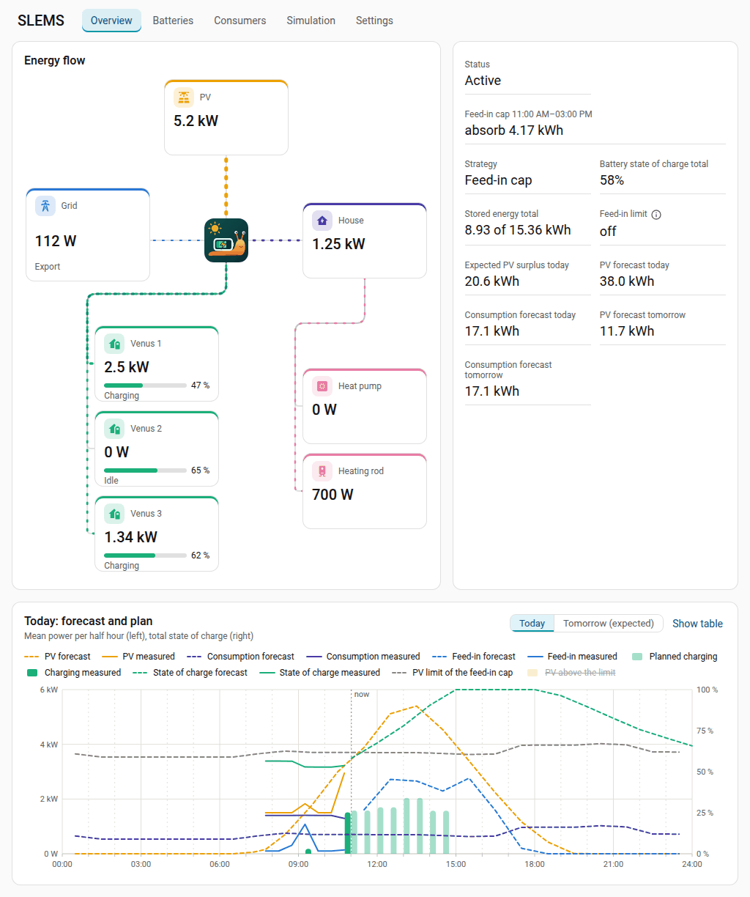
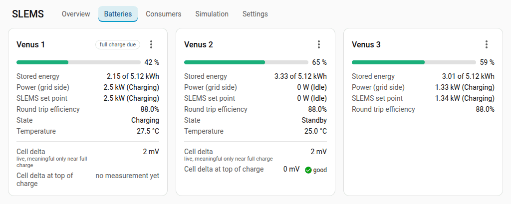
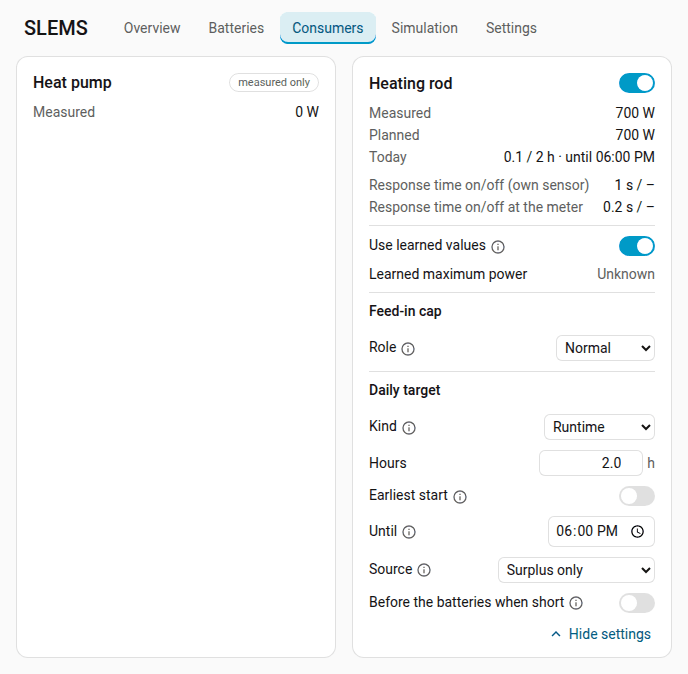
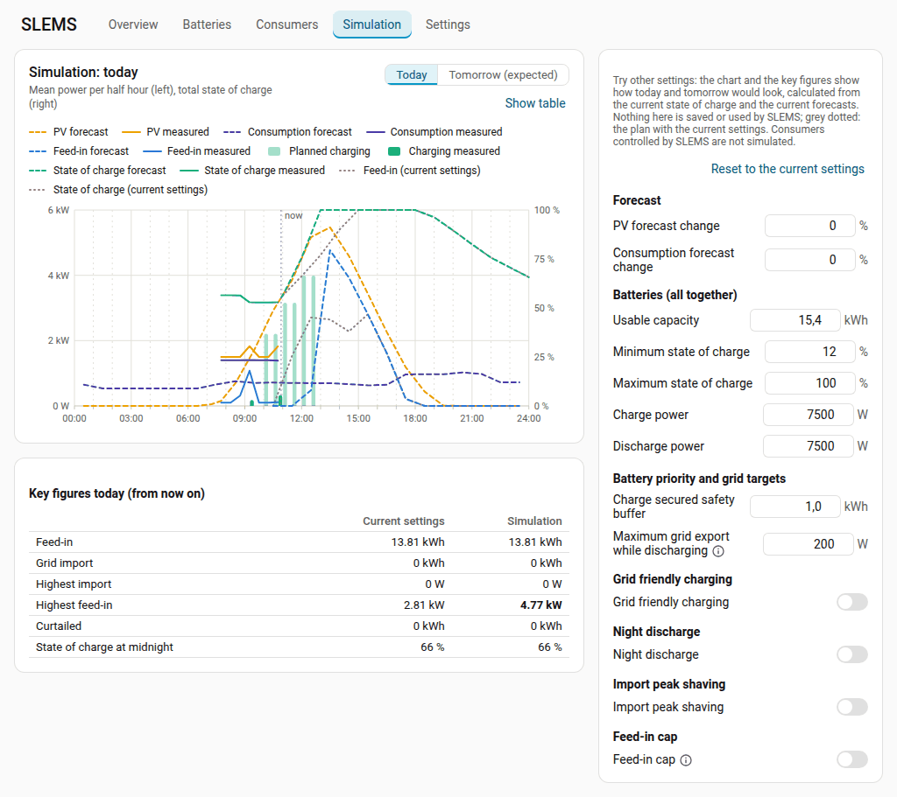
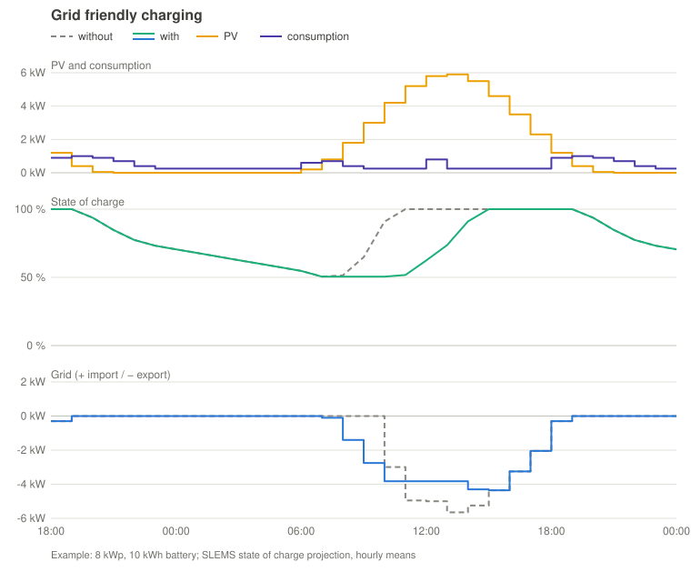
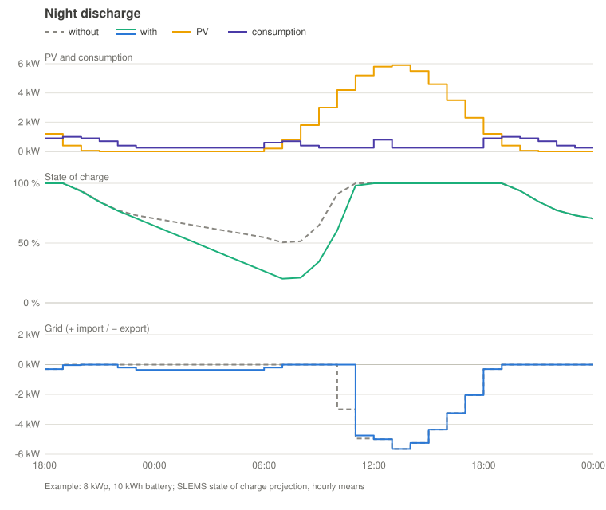
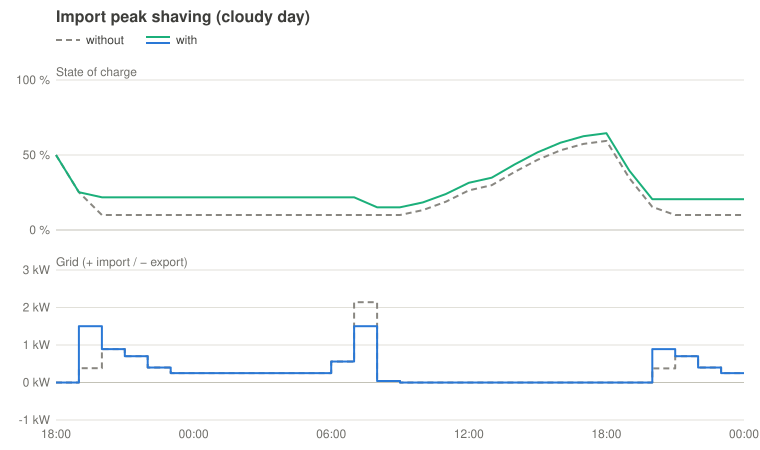
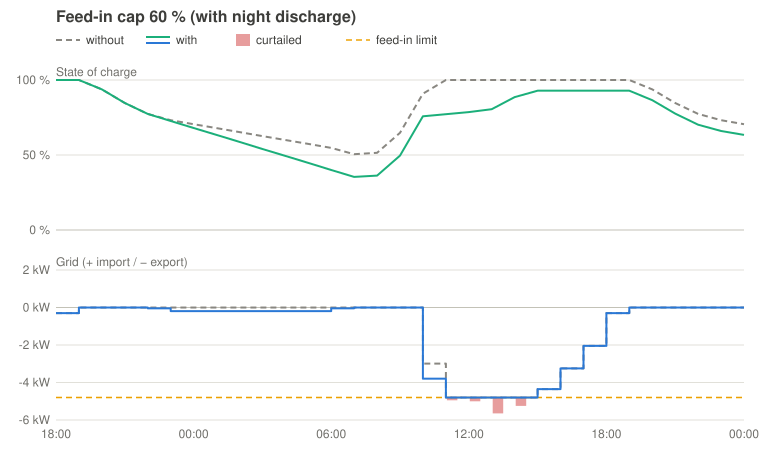

<p align="center"></p>

**English** | [Deutsch](README.de.md)

# SLEMS

SLEMS is a Home Assistant integration that manages home batteries and
controllable consumers. Its goal is to operate the batteries in a grid
friendly way, e.g. by shifting the charging time so that the daily feed-in
peak is absorbed, based on forecasts of consumption and PV production.

The name is a combination of *[Slug](https://en.wikipedia.org/wiki/Sea_slug)*
(a funny word for a very interesting animal) and *EMS* (energy management
system).



> **Supported batteries:** SLEMS currently controls the **Marstek Venus E
> 3.0** (Modbus TCP) directly. Other batteries can be added through the
> entities of their Home Assistant integration, read-only or controlled
> (experimental). If you would like to use SLEMS with another battery, please
> [open an issue](https://github.com/gojux/SLEMS/issues) with the model and
> how it is connected (Modbus, local API, Home Assistant integration), and
> whether you could test it.

## Contents

- [Why SLEMS?](#why-slems)
- [Features](#features)
- [Installation](#installation)
  - [HACS (custom repository)](#hacs-custom-repository)
  - [Manual](#manual)
- [Setup](#setup)
  - [Smart meter over Modbus (optional)](#smart-meter-over-modbus-optional)
  - [Tariffs (optional)](#tariffs-optional)
  - [PV forecast](#pv-forecast)
  - [Weather (optional)](#weather-optional)
  - [Consumption forecast](#consumption-forecast)
- [Without batteries](#without-batteries)
- [Batteries](#batteries)
  - [Distribution between batteries](#distribution-between-batteries)
  - [Battery wear costs](#battery-wear-costs)
  - [Battery efficiency](#battery-efficiency)
  - [Switching from another battery integration](#switching-from-another-battery-integration)
  - [Cell delta and active cell balancing](#cell-delta-and-active-cell-balancing)
  - [Firmware updates and battery menu](#firmware-updates-and-battery-menu)
  - [Battery limits and protection](#battery-limits-and-protection)
- [Consumers](#consumers)
  - [Current control](#current-control)
  - [Temperature sensors of the storage](#temperature-sensors-of-the-storage)
  - [Battery support](#battery-support)
  - [Role in the feed-in cap](#role-in-the-feed-in-cap)
  - [Daily target](#daily-target)
- [Dashboard](#dashboard)
  - [Overview](#overview)
  - [Batteries tab](#batteries-tab)
  - [Consumers tab](#consumers-tab)
  - [Simulation](#simulation)
  - [Settings tab](#settings-tab)
  - [Using the dashboard](#using-the-dashboard)
- [Operation and control](#operation-and-control)
  - [Operating mode](#operating-mode)
  - [Bad weather mode](#bad-weather-mode)
  - [How the control works](#how-the-control-works)
  - [Which option when?](#which-option-when)
  - [Grid friendly charging](#grid-friendly-charging)
  - [Feed-in cap](#feed-in-cap)
  - [Learned values](#learned-values)
  - [Further settings (entities)](#further-settings-entities)
  - [Problems and notifications](#problems-and-notifications)
- [Language](#language)
- [Roadmap](#roadmap)
- [Development](#development)
- [License](#license)

## Why SLEMS?

Most home battery controls react to the moment: they keep the grid power at
zero and charge whenever there is surplus. The battery is then full by late
morning, and the midday peak goes into the grid anyway. SLEMS plans ahead and
controls precisely:

- **Grid friendly instead of full by 10 o'clock.** From the PV and consumption
  forecasts SLEMS calculates a feed-in limit and charges the batteries with
  the surplus above it, so they absorb the feed-in peak and are still full in
  the evening. The limit is recalculated continuously and drops by itself when
  the day turns out worse than forecast.
- **Its own consumption forecast.** Learned from the long-term statistics of
  your house, with the weather and a separate heat pump model; vacation mode,
  night discharge to a forecast based reserve and a projection of the state of
  charge for today and tomorrow.
- **Batteries and consumers in one plan.** The surplus is distributed between
  batteries and controllable consumers (heating rod, heat pump, …) with
  priorities, battery priority until the charge is secured, minimum runtimes,
  external blocking and thermostat pauses.
- **Several batteries at their efficient point.** SLEMS learns the conversion
  losses of every battery, runs as few batteries as useful and switches
  between them with a smooth transition.
- **Precise control without oscillation.** Event driven on every report of the
  smart meter; the learned response time of the batteries is compensated and
  the control gain adapts itself.
- **Battery care and safety.** State of charge window, power limits (e.g. 800
  W), temperature charge limit, cell delta monitoring with active cell
  balancing, detection of batteries that do not respond, repair issues and
  notifications.
- **Regular full charge without losing surplus.** LFP batteries recalibrate
  their state of charge only when full. SLEMS charges the battery whose last
  full charge is the oldest first, one at a time and only with the surplus it
  would store anyway, and spares it when discharging so it starts the next day
  higher. It also recognises a full charge the BMS ends slightly below 100 %,
  and it measures the cell delta at the top.
- **Learns instead of asking.** Besides the consumption forecast, SLEMS learns
  the conversion losses and the response time of the batteries, the smart
  meter interval, the control gain and the consumption peaks; on request also
  the forecast buffers, the grid surplus targets, the control timing, the
  usable capacity of every battery and the power and thermostat behaviour of
  consumers (see *Learned values*). Every learned value can be switched back
  to a fixed one.
- **Transparent and local.** A dashboard with energy flow, forecast chart and
  all settings; everything runs locally in Home Assistant without a cloud. The
  simulation mode shows what SLEMS would do before it controls anything, also
  next to an existing battery integration.
- **Try before you change.** The simulation in the dashboard calculates the
  day plan with other settings (grid friendly charging, night discharge,
  feed-in cap, battery limits, forecasts ±%) and compares feed-in, grid import
  and state of charge with the current plan, without changing anything.
- **Also without batteries.** SLEMS can direct the PV surplus into consumers
  alone (heating rod, wallbox, dehumidifier, …), with daily targets, tariffs
  and forecasts (see [without batteries](#without-batteries)).

**When another solution fits better (today):** many different battery brands
(SLEMS talks directly only to the Marstek Venus E 3.0; other batteries are
controlled through the entities of their integration, which is coarser) or
electric vehicle charging. Omnibattery covers many battery models, evcc
specialises in EV charging; evcc complements SLEMS well (see the
[evcc guide](docs/wallbox-evcc.md)).

## Features

| Setup | Status |
|---|---|
| Any number of batteries, added/edited/removed at any time | ✅ |
| Smart meter, PV power and weather entity freely selectable | ✅ |
| Operating mode *Off / Simulation (read-only) / Active* | ✅ |
| Vacation switch | ✅ |

| Forecasts | Status |
|---|---|
| PV forecast from any solar forecast integration (Forecast.Solar, Solcast, …) | ✅ |
| Consumption forecast today/tomorrow (history + weather, heat pump temperature dependent) | ✅ |

| Batteries | Status |
|---|---|
| Marstek Venus E 3.0 via Modbus TCP | ✅ |
| Battery from existing entities: read-only (e.g. while Omnibattery is in control) or controlled by set point, charge/discharge power or script, entities suggested from the device | ✅ (control experimental) |
| Battery efficiency (battery counters, learned or manual) | ✅ |
| Distribution between batteries by efficiency, rotation with smooth transition | ✅ |
| Battery limits: minimum/maximum SoC, charge/discharge power limit (e.g. 800 W), temperature charge limit | ✅ |
| Detection of batteries that do not deliver the commanded power, confirmation of set points | ✅ |
| Cell delta and active cell balancing (Marstek Venus E 3.0) | ✅ |
| Regular full charge for the SoC calibration of LFP cells (one battery at a time, from the surplus, spared when discharging) | ✅ |

| Consumers | Status |
|---|---|
| Consumers with own power/energy sensors, inside or outside the smart meter | ✅ |
| Heat pump as consumer type (weather dependent forecast) | ✅ |
| Control of consumers: on/off or power set point, priority, minimum runtime/pause, external blocking | ✅ |
| Consumers with their own thermostat: pauses recognised, their power goes to the batteries meanwhile | ✅ |
| Temperature sensors of a storage: learned energy per degree, remaining capacity | ✅ |
| Role of a consumer in the feed-in cap (supporting, normal, never) | ✅ |
| Daily targets: runtime, enabled time, energy or temperature, with deadline and source (surplus, batteries, grid) | ✅ |
| Battery support per consumer (always, automatic with the energy the batteries can spare, never) | ✅ |
| Wallbox / evcc loadpoint: current set point in A with phases, start/stop ([guide](docs/wallbox-evcc.md)) | ✅ (not yet tested with a real wallbox) |

| Planning and control | Status |
|---|---|
| Distribution of surplus between batteries and consumers (priorities, split, minimum runtime/pause) | ✅ |
| Real-time control of batteries and consumers (operating mode *active*) | ✅ |
| Averaged grid surplus (0–300 s) | ✅ |
| Grid surplus targets for charging/discharging, maximum export while discharging | ✅ |
| Grid friendly charging: absorb PV feed-in peaks | ✅ |
| Feed-in cap: store the PV energy above a feed-in limit, make room in time | ✅ |
| Night discharge to a forecast based reserve | ✅ |
| Import peak shaving at low state of charge (manually enabled) | ✅ |

| Dashboard | Status |
|---|---|
| Dashboard (sidebar panel): energy flow, key figures, daily forecast and plan chart, batteries, consumers, settings | ✅ |
| Simulation in the dashboard: day plan with other settings compared with the current one (today or tomorrow), with the price chart | ✅ |

| Tariffs and prices | Status |
|---|---|
| Tariffs as on the bill (time windows, VAT per group, percent levies) with a check against a bill | ✅ |
| Tariff templates: Austria (grid fees of all grid areas, levies, suppliers incl. options such as a green upgrade), Germany (levies, EEG feed-in credit, grid fees of 19 grid operators incl. § 14a modules and metering), Switzerland (query of the ElCom open data); a general template for dynamic tariffs (market price plus the markup of the contract) | ✅ |
| Template updates: new prices, successor tariffs and corrections as a repair issue, reset to the template values | ✅ |
| Tariffs as YAML (import, export, own templates) with a prompt to create one from a bill with an AI | ✅ |
| Day-ahead prices per quarter hour (APG, SMARD, Energy-Charts) and official monthly market values (E-Control) only with consent; no feed-in credit at negative prices where the tariff says so (EEG) | ✅ |
| Monthly tariff comparison: import costs and feed-in credit per tariff, tariffs shown or hidden, estimated saving of the price aware control | ✅ |
| Price aware control: stored energy kept for the expensive hours, grid part of daily targets in the cheapest window, optional charging from the grid and feeding in from the batteries | ✅ |

## Installation

### HACS (custom repository)

[](https://my.home-assistant.io/redirect/hacs_repository/?owner=gojux&repository=SLEMS&category=integration)

The button opens SLEMS in HACS of your Home Assistant instance and adds the
custom repository; then continue with step 2. Or by hand:

1. HACS → ⋮ → *Custom repositories* → add `https://github.com/gojux/SLEMS`,
   type *Integration*.
2. Install *SLEMS* and restart Home Assistant.

### Manual

Copy `custom_components/slems` into the `custom_components` folder of your
Home Assistant configuration and restart Home Assistant.

Requires Home Assistant 2026.9 or newer.

## Setup

1. *Settings → Devices & services → Add integration → SLEMS*.
2. Select the grid power entity of your smart meter (positive = import,
   negative = export; enable *invert* if your meter uses the opposite sign),
   optionally PV power, PV forecast and weather.
3. On the SLEMS integration page choose **Add battery** for every battery and
   **Add consumer** for every consumer you want to measure or control.

### Smart meter over Modbus (optional)

The entity of the smart meter is updated once per polling cycle of its
integration, often only about once per second, and then shows only a part of
the meter's values. With *Also read the smart meter over Modbus* SLEMS reads
the grid power directly from a SunSpec meter, e.g. the meter at a SolarEdge
inverter, every 0.5 seconds (0.2 to 5 s). The control sees every value
sooner; the gain is largest with fast batteries.

- SLEMS uses the shared Modbus connection of Home Assistant. As long as the
  inverter integration keeps the inverter's only Modbus TCP connection to
  itself (e.g. SolarEdge Modbus Multi), enter a Modbus proxy in front of the
  inverter as host. If the inverter integration shares its connection one
  day, the inverter itself can be entered and the proxy is no longer needed.
- SLEMS finds the meters in the SunSpec model chain; with several meters
  (e.g. export+import and consumption) you choose the one at the grid
  connection point, the current power of each helps to recognise it.
- The sign is found automatically by comparing a few values with the grid
  power entity; this needs some import or export (at least 100 W). Otherwise
  choose it by hand.
- The entity stays required: it is the history, the basis of the forecasts
  and the fallback. While no Modbus value is newer than 3 intervals (at least
  5 seconds), SLEMS uses the entity; after 5 minutes without Modbus a repair
  issue appears. The sensor *Smart meter update interval* shows the source as
  attribute `source`.
- When the source is switched, the learned battery response times start
  again, since they contain the delay of the old source.

### Tariffs (optional)

With *Add tariff* on the SLEMS integration page you enter your electricity
tariff the way your bill shows it; the values stay in your Home Assistant.
Prices are in the currency set in Home Assistant under *Settings → System →
General* (hundredths per kWh, e.g. ct or Rp., and whole amounts per year);
market prices come in euro.

1. Name, role (*current tariff* or *comparison tariff*) and VAT: for the
   consumption bill, for the feed-in energy (often 0 % for private PV) and for
   the other feed-in items. Separate contracts for import and feed-in: add
   both as *current tariff*, they count together as one. A comparison tariff
   with items for only one side (e.g. a dynamic supply tariff) takes the other
   side from the current tariffs, so the comparison always shows total costs.
2. The lines of the bill one by one: name, side (*consumption* or
   *feed-in*), group (*energy*, *grid*, *levies*) and the net price (without
   VAT; SLEMS adds the VAT of step 1) in ct/kWh or €/year (charged per day; a
   discount is negative). If the bill only shows gross prices, enter those and
   set the VAT to 0 %. Optionally only in some
   months, on some weekdays or in a time window of the day, e.g. a cheaper
   grid price at noon in summer: a line with a window replaces the line of the
   same name in its window. A price change is the same line again with
   *valid from*. On the feed-in side the energy price is your credit.
3. *Check against a bill*: enter its period and amounts; SLEMS computes the
   period with the tariff and your recorded grid import and export and shows
   both amounts and the deviation, per side and group.

**Import and export as YAML.** Instead of entering the lines, *Add tariff →
Paste YAML* takes a tariff file (format `slems-tariff` with a version
number; prices net, plus optional supplier, validity from/to and source).
*Export as YAML* in the menu of the lines shows a tariff as such a file, e.g.
to save it or to use it in another SLEMS. An AI can turn a bill into such a
file: [prompt and instructions](docs/tariff-prompt.md). A file of a newer
format version is refused with a hint to update SLEMS; older versions are
converted.

**Templates.** *Add tariff → From templates* offers tariffs with public list
prices, per country and part of the bill: the energy of a supplier, the grid
fees of a grid area, the levies. First choose the energy tariff; the grid
tariff usually combined with it (households) and the levies of the country
are then preselected, each with the prices in effect today, and SLEMS
combines them into one tariff (then compare it with a bill). The result is
an ordinary tariff you can edit; later changes of a template do not touch
it. Options of a price sheet (e.g. an upgrade to certified green electricity,
a bonus for an online bill, the metering of the feed-in direction) are chosen
in an extra step. A feed-in tariff of its own is a template of its own, added
as a separate current tariff (SLEMS counts all current tariffs as one
contract). It remembers its templates, though: when an update of SLEMS (or an own
template) brings newer prices or a successor tariff, a repair issue tells
you, as it does when a current tariff is past its end. *Update to the new
prices* in the menu of the lines takes them over (with several successors you
choose one, or none): the current lines end the day before, the new ones
apply from then on, the old prices stay for the past and own lines stay as
they are. A corrected template (e.g. a misplaced decimal point, same dates)
is offered the same way: the values are corrected in place, also for the
past, lines you changed yourself stay. *Reset to the template values* undoes
your own changes of the template lines. Own templates: YAML files in
the folder `slems_tariff_templates` of your Home Assistant configuration.
Suggest a template for everyone as an
[issue](https://github.com/gojux/SLEMS/issues) with the source of the
prices. Switzerland: *Add tariff → From ElCom* queries the open data of
ElCom (ld.admin.ch) for the tariff of your municipality and consumption
category (energy, grid and levies, excluding VAT, as the mean of the
category; high and low tariff times are averaged); the next year, published
in September, is offered as new prices, in the background only with
*Fetch market prices* switched on. Austria: the grid fees of every grid area (network level 7, from the
grid fee ordinance, with the reduced price from April to September 10–16 h)
and the federal levies; the metering fee is entered at its legal maximum
(your grid operator may charge less) and municipal levies (e.g. the
Gebrauchsabgabe in Vienna) are not included. Austria and Germany: a general
template *Dynamic tariff* (energy at the day-ahead price per quarter hour);
enter the markup and the monthly fee of your contract afterwards in its
lines, as suppliers of dynamic tariffs mostly publish them only per postcode.
Germany: the federal levies
(electricity tax, surcharges and the concession levy by the size of the
municipality, at its legal maximum), the grid fees of the largest grid
operators (Westnetz, Bayernwerk, E.DIS, Avacon, Netze BW, Schleswig-Holstein
Netz, Stromnetz Berlin, Hamburger Energienetze, EWE NETZ, N-ERGIE Netz, SWM
Infrastruktur, RheinNetz, enercity Netz, Thüringer Energienetze, Netze ODR,
LEW Verteilnetz, Westfalen Weser Netz, Syna, Mainnetz; also with § 14a module 1 and
module 1 + 3 with time variable prices for controllable devices; metering as
an option at its legal maximum by meter type and consumption) and
the EEG feed-in credit of PV plants up
to 10 kWp per commissioning period; for plants commissioned since 25 February
2025 the credit is 0 while the day-ahead price is negative (*Fetch market
prices* needed). A line can have *Zero at negative market prices* for this. A line may also be a *percent of the group* (e.g. a municipal levy of
7 % on the energy).

Where the energy comes from: SLEMS records grid import and feed-in per
quarter hour itself from every grid value (kept for 400 days), so import and
feed-in within an hour do not cancel out and dynamic prices apply per quarter
hour. For exact totals choose the energy counters of your smart meter
(*Grid import energy (counter)* / *Grid export energy (counter)*) in the SLEMS
options: the recorded quarter hours are then scaled to the counter of each
hour. Hours before the recording use the counters, without counters the
hourly mean of the grid power (less exact).

**Dynamic tariffs and market prices.** A line can also follow the day-ahead
market: *spot price (hourly)* or *monthly market price*, each as market price
× (1 + share in %) + price in ct/kWh, e.g. "spot × 1.05 + 1.2 ct" or
"monthly market price − 0.5 ct" for the feed-in. Published monthly market
prices can be entered per month (e.g. "2026-08: 7.1"); months without a value
use the mean of the spot prices weighted by your feed-in. If the price
follows an official monthly value, choose it as the line's *Monthly value*
(Austria: the reference market value for PV, wind or hydro published by
E-Control according to § 13 EAG); SLEMS then fetches it with the market
prices, the weighted mean stands in until it is published.

SLEMS only fetches market prices from the internet once you switch on
*Fetch market prices* (off by default). *Price source* selects where from:
APG (Austria), SMARD of the Bundesnetzagentur (Germany/Luxembourg) or
Energy-Charts of Fraunhofer ISE (both zones); the default follows the country
set in Home Assistant. SLEMS then loads the last 12 months once, stores them
locally and fetches the next day after the day-ahead auction (from 13:00).
The sensor *Market price* shows the price of the current quarter hour in
ct/kWh without fees and VAT, with the source as attribution.

**Price aware control** (switch, off by default; needs a tariff): if the
stored energy does not last for every hour until PV refills the batteries,
they cover the hours with the highest import price of the current tariff and
keep their energy in hours that are cheaper by at least the *minimum gain*
(default 2 ct/kWh); there the house draws from the grid. The grid import
stays the same, it only moves to cheaper hours – no charging from the grid
and no feed-in from the batteries. Any time dependent price counts: market
prices or time windows of a fixed tariff. Import peak shaving still applies.
The strategy shows *Price hold* with the hours concerned, the day chart and
the simulation include it. The price plans work in quarter hours (market
prices change every quarter hour): the hourly consumption forecast is spread
evenly over its quarters, PV comes from the forecast; the day chart shows
their hourly means. Daily targets with the source *+ grid*: if the
forecast surplus is short for them anyway, the forced run starts in the
window with the lowest mean import price before the deadline (cheaper by at
least the minimum gain than at the latest start); the consumer card shows
*from … in the cheapest window*.

**Estimated prices**: the day-ahead prices of the next day are published
around 13:00. For the quarter hours after the last known price the price aware
control plans with estimates: per time of day the median of the last 14 days
of the same kind (working day or weekend), its swing around the mean of the
day halved as a safety margin. So the night and a cloudy next day are planned
before the real prices are known; a new plan follows as soon as they are.
Only known negative prices start the plan for negative prices. The price
chart shows the estimates faint.

**Charge batteries from the grid** (switch, off by default; only with price
aware control): in a deficit SLEMS plans until PV refills the batteries (after
the last known price with the estimated ones) which hours the batteries cover, which they
hold and in which they charge from the grid. A charge must pay after the
charge and discharge losses, the [wear costs](#battery-wear-costs) and the
minimum gain; of equal plans the later charge wins, as home storage ages
mostly with time at a high state of charge. Limits: *Highest state of charge
from the grid* (default 90 %), *Highest grid charge power* (0 = the charge
power of the batteries), the import limit of peak shaving and the space the
feed-in cap needs when PV takes over. With a surplus nothing is charged from
the grid. The plan includes the price hold; the strategy shows *Grid charging* with the energy, the
start and the expected saving, the day chart the planned charging.

**Negative prices**: with price aware control and a negative import price or
feed-in credit within the known prices, the plan also covers the surplus
hours: the batteries keep room for the PV surplus of the negative hours (they
take only part of the surplus before and feed in the rest at a positive
price; strategy *Room for cheaper hours*) and, with *Charge batteries from
the grid*, also charge from the grid when the import price including all fees
is negative. Your own PV surplus is taken first. *Highest grid import while
charging from the grid* (0 = no limit, e.g. for the main fuse) and the import
limit of peak shaving cap the import. This only matters with a credit or an
import price that follows the market price per hour.

**Feed in from the batteries** (switch, off by default; only with price
aware control): the same plan may feed in from the batteries beyond the
house's need when the credit of the hour is higher than what the energy is
worth later plus the minimum gain – accepting grid import later. Not below
the morning reserve, at most the maximum grid export while discharging and
the feed-in cap. This only pays with a feed-in credit that follows the market
price per hour; with a fixed or monthly credit the strategy says the option
has no effect. Check your contract and any subsidy first: some do not allow
feeding in energy that was charged from the grid.

**Measured saving**: the sensor *Saving price control* adds up per month what
the price aware control saved: after every night (or other run until PV takes
over) in which it held, charged or fed in, SLEMS compares the recorded costs
with the same hours played *as usual* through the battery model, starting from
the measured state of charge. Nights without such an action count nothing.
The tariff comparison shows the value next to the estimate.

### PV forecast

Every integration that provides a solar forecast for the Home Assistant energy
dashboard can be selected, e.g. Forecast.Solar or Solcast. Several entries
(e.g. one Forecast.Solar entry per roof plane) are summed up. SLEMS uses the
finest resolution the provider delivers (e.g. 15 or 30 minutes).
Forecast.Solar marks each period by its end; SLEMS takes this into account.

**Recommendation: [Helios Forecast](https://github.com/ReikanYsora/Helios-Forecast)**
(open source, no account or API key, computed locally with weather data from
Open-Meteo). It learns from the production of your own PV system, including
shading by trees or mountains, soiling and an orientation that is a few
degrees off, and uses the existing long-term statistics of your energy sensor
right away. It provides a forecast for the energy dashboard in 15 minute
steps, so it can be selected in SLEMS directly.

### Weather (optional)

The weather entity improves the consumption forecast, especially for a heat
pump. Recommendations for Vorarlberg / the Alpine region:

- **GeoSphere Austria AROME**: high resolution model of the Austrian weather
  service, well suited for alpine valleys. Available in Home Assistant through
  custom integrations such as [GeoSphere Austria
  Plus](https://github.com/coding-pagro/GeoSphere-Austria-Plus) or [GeoSphere
  Austria Next](https://github.com/slettmayer/ha-geosphere-next) (HACS). The
  built-in *GeoSphere Austria* integration only provides station measurements,
  no forecast.
- **Open-Meteo** (built-in integration): no account needed, combines several
  weather models.
- **Met.no** (Home Assistant default): works everywhere, less detailed in
  alpine terrain.

### Consumption forecast

SLEMS learns the consumption from the long-term statistics of Home Assistant
and forecasts today and tomorrow hourly. Recent days count more than older
ones, so changes are followed within days. Heat pumps are forecast from the
outdoor temperature of the day, so a warm day in the heating season
immediately predicts less heating energy. Two optional settings help at the
start:

- **Outdoor temperature**: a temperature sensor with history. Without it,
  SLEMS records the temperature of the weather entity itself; the heat pump
  model then needs about a week before it uses the temperature.
- **House consumption history**: a power sensor of the house consumption with
  existing history (e.g. from another battery integration), used for the time
  before SLEMS recorded its own values.

Recommended setup when switching from another battery integration:

1. Select that integration's house consumption sensor as *House consumption
   history*. SLEMS then learns from the full history right away. Without it,
   SLEMS derives the history from grid and PV only; the battery power before
   SLEMS is unknown, so charging and discharging would distort the learned
   consumption.
2. Select an outdoor temperature sensor with history if one exists. Otherwise
   the heat pump forecast uses the mean of the last days until SLEMS has
   recorded about a week of temperatures.
3. Holidays are currently treated like workdays.

**Forecast accuracy** (card in the overview, sensors *Consumption forecast
accuracy* and *PV forecast accuracy*):

- Consumption: SLEMS recalculates the forecast of each of the last 14 days as
  it would have been made at midnight, with the history up to then, and
  compares it with the measured consumption. Shown are the accuracy of the
  daily energy (100 % minus the mean deviation), the tendency (too high or too
  low), the deviation per hour (how well the course of the day is hit), the
  data basis (days of consumption, days of heat pump data with temperature)
  and tomorrow's forecast with its expected deviation. The heat pump is
  recalculated with the measured temperature of the day, so its share looks
  somewhat better than it was.
- PV: past forecasts are not available from the solar forecast integration, so
  SLEMS records the forecast of each day at its start and compares it with the
  production in the evening. The card shows accuracy and expected deviation
  from 7 compared days on (before: *collecting data*), because a few days say
  little.

The sensor *House consumption* (used for the forecast and shown in the energy
flow) is calculated as grid + PV − batteries. The smart meter often reports a
change later than PV and batteries; a momentarily negative result is therefore
replaced by the last valid value (for at most 30 seconds, then unknown).

## Without batteries

SLEMS also works without any battery: add the consumers only.

- **Works**: directing the PV surplus into controlled consumers (heating rod,
  wallbox also with evcc, dehumidifier, heat pump through a switch input) with
  priorities, minimum runtime and pause, *Avoid short runs* and external
  blocking; daily targets with the sources *surplus only* and *+ grid* (also
  in the cheapest window with price aware control); tariffs, bill check,
  market prices, tariff comparison and price chart; energy flow, consumption
  and PV forecast with their accuracy.
- **Not without batteries**: everything that charges, discharges or plans a
  battery – grid friendly charging, night discharge, import peak shaving,
  price hold, charging from the grid, feeding in from the batteries – and
  currently the feed-in cap (it needs a battery even with supporting
  consumers).

## Batteries

- **Marstek Venus E 3.0**: host/IP, port (502) and Modbus unit ID. The battery
  accepts only **one** Modbus TCP connection. Never let two integrations (e.g.
  SLEMS and Omnibattery) talk to the same battery at the same time. Its sensor
  *AC power* is positive when discharging and negative when charging, as the
  Home Assistant energy dashboard expects for battery power.

  **Remote control**: the Venus only follows set points while its remote
  control is on; Marstek's register list calls it *RS485 control mode*.
  Despite the name it does not need an RS485 cable: SLEMS controls the Venus
  over the LAN (Modbus TCP) and switches the remote control on and off
  itself; there is nothing to set up.

  **Search**: when adding a Venus, SLEMS first searches the network of Home
  Assistant for batteries (TCP port 502, then a test read of the state of
  charge; a few seconds) and offers the ones found; batteries already added
  are left out. A battery whose single Modbus connection is held by another
  integration cannot be found.

  **Finding the IP address**: Modbus TCP is only available on the **LAN port**
  of the battery (connect it with a network cable), not over Wi‑Fi. The
  Marstek app does not show the LAN IP address; look it up in your router /
  internet gateway / DHCP server (list of connected devices). Give the battery
  a fixed address there (DHCP reservation), so it does not change later.
  Alternatively scan your network for devices with the Modbus port open, e.g.
  with [nmap](https://nmap.org) (adjust the network to yours):

  ```bash
  nmap -p 502 --open 192.168.0.0/24
  ```

  Every address listed with `502/tcp open` is a Modbus TCP device (nmap shows
  the MAC address when run with `sudo` in the same network, which helps to
  tell several batteries apart). When adding the battery, SLEMS checks the
  connection by reading its state of charge; stop other integrations using the
  battery first.
- **Existing Home Assistant entities** (control: experimental): any battery
  that another integration brings into Home Assistant. First choose the
  battery's device: SLEMS suggests its entities (state of charge, power, set
  points, mode, optional temperature, cell voltages and energy counters);
  check and correct them. Leave the device empty to choose everything by hand.
  - **Read only**: SLEMS never sends commands, e.g. to run SLEMS in simulation
    mode side by side with an existing battery integration.
  - **Set point**: one number entity with the signed power (+charge /
    −discharge, sign can be inverted).
  - **Separate charge and discharge power**: one number each, optionally a
    mode select (charge / discharge / standby / automatic, the options are
    assigned in the next step).
  - **Script**: a script of yours receives the power as variable `power_w` (W,
    +charge / −discharge, 0 = standby); optionally a release script. This
    covers batteries controlled through actions (services). SLEMS waits until
    the script is done (at most 10 seconds) so its errors are noticed; keep
    it short (no waits).

  Optionally a *remote control* switch or select (e.g. *Manual battery
  control* of Omnibattery) is switched on before the first set point and off
  when SLEMS releases the battery to *Automatic*, so it controls itself again;
  leave it empty if you switch it yourself. For controlling, the battery power sensor is required.
  *Minimum time between commands* suits integrations with a rate limit (often
  cloud based), *Repeat set point every* batteries that fall back to their own
  logic without new commands. Switch off the battery's own control (e.g. its
  zero export) in its integration, otherwise both control at the same time.

  **Response time**: from a set point until the smart meter shows it, the
  path adds up: the integration writing the command (often in its own
  polling cycle, behind a cloud also with a rate limit), the battery itself
  and the smart meter's update interval. SLEMS learns the response time per
  battery (*Details* of the battery). Measured on one installation with the
  same Marstek Venus E 3.0 and the smart meter read over Modbus every 0.5 s:
  about 0.7–1.3 s directly over Modbus, about 4 s through Omnibattery
  (entities); batteries behind a cloud are usually slower still. A slower
  battery means more grid exchange after load changes and a coarser control;
  together with faster batteries, those take the changes first (see
  [distribution between batteries](#distribution-between-batteries)).
  With cell voltages SLEMS uses gentle charging near the top, the cell delta
  and cell balancing as for a Venus (LFP cells). This control has been tested
  with simulated entities and with a Marstek Venus E 3.0 through Omnibattery;
  please report your experience with other devices in an
  [issue](https://github.com/gojux/SLEMS/issues).

  **Directly or through another integration?** Where SLEMS supports a battery
  directly (Marstek Venus E 3.0 over Modbus), that is the better choice: it
  reacts faster, has fewer parts in between and gives SLEMS more data (cell
  voltages, counters, firmware, OTA state). Through another integration makes
  sense if the battery is not supported directly, if that integration must
  keep the battery's only Modbus connection, or if no network cable reaches
  it. The difference matters most with fast load changes (cooking, kettle).

  **Another battery model?** If you would like SLEMS to support a model
  directly, please open an [issue](https://github.com/gojux/SLEMS/issues) with
  manufacturer and model, interface (Modbus TCP/RTU, local API, cloud only),
  a register list or API documentation if available, and the Home Assistant
  integration that exists for it.

  **Example: a battery through Omnibattery.** For a battery model SLEMS does
  not support directly, [Omnibattery](https://github.com/ffunes/Omnibattery)
  can do the communication and SLEMS the control:
  1. In Omnibattery switch on *Manual battery control* for the battery, so its
     own control stops.
  2. In SLEMS add the battery as *Existing Home Assistant entities* and choose
     the Omnibattery device. SLEMS suggests the entities (state of charge,
     power, charge and discharge power, operating mode, cell voltages,
     counters); check them.
  3. Switch off automations that control the battery, so only SLEMS sends
     set points.

**State when released**: what SLEMS leaves the battery in when it stops
controlling it, e.g. in operating mode *Off*, without smart meter values or
when the battery is removed from SLEMS. *Automatic* (default): the battery's
own logic takes over again (e.g. its zero export); for a battery from entities
this needs a remote control entity, a mode option for automatic or a release
script. *Standby*: the battery stays idle at 0 W until something else takes it
over; a Venus keeps its remote control on for this.

### Distribution between batteries

With several batteries SLEMS decides how many run and which: at low power a
single battery is usually more efficient, at high power sharing is. When
discharging the battery with the highest state of charge runs, when charging
the one with the lowest. If the running battery drifts more than *Battery
rotation threshold* (default 5 %) away from the best inactive one, SLEMS
switches, at most once per *Battery rotation minimum interval* (default 15
min) and with a smooth transition: the power moves with *Battery rotation ramp
rate* (default 100 W/s), but never takes longer than *Battery rotation maximum
ramp time* (default 30 s). The conversion losses per power level are learned
from the battery's AC and DC power.

Batteries that react at clearly different speeds (learned response times,
the slowest at least twice and 3 s slower than the fastest, e.g. a Venus over
Modbus next to a battery over a cloud integration): changes of the total
power go to the fastest battery first and then move over to the efficient
split with the response time of the slower ones. No battery works against the
direction of the total.

Every battery has an *Enabled* switch. A disabled battery is still measured
(its power is part of the energy balance), but it is neither planned with nor
controlled, and it does not count towards the total state of charge. If it is
discharging in active mode, the other batteries take over within 5 seconds
before it is handed back to its own logic.

### Battery wear costs

Optional in the battery configuration: purchase price and rated cycles
(manufacturer). From them SLEMS computes the wear costs per kWh stored and
delivered again: price ÷ (cycles × usable capacity), e.g. 1200 € ÷ (6000 ×
5 kWh) = 4 ct/kWh. Price aware actions that cost an extra cycle (charging
from the grid) only happen if they earn more than that. A price of 0 means no
wear costs: field measurements of home storage systems show that they age
mostly with time, temperature and state of charge and often reach their end
of life before their rated cycles. Without the values SLEMS assumes a low
estimate of 1 ct/kWh; *Details* of the battery then say so. The sensor *Wear costs*
shows the value.

### Battery efficiency

Round trip efficiency (AC to AC), one of three sources per battery:

- *Battery counters* (recommended for the Marstek Venus E 3.0 and for
  batteries from entities with energy counters): from the lifetime charge and
  discharge counters of the battery and its state of charge: (discharged +
  stored) / charged. The battery counts itself, fast and over its whole
  operating time, so the value is accurate at once and stable. The only
  assumption is an empty battery at the start of the counters; its influence
  disappears after a few cycles.
- *Learned*: SLEMS adds up the measured battery power itself (every 5 seconds)
  from the start of SLEMS. It only counts after about three full charge cycles
  (until then the start value applies), and short power peaks between two
  polls are missed. Recommended for batteries without their own counters.
- *Manual*: a fixed value, e.g. from the data sheet.

The efficiency is used where energy is converted: whether the PV surplus will
fill the batteries (charge secured), grid friendly charging, the night
discharge and the state of charge projection. It is **not** used to decide how
many batteries run: for that SLEMS learns a separate loss curve per battery
from the difference of AC and DC power at every power level (fixed loss of a
running inverter plus losses rising with the power). From it the distribution
calculates the number of batteries with the lowest total loss: at low power
one battery, above the break-even point several (see *Distribution between batteries*). This
works with every efficiency source, but only for batteries that report AC and
DC power (Marstek Venus E 3.0).

### Switching from another battery integration

When SLEMS takes over a battery from another integration (e.g. Omnibattery),
the history of the old sensors (e.g. the charged and discharged energy used in
the energy dashboard) can be carried over to the SLEMS sensors with [HA Merge
Sensor History](https://github.com/mayerwin/HA-Merge-Sensor-History). It
copies states and long-term statistics, so the running totals of the energy
dashboard continue.

- Make a full backup of Home Assistant first; the tool writes directly into
  the database.
- Check the preview: the counters of the Venus (registers 33000/33002) have
  the same value in both integrations, so the total continues without a jump.
- Compare the sign of power sensors: the SLEMS *AC power* is positive when
  discharging.
- Afterwards replace the old sensors in the energy dashboard with the SLEMS
  sensors and delete the old entities once everything looks right.

### Cell delta and active cell balancing

For batteries that report their cell voltages (Marstek Venus E 3.0), SLEMS
shows the *Cell delta* (highest minus lowest cell voltage). With LFP cells the
live value is only meaningful near full charge: in the middle of the charge
the voltage curve is so flat that unequal cells show almost the same voltage.
SLEMS therefore records the *Cell delta at top of charge*: after the highest
cell reached 3.60 V or the BMS ended the charge at 100 %, and the battery then
rested for 60 seconds (standby, including the about 13 W a Venus draws
itself). It is measured once per charge: while the battery stands full the
cells relax and the delta keeps falling without the balance getting better, so
the next measurement follows only after the battery was discharged out of the
top range (highest cell below 3.49 V); after a restart of SLEMS, too. The
curve is steep there; Marstek cells typically show about 180 mV from the
factory, which is normal. Status: below 200 mV good, below 230 mV minor, below
250 mV moderate, otherwise high imbalance. From 230 mV the dashboard
recommends active cell balancing.

Active cell balancing (switch *Active cell balancing*, or the button in the
dashboard) follows the Omnibattery balancing blueprint. It can only be started
in operating mode *active*:

1. If the battery is discharging, it first hands over smoothly (as when it is
   disabled). It then leaves the normal planning; the other batteries take
   over.
2. It charges until the highest cell reaches 3.49 V, with the PV surplus
   (before the other batteries), at least 95 W. Without enough surplus the
   other batteries discharge to cover the 95 W.
3. It charges with 95 W until the highest cell reaches 3.60 V, stands by for
   60 seconds and measures the cell delta.
4. Otherwise it discharges with 200 W to the retry voltage (3.49 V) and
   repeats from step 3. If the BMS refuses to charge (less than 30 W instead
   of 95 W, e.g. because it reports full at about 3.55 V), it does not measure
   (the delta below 3.60 V is smaller and not comparable), discharges to the
   retry voltage (3.49 V, or 10 mV below the voltage it refused at) and tries
   again.
5. It discharges with 200 W to 3.48 V and ends when the delta is in the normal
   range (at most 190 mV), when it has not fallen by 2 mV for 6 hours, or
   after 24 hours.

The BMS bleeds the high cells passively, only a few mV per day; a run lowers
a large delta step by step but does not reach the 0 mV of a lab charger. If
the last measurement is already in the normal range, the dashboard says so
before the start.

The discharge of the balancing battery is fed into the grid; the other
batteries do not store it (they keep charging only if they charge anyway). Its
expected charge is taken into account in the expected PV surplus and in grid
friendly charging. It stops with an error if the battery cannot be read or the
final discharge has not finished 2 hours after the 24 hours; it pauses outside operating mode *active* and
continues after a restart of Home Assistant. When it ends, the battery is
handed back to its own logic and then returns to the normal planning. The
sensor *Cell balancing phase* shows the phase and the result of the last run.

### Firmware updates and battery menu

During a firmware update of a Marstek battery there must be no Modbus
communication at all. The menu (⋮) of a battery card offers *Pause
communication (firmware update)*: SLEMS hands the battery back to its own
logic, closes the connection and does not read or send anything for the
*Communication pause duration* (default 20 minutes; switch *Communication
paused*). Afterwards it reconnects by itself; *Resume* ends the pause earlier,
*Extend pause* adds the pause duration to a running pause (as does switching
*Communication paused* on again, e.g. in an automation).
Meanwhile the battery is treated like a disabled one. If the battery itself
reports a running firmware update (state *OTA update*), SLEMS pauses
automatically; as this is only noticed with the next poll, pause manually
before an update.

The same menu enables or disables the battery, starts or cancels the cell
balancing and opens *Details*: model, device name, firmware versions (EMS,
VMS, BMS, communication module; sensor *Firmware*), MAC address, capacity,
charge cycles, the total charged and discharged energy, the last full charge
and when the cell delta was last measured. *Open device in Home Assistant*
leads to the device page of the battery with all its entities.

The last full charge (sensor *Last full charge*) is the moment the battery
last reached the top: the highest cell at the charge stop voltage, the SoC the
BMS reports when full, or the BMS ending the charge near the top (it takes
nothing for 2 minutes although SLEMS commands at least 100 W, from 98 % or
3.45 V on), also if it was discharged again right away. A new full charge
counts once the battery has left the top (highest cell below 3.40 V, without
cell voltages below 97 %). LFP batteries recalibrate their state of charge
only when full, so it should happen regularly.

**Regular full charge** (settings group of the same name, on by default): a
battery not full for longer than *Full charge at the latest every* (default 7
days), or never full since SLEMS records it, is charged first until it was
full once. Only one battery at a time, the one whose last full charge is the
oldest (never full first, then by name). The split between batteries and
consumers does not change; the battery only gets the charge power before the
other batteries. For this it may exceed its maximum SoC once; afterwards the
limit applies again. If it does not get full for lack of PV, it stays first
the next days. When discharging it is spared while all other batteries have
more than 50 % and can deliver the power, so it starts the next day higher.
Once full it rests 90 seconds, so the cell delta at the top is measured. Its
card shows *full charge due* meanwhile; after 14 days without a full charge
the overview names the battery.

### Battery limits and protection

Every controllable battery has these settings (dashboard: *Settings*):

- *Minimum state of charge* (default 12 %) and *Maximum state of charge*
  (default 100 %): SLEMS does not discharge at or below the minimum and does
  not charge at or above the maximum (with 100 % the BMS ends the charge).
  After reaching a limit the battery is used again 2 % away from it, because
  the resting SoC rebounds after a load. The maximum counts as "full" for grid
  friendly charging, the charge secured check and the projection; the minimum
  is the lowest target of the night discharge. Active cell balancing ignores
  the SoC window (it needs the top of the charge).
- *Charge power limit* and *Discharge power limit* (default: the maximum of
  the battery), e.g. 800 W for a plug-in system.

*Temperature charge limit* (off by default, after Omnibattery) limits the
charge power by the battery temperature: above *Charge derating temperature*
(40 °C) it decreases linearly across *Charge derating range* (10 °C) down to
*Charge power at high temperature* (40 %); at or below *Minimum charging
temperature* (0 °C) there is no charging, and within 5 °C above it the power
rises to full again. The Venus reports its internal temperature, not the cell
temperature; the BMS keeps its own protection. The sensors *Allowed charge
power* and *Allowed discharge power* show the current limit and its reason.

Near the top of the charge SLEMS charges gently (always, after Omnibattery's
full charge voltage taper): once the highest cell reaches 3.48 V a battery
charges with at most 200 W until the cell falls below 3.44 V again. At a low
current the BMS balances the cells passively before the highest cell ends the
charge, so the batteries get really full with a smaller cell delta, and the
cells see less voltage peak and heat. It only affects the last one or two
percent; the surplus meanwhile goes to the other batteries or the consumers.
The sensor *Allowed charge power* has the reason `top`; batteries without cell
voltages are not limited.

In operating mode *active* SLEMS checks, like Omnibattery, whether every
battery delivers the commanded power. A battery that delivers less than 10 %
of a command of at least 100 W (after 30 s in that direction) three polls in a
row first gets all control registers written again; if that does not help, it
is excluded for 5 minutes (like a disabled battery, handed back to its own
logic, the others take over) and then retried. A full battery that stops
charging or a battery at 20 % or less that stops discharging does not count
(the BMS protects it). The Venus also reads its control registers back after
every complete write (first command and every 60 s); a write that is not
confirmed counts as well. The binary sensor *Not responding* and the dashboard
show an excluded battery.

## Consumers

Every consumer needs its own power **and** energy sensor.

Which consumers to add: the ones SLEMS controls (heating rod, wallbox,
dehumidifier, …) and heat pumps (their consumption is forecast from the
weather). Adding other devices only to measure them, e.g. a washing machine or
a dishwasher, currently does not improve the planning: their consumption is
already part of the house consumption, and its forecast (a profile per weekday
and hour) contains their average use. They only get their own card and box in
the energy flow.

- **Included in smart meter**: enable if the consumer is behind the smart
  meter (its consumption is already part of the grid power). Disable for
  consumers on a separate supply.
- **Show in the energy flow** (default on): off hides the consumer's box in
  the energy flow of the dashboard; its consumption still counts in the house,
  and the consumer card still shows it.
- **Type**: *heat pump* (heating and hot water, forecast from the weather),
  *heating rod* (e.g. hot water in summer), *wallbox* (electric vehicle) or
  *other*. Heat pump and heating rod may run at the same time. A wallbox is
  never part of the house consumption forecast (also when only measured);
  its defaults are current control, 6–16 A, 3 phases, 5 minutes minimum
  runtime and pause and battery support *automatic*.
- **Control**: none (measurement only), on/off via a switch, a power set
  point via a number entity in W, or a [current set point](#current-control)
  in A. For controlled consumers an entity can be
  selected that blocks them externally (SLEMS leaves the consumer alone while
  a switch or binary sensor is on, or while a water heater is in operation
  mode *off*), a priority (1 = highest) and optionally a minimum runtime and a
  minimum pause. For on/off consumers a rough estimate of the power when on is
  enough if *Use learned values* is on; rather too low than too high, because
  SLEMS only learns while it runs the consumer.
- **Avoid short runs** (e.g. a device with a compressor): SLEMS switches the
  consumer on only when the forecast surplus lasts for a whole run (its
  minimum runtime, 15 minutes without one, or what its daily target still
  needs if less), and keeps it running through dips of the surplus for up to
  5 minutes (the batteries or the grid bridge them). Forced runs of a daily
  target are not affected. Set a minimum runtime and pause as well.
- **Own thermostat** (no setting, observed): a consumer that draws nothing
  although commanded counts as saturated for 15 minutes and keeps its last
  command (shown as *Planned* with "held"); once it draws half of that command
  again, SLEMS controls it again at once. If its own thermostat switches it
  off and on while it is commanded (e.g. a heating rod that measures at the
  element: two pauses of 30 s to 10 min within 30 days), SLEMS keeps
  controlling it instead: during a pause (no power for 2 response times,
  10–60 s) the batteries get its unused power, and as soon as it draws again
  it gets it back (shown as *thermostat pause*).
- **Control active** (switch per controllable consumer, also on its card in
  the dashboard): off means SLEMS only measures the consumer. Switching it off
  in operating mode *active* sets it to 0 W (or off) once; afterwards SLEMS
  leaves it alone and plans it like an uncontrolled load.

### Current control

For wallboxes and evcc loadpoints: SLEMS plans in watts and sends whole
amperes, rounded down so the charging stays within the planned power.

- **Minimum / maximum current** (default 6 / 16 A): below the minimum the
  consumer is stopped. Its power range is current × voltage × phases (3
  phases: 4.1–11 kW, 1 phase: 1.4–3.7 kW); one ampere is 230 W per phase.
- **Phases** fixed (1 or 3) or an **entity of the active phases** (1 or 3,
  e.g. of a wallbox or evcc loadpoint switching phases itself); the power
  range follows it. SLEMS does not switch phases itself.
- **Voltage** (default 230 V per phase).
- **Start/stop entity** (optional): a switch, or a select with the options
  for on and off (asked in the next step), e.g. the mode of an evcc
  loadpoint (*now* / *off*). Without it SLEMS stops by setting the lowest
  current the control entity takes (0 A if allowed).
- The control entity is a number entity in A or a select with ampere
  options.
- With evcc ([ha-evcc](https://github.com/marq24/ha-evcc)): the control
  entity is the maximum charging current of the loadpoint (a select), the
  phases entity its active phases. Step by step with screenshots:
  [Connecting a wallbox with evcc](docs/wallbox-evcc.md). Without a start/stop entity evcc decides itself when to
  start and stop (e.g. in its PV mode) and SLEMS only caps the current; with
  the charge mode as start/stop entity SLEMS controls the charging fully, so
  its battery support and forecasts decide. The card shows the planned power
  with amperes and phases, e.g. *4,140 W (6 A, 3 phases)*.

### Temperature sensors of the storage

Optional, up to two, e.g. the sensor of a boiler at the heating rod and one
higher up.

- SLEMS learns from the mean of the sensors (and of each sensor) how much
  energy the storage takes per degree, from which temperature the thermostat
  starts cycling, its mean power while cycling and when it is full. Which
  sensor switches the thermostat and where they sit does not matter.
- From three heating runs and two starts of the cycling on, the consumer card
  shows how much the storage can still take, and the feed-in cap plans the
  consumer only with 80 % of that.
- Its box in the energy flow shows the temperature of the sensor chosen for
  the daily target (the mean by default).

### Battery support

Select per consumer behind the smart meter (also measured only ones), on its
card under *Show settings*: how far the batteries may cover it when there is
no PV surplus.

- **Always** (default): like any other load.
- **Never**: its power always comes from the grid; the batteries cover only
  the rest of the house.
- **Automatic**: the batteries cover it only with the energy they can spare,
  the *budget*: the lowest stored energy until the next charge from PV (from
  the forecast of house consumption and PV, without night discharge) minus
  the minimum state of charge, the *morning reserve* and the safety buffer;
  with import peak shaving also its SoC threshold. "Until the next charge"
  is the coming morning at night and the morning after the coming night
  during a surplus. The budget is computed anew from the current state of
  charge all the time and shrinks while the batteries cover the consumer;
  once used up the consumer runs from the grid until the budget is back at
  0.2 kWh. Several consumers on automatic share the budget. Energy the night
  discharge would feed in may go to them instead.

The PV surplus is not affected, import peak shaving still covers peaks, and a
forced run of a daily target with the source *battery* may use the batteries.
The forced runs of daily targets with the source *grid* follow the setting in
the forecast chart as well (on automatic until the next charge from PV;
later ones are planned like *always*); measured only consumers are part of the
consumption forecast, there the setting acts only in the control. The card
shows the setting with the budget and whether the batteries cover the
consumer right now; while it runs from the grid for this reason, its box in
the energy flow carries the badge *grid*. The budget is also the attribute
`support_budget_kwh` of *Stored energy total*.

Useful for loads that would empty the batteries in the evening: a sauna, an
instantaneous water heater, a heating rod with the source *grid*, later a
wallbox.

### Role in the feed-in cap

Select per controlled consumer, on its card in the dashboard under *Feed-in
cap* while the cap is on. Within a role the priority decides. Applies only
while *Control active* is on (greyed out otherwise). See *Feed-in cap*.

- *Supporting*: gets no other surplus while the feed-in cap is on, only the
  surplus above the limit the batteries cannot absorb; if the forecast shows
  that a peak does not fit into the batteries, it runs from the start of the
  peak so its power is used over the whole peak.
- *Normal* (default): surplus as without the feed-in cap; above the limit it
  takes what the batteries and the supporting consumers cannot, before it is
  curtailed.
- *Never*: surplus as without the feed-in cap, never the surplus above the
  limit.

### Daily target

Per controlled consumer, on its card under *Daily target*.

- **Kind**: *runtime* (time it draws power), *enabled time* (time SLEMS has it
  switched on, for devices with their own control such as a dehumidifier with
  a hygrostat), *energy* (kWh) or *temperature* (with temperature sensors:
  minimum and target temperature of its storage; with two sensors *Sensor*
  chooses the mean, sensor 1 or sensor 2, in the order of the consumer's
  configuration).
- **Period**: counted from one deadline (*Until*, default 22:00, also across
  midnight) to the next and met from the surplus first.
- **Earliest start** (runtime, enabled time, energy): before this time SLEMS
  does not switch the consumer on, not even with surplus (e.g. a dehumidifier
  only from 10:00); the latest start is never before it. If the hours (or the
  energy at full power) do not fit between the earliest start and the
  deadline, the target settings show a warning.
- **No power**: if a consumer with a daily target draws no power on 3 days in
  a row although SLEMS switched it on (at least 30 minutes a day, less if the
  target or its window is shorter), its card and its box in the energy flow
  show a hint (switched off, fuse or broken?) until it draws power again.
- **Source** decides what may cover the rest in time:
  - *surplus only* (default; the target may be missed, then a notification
    says so – not if SLEMS could not control the consumer at some time of the
    period: operating mode not *Active* or its *Control active* switched off –
    or if it declined power because its own thermostat was satisfied
    (saturated or resting); if it was blocked externally, the notification
    names how long),
  - *surplus + batteries* (from the latest start on the consumer runs
    regardless of the surplus as long as the batteries can deliver, a power
    controlled one at most with their discharge power),
  - *surplus + batteries + grid*.

  The latest start is the deadline minus the remaining time × 1.2 minus 10
  minutes.
- **Before the batteries when short**: the consumer gets the surplus before
  the batteries if the forecast surplus until the deadline is short for the
  rest of its target plus filling the batteries.
- **Temperature**: below the minimum the consumer always gets the surplus
  before the batteries (forced from the latest start, estimated with the
  learned energy per degree, otherwise 2 hours before the deadline); at the
  target temperature it is off for the rest of the day; if a higher target
  temperature is set later in the day, it heats on. A temperature target
  applies to the calendar day: after the deadline the consumer stays off until
  midnight (*waits until 00:00*), also with surplus. If the temperature falls
  below the minimum again (e.g. after drawing hot water), the target is open
  again: up to the minimum with priority, then with the surplus up to the
  target. Choosing another sensor starts the target open again.
- **Display**: the card shows the progress, e.g. *1.5 / 4 h · until 22:00 ·
  forced from 19:30 · about 2.3 kWh to go*, and the chips *priority* or
  *forced* while they apply; the consumer's box in the energy flow carries
  the same badge, and the strategy tile lists it (*Before the batteries:
  …*), since the batteries then only get what is left. The energy still needed is exact for an energy
  target; for a runtime or enabled time it is the remaining time at full power
  (less if the consumer's own thermostat stops it earlier); for a temperature
  target it is the way up to the target temperature with the learned energy
  per degree. That leaves out water draws and heat losses, so it is at least
  the mean daily energy of the consumer's last 7 days with consumption (at
  least 2) minus what it already got in the period (*estimated from the last
  days*); this estimate also applies while the energy per degree is not
  learned yet, without such days *energy still being learned*.
- **Planning**: with a source beyond the surplus the planning counts the
  forced run as extra consumption from the latest start on, as if the surplus
  covered nothing more; the planned run shrinks as the surplus fills the
  target. The rest of the target the planning expects from the surplus: hour
  by hour it takes what is left after charging the batteries, in order of
  priority, from now (or the earliest start) until the deadline and at most at
  the consumer's power; the expected feed-in drops by it. The target of the
  following period is planned the same way (a temperature target with the
  daily energy of the last days), so *Tomorrow* shows it too. A controllable
  consumer without a daily target is expected to take its mean daily energy
  of the last days from the surplus (today what is left of it). Both appear in the
  day chart as *Consumers (planned)* and in the consumption forecast, the state
  of charge forecast and the night discharge. A consumer with the role
  *Supporting* is left out of the surplus part while the feed-in cap is on:
  the feed-in cap plans it with the surplus above the limit.

## Dashboard

SLEMS adds the entry **SLEMS** to the Home Assistant sidebar.

### Overview

- **Energy flow** between grid, PV, house, every battery (with its state of
  charge) and the consumers; the animated dots run in the direction of the
  flow, faster and on a thicker line the higher the power. The SLEMS logo in
  the middle opens a menu: the [bad weather mode](#bad-weather-mode) and the
  *control details* (status, control gain, control interval and averaging
  window, source and update interval of the smart meter, with Modbus its
  round trip, errors and the time on the entity today, and the battery
  response times).
- **Key figures**: status (problems first – smart meter without values,
  battery unreadable or not responding – otherwise the operating mode),
  strategy, state of charge, feed-in limit, stored energy and capacity,
  forecasts, and the *expected export today*: the export measured since
  midnight plus the export the plan still expects (the blue line of the chart).
- **Forecast chart** (mean power per half hour in kW):
  - *Today* shows PV and consumption forecast (dashed), the measured values so
    far (solid), the expected and the measured feed-in into the grid (blue;
    the expected one from the plan, including night discharge, at most the
    feed-in cap), the planned battery charging (light bars) and the measured
    charging (solid bars), the planned load of the consumers' daily targets
    (pink, dashed; part of the consumption forecast), plus the projected total
    state of charge (dashed) and the measured one (solid) with their scale in %
    on the right.
  - *Tomorrow* shows the forecasts, planned charging and state of charge of
    the next day, continued from today's projection.
  - The projection follows the planning: charging only with the planned
    surplus, deficits covered by the batteries, import peak shaving and night
    discharge if enabled.
  - Hovering (on a phone: tapping, a tap elsewhere closes it) shows the values
    of a half hour; a click on an entry of the legend hides or shows that
    series (the scale follows the series shown; the browser keeps the choice;
    *PV above the limit* of the feed-in cap is hidden until switched on);
    *Show table* switches to a table.
- **Price chart** (only with a [tariff](#tariffs-optional) whose prices change
  over the day, with market prices or with price aware control), below the
  forecast chart on the same time axis: per quarter hour the price of an
  imported kWh with the current tariff and the feed-in credit (ct/kWh incl.
  VAT, with time windows and dynamic prices, without fixed fees) and the
  market price if market prices are fetched, with its source.

### Batteries tab



State of charge, stored energy and capacity (kWh), power on the grid side (AC)
with its direction, the SLEMS set point, efficiency, state and the *Enabled*
switch of every battery (disabling asks for confirmation), the cell delta with
its balance status, a recommendation for active cell balancing and the phase
of a running one.

### Consumers tab



One card per consumer, collapsed to the important values (measured and
planned power, progress of the daily target) and expanded with *Show
settings* (the browser keeps the choice). Measured and planned power,
blocked/saturated state, the learned response times for switching on and off
(own sensor and at the meter; switching on includes a start delay of the
device, e.g. a compressor) and the *Control active* switch.

### Simulation



Try other settings without changing anything.

- **What can be changed**: next to the day chart (today from now on or
  tomorrow) grid friendly charging, night discharge, import peak shaving and
  the feed-in cap can be switched on and off; their values appear below each
  switch as in the settings. The batteries (capacity, minimum/maximum state of
  charge, charge and discharge power), the night discharge buffer, the maximum
  grid export while discharging and the PV and consumption forecasts (±%) can
  be changed too.
- **Result**: SLEMS calculates the day plans like the real ones, from the
  current state of charge and the current forecasts; the plan with the current
  settings is shown grey dotted for comparison, key figures (feed-in, grid
  import, highest import and feed-in, curtailed energy, state of charge at
  midnight) side by side below.
- **Nothing is saved** or used for the control; every visit starts with the
  current settings.
- *Today* is simulated from now on (the values before are measured); in the
  afternoon a note suggests *Tomorrow* for a whole simulated day.
- The daily targets of the consumers are planned as in the real plan;
  otherwise consumers controlled by SLEMS and the battery priority (which acts
  in the real-time distribution) are not simulated.

**Tariff comparison**: with [tariffs](#tariffs-optional) the simulation tab
shows per month of the last year (and the current month to date) the recorded
grid import and feed-in and, per tariff including VAT, the costs of the
import and the credit for the feed-in (less its fees; a switch shows both
summed), below each comparison tariff its difference to the current one
(green better, red worse). The comparison tariffs can be shown or
hidden with a click on their names (remembered in the browser). It is a passive comparison: the recorded energy priced
differently, not what SLEMS would have done with another tariff (e.g. charging
the batteries in cheap hours). Dynamic tariffs use the stored market prices;
energy without a market price is marked. With batteries a line below the
costs of a tariff adds an estimate of what the [price aware control](#tariffs-optional) would
have saved: the recorded hourly house consumption and PV are played through a
simple battery model, once as usual and once planned like the price aware
control (with charging from the grid if it is switched on). The plan knows
consumption and PV exactly, so the estimate is an upper bound. Tariffs where
the control saves nothing (a fixed price) have no such line.

### Settings tab

All settings grouped and editable directly; the *Control* card also shows the
learned values (current control gain, smart meter update interval, battery
response time).

### Using the dashboard

A click on a value (tile, box in the energy flow, row of a card) opens the
Home Assistant dialog of its entity with history and settings.

The dashboard follows the language and the light/dark theme of Home Assistant
and works on phones (with little space the batteries in the energy flow are
shown one below the other).

## Operation and control

### Operating mode

The entity *SLEMS Operating mode* switches between:

- **Off** – nothing is planned or sent.
- **Simulation** – forecasts and plans are computed and shown, but no command
  is sent to batteries or consumers. This is the default.
- **Active** – plans are executed: SLEMS sends set points to the batteries and
  switches/sets the consumers. It reacts to every change of the smart meter.
  The entity *Control status* shows whether the control is active or paused
  because the smart meter did not report for a while (60 s or ten update
  intervals; the batteries then follow their own logic until the meter is
  back).

### Bad weather mode

When bad weather is coming, the switch *Bad weather mode* (also in the menu
of the SLEMS logo in the energy flow) stores as much of today's surplus as
possible:

- The batteries charge every surplus at once instead of charging grid
  friendly, and the night discharge is off.
- The target grid surplus, the feed-in cap and the battery limits stay.
- It ends by itself in the evening: at the end of the last hour in which the
  PV forecast is above the consumption forecast (without such an hour at the
  end of the PV production), recomputed with every new forecast. Switched on
  after that moment, e.g. in the evening before a rainy day, it lasts until
  the evening of the next day, so the night discharge of this night is off as
  well. The attribute `until` shows the end.
- While it is on, the logo carries a rain cloud; the forecast chart and the
  expected export follow it.

### How the control works

In operating mode *active* SLEMS reacts to every new value of the smart meter:

1. From the energy balance it calculates which battery power would bring the
   grid power exactly to the target (e.g. 100 W export while charging).
2. It only counts battery commands that the smart meter can already show. A
   new command needs some time until it appears in the meter value; SLEMS
   learns this *response time* and does not count a command twice. The same
   applies to the controlled consumers: until a command reaches the meter
   (*response time at the meter*, learned per consumer) the power before it
   counts, afterwards the measured power, or the commanded one while the
   consumer's own sensor has not caught up yet. So meter value, batteries and
   consumers always describe the same moment.
3. It does not jump to the calculated value at once but moves a share of the
   way per cycle, the *control gain*. With 0.5, half of the remaining
   deviation is corrected per cycle. A high gain reacts faster, a too high
   gain overshoots and makes the grid power swing back and forth.

**Automatic control gain** (switch, on by default): SLEMS watches its own
corrections and adjusts the gain between 0.2 and 0.9:

- If the corrections change direction several times in a row without dying
  out, the control swings: the gain is lowered at once (× 0.8).
- If the grid power approaches the target only slowly over many cycles without
  ever overshooting, the gain is raised in small steps (+ 0.05).
- After each change SLEMS waits 30 seconds to see its effect. Normal load
  changes (a kettle, a cloud) are not mistaken for swinging. The learned value
  is kept across restarts.

*Control gain* is the start value of the automatic adjustment; changing it
restarts the adjustment from the new value. With the automatic adjustment
switched off, *Control gain* is used as a fixed value. *Control interval*
(default 1 s) limits how often SLEMS sends commands.

Diagnostic sensors show what SLEMS has learned:

| Sensor | Meaning |
|---|---|
| *Current control gain* | gain used right now |
| *Smart meter update interval* | how often the smart meter reports; attribute `source`: Modbus or entity |
| *Battery response time* | time from a battery command until the smart meter shows it, for all batteries together; per battery (from steps it makes mostly alone) in *Details* of the battery, used by the control once learned |
| *Planned power* of a consumer, attribute `response_time_s` | time from a command until the consumer's own power sensor reacts |

Switch the automatic adjustment off only if the gain keeps changing
noticeably, e.g. because the smart meter reports very irregularly; then set a
fixed value (0.3–0.5 is a good start).

### Which option when?

All options are optional and can be combined. The charts show the same example
with and without each option: 8 kWp PV on a sunny day, a household with
morning and evening peaks, a 10 kWh battery, from 18:00 until midnight of the
next day. They are calculated with the SLEMS state of charge projection
(hourly means), so they show how SLEMS plans; the real curves depend on your
forecasts. Top: PV production and consumption (the same with and without the
option); middle: total state of charge; bottom: grid power (+ import / −
export); grey dashed without, coloured with the option.

**Grid friendly charging** (on by default)



Without it the batteries are full before noon and the whole midday peak goes
to the grid (here 5.7 kW). With it they charge with the surplus above a
feed-in limit and are still full in the afternoon; the peak drops to about 4.4
kW. Useful whenever many PV systems feed in at the same time (grid, energy
community). Switch it off if the batteries should be full as early as
possible, e.g. for backup power.

**Night discharge**



Energy still in the batteries in the morning is fed in over night, down to a
reserve that the PV forecast can refill the next day (here *Morning reserve*
10 %: about 2.9 kWh are fed in over night, and 3.2 kWh less at noon,
because the batteries have more room for the PV). Useful if the batteries are
still well charged in the morning (large battery, low night consumption,
summer):

- In an **energy community** your energy is more likely to find a buyer at
  night: during the day most members produce themselves, at night they
  consume. Night discharge shifts part of your surplus from noon to the night.
- It works well together with the **feed-in cap**: the batteries start the day
  with room for the energy above the limit, so SLEMS rarely has to feed in
  shortly before the peak.

The energy fed in at night passes the battery twice (charge and discharge
losses, about 10 %), and less energy is left for a power outage until the next
charge. Switch it off if the batteries are meant as a backup supply.

**Import peak shaving** (useful on days with little PV, e.g. in winter)



Without it the battery covers everything until it is empty in the evening; the
morning peak then comes from the grid in full (here 2.1 kW). With it, below
the state of charge threshold the battery only covers the power above the
import limit: the base load comes from the grid, the battery keeps its energy
for the peaks (here 1.5 kW at most). Some peaks become higher than without
(here at 19:00, 1.5 instead of 0.4 kW, because the battery no longer covers
everything), but none goes above the import limit, so the highest peak drops.
Useful with a power based tariff or grid fee, or if the grid connection is
weak. Somewhat more energy comes from the grid (here 1 kWh), but it is still
in the battery at the end: the peaks are lower, the energy balance stays about
the same.

**Feed-in cap** (if the feed-in is limited, e.g. to 60 % of the peak power)



Without it the batteries are full at noon and the inverter curtails everything
above the limit (red, here 7.2 kWh at a limit of 45 %). With it SLEMS keeps
enough room free; here the night discharge makes the room and the batteries
absorb the energy above the limit. Needed whenever your grid operator limits
the feed-in; it takes precedence over the other options.

### Grid friendly charging

Charging as soon as there is surplus fills the batteries in the morning, and
the PV feed-in peak around noon then goes to the grid in full. With *Grid
friendly charging* (switch, on by default) SLEMS shifts charging into the
peak:

- From the PV and consumption forecasts it calculates a *Feed-in limit*: the
  highest grid export at which the surplus above it still fills the batteries
  by the end of the day (charge losses, maximum charge power and *Grid
  friendly charging buffer* included; default 1 kWh, a larger buffer lowers
  the limit and makes the batteries full earlier and more reliably when the
  forecast is too optimistic). Without a limit the overview tile shows the
  reason: *off* (grid friendly charging switched off), *none – charge at once*
  (the surplus is not enough) or *no forecast*; the sensor then has no value
  and the reason in its attribute `reason`.
- The batteries only charge with the surplus above this limit; below it the
  power goes to the consumers or to the grid. The highest hours of the day are
  cut, wherever the clouds put them.
- The limit is recalculated continuously from the current state of charge and
  the remaining forecast. If charging falls behind (e.g. more clouds than
  forecast), the limit drops by itself.
- The PV forecast is corrected with today's actual production (diagnostic
  sensor *PV forecast correction*: the ratio of the production to the forecast
  until now, 50–120 %). A morning says little about the whole day (fog, a hill
  shading the first hours), so the ratio is applied with a weight: the current
  hour at 80 %, fading out over two hours, and the rest of the day only once
  15 % of the day's forecast energy has passed, fully from 50 % on (attributes
  of the sensor). After a restart SLEMS takes the production so far from the
  statistics of the PV sensor, so nothing is lost.
- As long as the charge is not secured (state of charge below *Battery
  priority below state of charge* or the forecast is not sufficient), SLEMS
  charges at once as before.

How much of the peak can be absorbed depends on the battery size compared to
the day's surplus: on a clear summer day with a large surplus a 10 kWh battery
takes about the top kilowatt of the peak, on days with less surplus a much
larger share.

### Feed-in cap

Some grid operators or regulations only allow a PV system to feed in a share
of its peak power (e.g. 60 %); the inverter curtails everything above it. With
*Feed-in cap* (switch, off by default) SLEMS stores that energy in the
batteries instead of losing it. The limit is *PV peak power* (kWp) × *Feed-in
cap limit* (%), measured at the grid connection point (grid export, after the
house consumption).

- **Planning**: from the PV forecast in its finest resolution (15/30/60 min,
  so short peaks are not averaged away) and the consumption forecast, SLEMS
  calculates until the end of tomorrow how much energy lies above the limit
  and how much free space the batteries need for it. Several peaks per day
  (clouds in between) and peaks today and tomorrow are covered: a cloud dip or
  the night in between, in which the batteries supply the house, makes room
  again; a surplus below the limit does not.
- **Buffer**: *Feed-in cap buffer* (default +20 %, negative values plan with
  less) is added to the energy to absorb. With *Automatic feed-in cap buffer*
  SLEMS uses the recorded PV forecast errors instead (see *Forecast
  accuracy*): of the days with more PV than forecast, the underestimation not
  exceeded on 80 % of them raises the PV forecast. This needs 14 recorded
  days; until then the fixed buffer applies. In addition a fixed minimum
  buffer of 5 % of the PV peak power as energy of one hour (0.5 kWh at 10 kWp)
  stays free per peak in any case: it covers errors in the timing and height
  of a peak that the daily forecast errors do not show, and small peaks for
  which the percentage buffer is tiny. The settings show the limit, the buffer
  in use and the minimum buffer.
- **Making room**: charging with surplus below the limit only happens as long
  as the space needed later stays free; above the limit the batteries always
  charge. The night discharge (if enabled) stops early enough to leave the
  space. If the house consumption and the night discharge are not enough,
  SLEMS feeds battery energy into the grid before the peak, as late as
  possible: it is planned to be finished one hour before the peak with 70 % of
  the possible power, never above the limit. For this it may exceed *Maximum
  grid export while discharging*.
- **Order during the peak**: the surplus above the limit goes to the batteries
  (regardless of battery priority, battery share and grid friendly charging),
  then to the consumers with the role *Supporting*, then to those with
  *Normal*, and only the rest is curtailed. If the forecast shows that a peak
  does not fit into the batteries (too small, or too late to make room, with
  the buffers), SLEMS plans the supporting consumers from the start of the
  peak for the part that does not fit: a consumer with little power would
  otherwise only start when the batteries are full and could then take far
  less than the surplus. With temperature sensors it plans them only as far as
  their storage can still take energy. The feed-in cap takes precedence over
  grid friendly charging (its feed-in limit never lies above the cap), night
  discharge and battery priority; the peak shaving threshold stays a floor for
  feeding in.
- **Overview**: the tile *Feed-in cap* shows the next peak, the energy the
  batteries have to absorb and, if needed, the energy to feed in before it and
  by when. The day chart shows the *PV limit of the feed-in cap* as a grey
  dashed line: expected consumption + limit, the PV power above which the
  export would exceed the limit (the limit applies after the house
  consumption, so the line follows the consumption forecast). The energy above
  it is shown as a bar on that line; in red the part that is still lost
  according to the plan, because the batteries are full or charge too slowly
  (the reason is shown in the tooltip; consumers set to take surplus above the
  limit are taken into account). The key figure *Curtailed* in the simulation
  is the same energy.
- **Warnings** (overview and notifications): batteries too small for the space
  needed, not enough time or power left to feed in before the peak, charge
  power too low for the surplus above the limit, and feed-in above the limit
  for more than 5 minutes. *Batteries too small* means the forecast itself
  does not fit; if only the safety buffer does not fit completely, the
  overview shows the note *forecast within the buffer zone* instead (no
  notification). Energy that does not fit into the batteries (too small, or
  too late to make room) does not count as a problem as far as the supporting
  and normal consumers can take it during the peak; the overview then shows
  the note *consumers take the rest* with the energy and the consumers.
  Batteries left out of the planning (cell balancing, communication paused,
  disabled, not responding) are named in the texts.

Sensors: *Feed-in cap energy to absorb* (on the day of the next peak, with the
peaks, the space needed, the export plan and the buffer as attributes) and
*Feed-in cap export before the peak*.

### Learned values

Each of these values has a switch *… automatic* (or *Use learned …*). SLEMS
always learns, whatever the switch; it only decides what is used. Off, the
value you set applies; on, SLEMS uses the learned value as soon as there is
enough data, until then still yours. The settings show the learned value
(*learned*) or the note that there is not enough data yet; the diagnostic
sensor *Learned values in use* has all learned values as attributes.

| Value | Learned from | Needs |
|---|---|---|
| Grid friendly charging buffer | recorded PV forecasts: of the days with less PV than forecast the shortfall not exceeded on 80 % of them, applied to the PV still expected today | 14 recorded days |
| Charge secured safety buffer (also the night discharge target) | the same for the PV plus the consumption forecast being too low (backtest), applied to the rest of the day or the next 24 hours | 14 PV days, 7 consumption days |
| Grid surplus targets while charging and discharging | how far the grid power swings towards import while the batteries control it; charging: the target keeps the grid on the export side 90 % of the time (20–1000 W); discharging: the grid swings around the target, half of the time each side (−100 to 300 W), as a short import costs little there but a permanent export gives battery energy away | some controlling in operating mode *active* |
| Control interval and surplus averaging window | the learned report interval of the smart meter (0.8 × and 3 ×) | a few meter reports |
| Usable capacity (per battery, *Use learned capacity*) | charge and discharge legs over at least 20 % state of charge: DC energy / change of the state of charge (legs with a jump of the state of charge are discarded), median of the last ten | three legs |
| Morning reserve (*Morning reserve coverage* sets how cautious; shown only while the reserve is automatic) | the morning gap: energy the house needed from battery or grid between the planned takeover of PV (end of the night discharge) and the real one (PV covering the consumption for 15 minutes), in % of the day's forecast consumption; the reserve covers the chosen share of the mornings (90 % = 9 of 10), above 100 % the largest gap times the value (110 % = 10 % more than the worst morning) | 14 measured mornings (also measured while the night discharge is off) |
| Power and thermostat of a consumer (per consumer, *Use learned values*) | the power while switched on (on/off consumers: replaces the nominal power; power controlled consumers: the typical power at full load, measured while commanded at ≥ 90 % of the maximum power for at least 15 s or twice its response time, used for planning: forecast, daily target, feed-in cap; it is still commanded up to its maximum power) and pauses of its own thermostat while it is commanded, lasting 30 s to 10 min (two within 30 days: its own thermostat cycles, see *Own thermostat*; applies also without *Use learned values*; longer pauses, e.g. a dehumidifier at its target humidity, do not count) | 30 samples, two pauses |

### Further settings (entities)

- *Vacation* (switch) – the household is away; switch manually or by an
  automation.
- *Battery priority below state of charge* (default 30 %), *Charge secured
  safety buffer* (default 1 kWh) and *Battery share when charge is secured*
  (default 75 %) – the batteries get all surplus until their charge is
  secured: the state of charge is above the threshold and the expected PV
  surplus of the day covers the energy to fill them plus the safety buffer.
  Afterwards the surplus is split, the consumers' share is distributed by
  priority; a running on/off consumer keeps its power before power controlled
  consumers of higher priority (they take less instead, so the on/off one is
  not switched off and on again). Power one side cannot use goes to the other.
- *Grid surplus target while charging* (0–5000 W, default 100 W) – the
  batteries only charge from the surplus above this value.
- *Grid surplus target while discharging* (−1000…+1000 W, default 50 W;
  positive = export, negative = import) – the grid power the discharging
  batteries aim at. Between the two targets the batteries stay idle.
- *Maximum grid export while discharging* (0 up to the sum of the maximum
  discharge power of all batteries, default 5000 W) – discharging never causes
  more export than this. 0 W means never feeding battery energy into the grid,
  the maximum switches the limit off. Below the *grid surplus target while
  discharging* it wins (the dashboard shows a note).
- *Morning reserve* (default 25 % of tomorrow's forecast consumption): energy
  that should remain above the minimum state of charge in the morning, for
  mornings when PV takes over later than forecast; used by the night
  discharge and the [battery support](#battery-support).
- *Night discharge* (switch, off by default) – over night the batteries
  discharge evenly down to the reserve (usable energy above the minimum state
  of charge of the batteries) until PV production exceeds the consumption
  again, ignoring the discharge grid target (the maximum grid export still
  applies). If tomorrow's PV forecast cannot refill the batteries from the
  reserve, a higher reserve is kept; the refill counts per hour at most the
  charge power of the batteries, and the surplus that daily targets of
  consumers are expected to take that day must fit besides it. Requires the
  consumption forecast.
- *Surplus averaging window* (0–300 s, default 5 s, 0 = off) – the grid power
  is averaged; the less favourable of average and current value is used, so
  the control does not overshoot with fluctuating PV.
- *Import peak shaving* (switch) – off by default. When enabled and the total
  state of charge is at or below *Peak shaving state of charge threshold*, the
  batteries only discharge to keep the grid import below *Peak shaving grid
  import limit*. The threshold is an absolute state of charge but cannot be
  set below the minimum state of charge of the batteries; below 20 % the
  settings show how much is left above the minimum. With *Automatic peak
  shaving limit* SLEMS calculates the import limit itself: the lowest one for
  which the expected energy above it, until PV refills the batteries (the
  forecast surplus adds up to the energy back to the threshold, so a little
  surplus on a rainy day does not count), fits into the usable energy above
  the minimum state of charge minus *Peak shaving safety reserve* (default 20
  %). The expected energy comes from the 5 minute statistics of the house
  consumption of the last days, so short peaks such as an oven are included;
  the limit is recalculated continuously and rises when more is used than
  expected. Above the threshold it is calculated as if the threshold were
  reached, and during the day for the coming evening and night, so it shows
  the limit that will apply. In the settings the import limit then shows the
  calculated value (read only); the sensor *Peak shaving import limit in
  effect* shows the limit used.

### Problems and notifications

Ongoing problems appear under *Settings → Repairs* and disappear by themselves
when they are solved:

- a battery does not respond (excluded, see above),
- a battery could not be read for more than 5 minutes,
- a battery could not be handed back to its own logic for more than 5
  minutes (it may still run with the last set point; SLEMS keeps trying,
  every release is confirmed by reading the battery back),
- the smart meter does not report while SLEMS is in operating mode *active*,
- the smart meter could not be read over Modbus for more than 5 minutes
  (SLEMS uses the entity meanwhile).

The dashboard also shows them: a red note on the battery card (*cannot be
read*, *not responding*), in the energy flow and, for the smart meter, at the
top of the overview. The end of an active cell balancing run (in the normal
range, without further progress, after 24 hours or with an error) creates a notification with
the cell delta before and after and the duration; cancelling it yourself does
not.

For a problem report, *Settings → Devices & services → SLEMS → ⋮ → Download
diagnostics* (or the same on a battery device) saves the configuration and the
internal state as a file: measurements, plans, battery limits, the last
register values, the state of the cell delta measurement and of a balancing
run. IP and MAC addresses are removed. The warnings of the feed-in cap
(batteries too small, not enough time to make room, charge power too low,
feed-in above the limit, see *Feed-in cap*) are notifications too; they
disappear by themselves when the problem is gone.

## Language

SLEMS is available in English and German. Home Assistant uses two different
language settings:

- **Entity names** (e.g. *House consumption*, *Operating mode*, also the key
  figures in the dashboard) follow the **server language** under *Settings →
  System → General*. They are set when the integration loads, so reload SLEMS
  after changing it.
- Dialogs, menus, states (e.g. *Simulation (read-only)*) and the texts of the
  dashboard follow the language in the **user profile**.

If names stay in the wrong language after an update of SLEMS, restart Home
Assistant (translations are only read at startup) and reload the browser
without cache. Entity IDs such as `sensor.slems_house_consumption` keep the
language of their creation; only the displayed names change.

## Roadmap

Possible extensions:

- Feedback from users with a real wallbox on the
  [evcc guide](docs/wallbox-evcc.md).
- Batteries with an availability (e.g. "car plugged in") and a reserve until
  a time of day: the basis for a car supplying the house (V2H).
- Learned presence of the car for the planning.
- Feeding in from the batteries also in the estimate of the tariff
  comparison.
- Tariff comparison with other hardware: what a larger battery, more charge
  power, another maximum state of charge or more PV would have brought in the
  recorded year (the battery model of the estimate with the settings of the
  simulation).
- Consumers preferred at negative prices (e.g. the heating rod).
- Price aware control: a more stable plan (changed only when clearly
  better).
- Prices from a Home Assistant entity of the supplier (e.g. the Tibber
  integration, Octopus Germany, Ostrom): a line type with adapters for the
  common forecast formats, stating whether the price already includes the
  grid fees and levies.
- Daily targets of the consumers planned together with the batteries.
- Index tariffs (e.g. on the Austrian electricity price index ÖSPI): a line
  type with the supplier's formula, the monthly index values fetched (with
  consent) from the Austrian Energy Agency; templates for index tariffs too.
- Program devices (washing machine, dishwasher, dryer): learn the course of a
  program and add the rest of a running program to the forecast of the next
  hours (helps the evening and night planning); later possibly starting them
  with surplus if the device allows a remote start.
- Further battery models via the driver interface.

## Development

See [developers.md](developers.md).

## License

GPL-3.0, see [LICENSE](LICENSE). The Marstek Venus register map and control
sequence are based on [Omnibattery](https://github.com/ffunes/Omnibattery)
(GPL-3.0).
