# Wallbox mit evcc an SLEMS anbinden

[English](wallbox-evcc.md)

Diese Anleitung verbindet eine Wallbox, die von [evcc](https://evcc.io) gesteuert
wird, mit SLEMS. evcc kennt die Wallbox und das Fahrzeug, SLEMS entscheidet, wie
viel Leistung das Auto bekommt und woher sie kommt: aus dem PV-Überschuss, aus den
Batterien (nur so weit sie es sich leisten können) oder aus dem Netz.

## Was bringt die Verbindung?

evcc allein lädt das Auto gut mit PV-Überschuss, kennt aber die Pläne von SLEMS
nicht. Zusammen:

- **Batterie und Auto regeln nicht gegeneinander.** Ohne Abstimmung sieht evcc
  das Laden der Hausbatterie als Überschuss oder ihr Entladen als Bezug, und
  zwei Regler kämpfen um dieselben Watt. Mit SLEMS gibt es einen Regler am
  Netzanschluss, der den Überschuss auf Batterien, Auto und andere Verbraucher
  verteilt.
- **Erst die Batterie, dann das Auto, wenn es sich ausgeht.** SLEMS weiß aus der
  PV-Prognose, ob die Batterien heute noch voll werden. Ist das gesichert,
  bekommt das Auto seinen Anteil; sonst haben die Batterien Vorrang. evcc allein
  arbeitet nur mit festen Ladezustands-Schwellen.
- **Die Batterie hilft nur mit Energie, die sie übrig hat.** Mit der
  Batterie-Unterstützung *Automatisch* lädt das Auto aus der Batterie nur so
  viel, wie bis zur nächsten PV-Ladung übrig bleibt, und das Haus kommt trotzdem
  durch die Nacht. Den Rest liefert das Netz.
- **Tagesziele mit Prognose.** Z. B. „10 kWh bis 7:00“: SLEMS lädt zuerst mit
  Überschuss und erst so spät wie nötig aus dem Netz, was noch fehlt.
- **Mittagsspitzen abfangen.** Bei einer Einspeisebegrenzung nimmt das
  angesteckte Auto die Spitzen auf, bevor PV abgeregelt wird.
- **Alles in einem Bild.** Energiefluss, Tagesdiagramm und Prognosen von SLEMS
  zeigen die Wallbox mit; ihre Ladungen verfälschen die Prognose des
  Hausverbrauchs nicht.

evcc bleibt dabei für das zuständig, was es am besten kann: die Wallbox selbst,
das Fahrzeug, die Umschaltung zwischen 1 und 3 Phasen.

> Getestet mit evcc 0.316 und einer Demo-Wallbox, noch nicht mit einer echten
> Wallbox. Rückmeldungen bitte als [Issue](https://github.com/gojux/SLEMS/issues).

## Wie die Teile zusammenspielen

```
Home Assistant / SLEMS ──(Netz, PV, Batterien; nur lesend)──▶ evcc
SLEMS ──(Max. Ladestrom, Modus; über ha-evcc)──▶ evcc ──▶ Wallbox
```

- **evcc liest** Netzleistung, PV-Leistung und die Summe der Batterien aus den
  SLEMS-Sensoren in Home Assistant. Damit rechnen evcc und SLEMS mit denselben
  Werten. evcc steuert die Batterien **nicht**, das macht SLEMS.
- **SLEMS steuert** den Ladepunkt über die Home-Assistant-Integration
  [ha-evcc](https://github.com/marq24/ha-evcc): den *Max. Ladestrom* (ganze
  Ampere, abgerundet) und, wenn gewünscht, den *Modus* (`now` zum Laden, `off`
  zum Stoppen).

Es gibt zwei Betriebsarten:

| | **A: SLEMS steuert (empfohlen)** | **B: evcc entscheidet, SLEMS begrenzt** |
|---|---|---|
| Start und Stopp | SLEMS über den evcc-Modus (`now` / `off`) | evcc selbst (z. B. Modus *Smart*) |
| Ladestrom | SLEMS | SLEMS begrenzt den Höchststrom, evcc regelt darunter |
| Batterie-Unterstützung und Prognosen von SLEMS | wirken vollständig | wirken nur als Obergrenze |
| Ladepläne und Fahrzeuglogik von evcc | nicht nutzen (stattdessen ein Tagesziel in SLEMS) | bleiben nutzbar |

## Voraussetzungen

- SLEMS mit Stromvorgabe (A) und Verbrauchertyp *Wallbox*.
- evcc ab Version 0.316, eingerichtet über die Weboberfläche, mit deiner Wallbox
  als Ladepunkt.
- Home Assistant ist von evcc aus erreichbar, und du öffnest evcc im Browser
  über dieselbe Adresse, die evcc selbst verwendet (z. B. `http://192.168.1.20:7070`,
  nicht `localhost`). Sonst schlägt die Anmeldung an Home Assistant fehl.
- [HACS](https://hacs.xyz), um ha-evcc zu installieren.

## Schritt 1: evcc liest die Werte von SLEMS

In evcc über *Mehr* (unten rechts) → *Konfiguration*.

### Netzzähler

1. *Netzanschluss* → *Netzzähler hinzufügen*.
2. *Hersteller*: **Home Assistant**. evcc findet Home Assistant im Netzwerk
   selbst; sonst die Adresse eintragen.
3. *Verbindung vorbereiten* → *Mit … verbinden*. Ein neuer Tab öffnet die
   Anmeldung von Home Assistant; dort anmelden und den Zugriff für evcc
   erlauben, dann zurück zu evcc.

   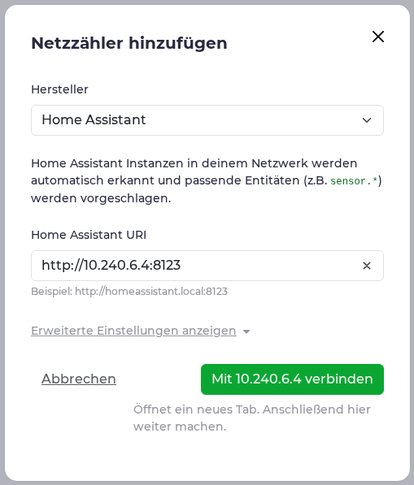
   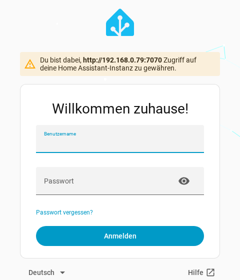

4. Den Dialog erneut öffnen (Schritt 1–2), falls die Felder nicht erscheinen.
   *Leistungsentität*: **SLEMS Netzleistung** (`sensor.slems_grid_power`;
   positiv = Bezug, wie evcc es erwartet).
5. *prüfen* zeigt die aktuelle Leistung; dann *Speichern*.

   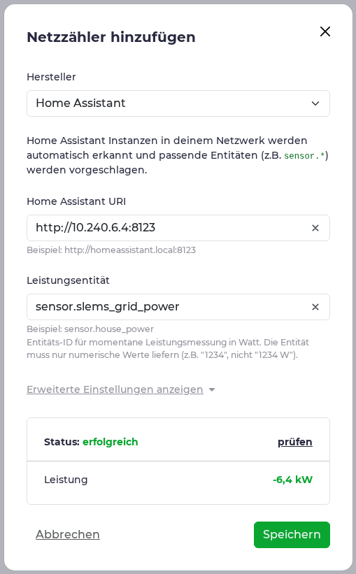

### PV

*PV & Batterie* → *PV oder Speicher hinzufügen* → *PV-Anlage hinzufügen*, Titel
z. B. „PV“, Hersteller **Home Assistant**, *Leistungsentität*: **SLEMS
PV-Leistung** (`sensor.slems_pv_power`). *prüfen*, *Speichern*.

### Hausbatterie

*PV oder Speicher hinzufügen* → *Hausbatterie hinzufügen*:

1. Titel z. B. „Hausbatterie (SLEMS)“, Hersteller **Home Assistant**.
2. *Leistungsentität*: **SLEMS Batterieleistung gesamt (Entladen positiv)**. evcc
   erwartet beim Entladen einen positiven Wert; der Sensor *Batterieleistung
   gesamt* hat das umgekehrte Vorzeichen und passt deshalb nicht. Die
   Entity-ID hängt von der Sprache von Home Assistant ab (z. B.
   `sensor.slems_batterieleistung_gesamt_entladen_positiv`).

   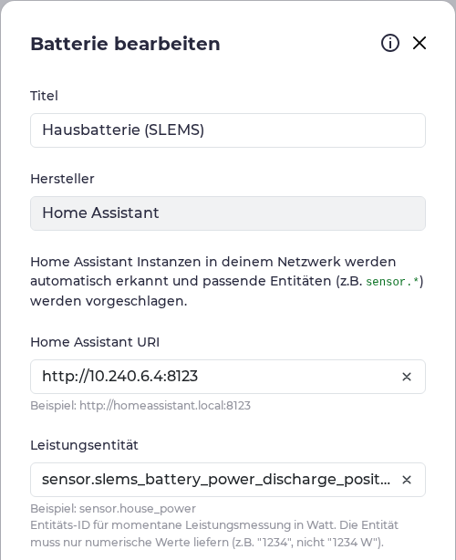

3. *Erweiterte Einstellungen anzeigen* → *Batterieladestand*: **SLEMS
   Ladezustand gesamt** (`sensor.slems_battery_state_of_charge_total`).
4. **Alle Skript-Felder leer lassen** (*Normalbetrieb*, *Halten*, *Netzladung*
   …). Mit ihnen würde evcc die Batterie selbst steuern, und SLEMS und evcc
   würden gegeneinander regeln.

   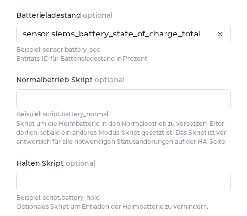

5. *prüfen*, *Speichern*.

   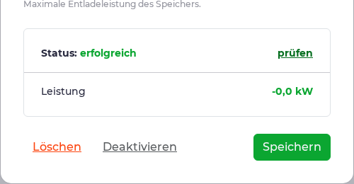

Zum Schluss evcc neu starten (Hinweis oben auf der Seite oder *System* → *Neu
starten*), damit die Zähler aktiv werden.

**Batterie-Einstellungen von evcc:** In Betriebsart A spielen *Vorrang* und
*Puffer* keine Rolle, weil SLEMS über Start und Stopp entscheidet. In
Betriebsart B nutzt evcc sie für seinen Smart-Modus. *Batterie-Boost* und die
Entladesperre nicht verwenden: Sie brauchen die Steuer-Skripte, und die Batterie
steuert SLEMS.

## Schritt 2: ha-evcc in Home Assistant

1. In HACS das Repository **evcc ☀️🚘 Solar Charging** (marq24/ha-evcc)
   installieren und Home Assistant neu starten.
2. *Einstellungen* → *Geräte & Dienste* → *Integration hinzufügen* → **evcc**.
3. *Deine lokale evcc-Server Adresse*: die Adresse von evcc mit Port, z. B.
   `http://192.168.1.20:7070`. WebSocket anlassen. Das Admin-Passwort braucht
   SLEMS nicht.

   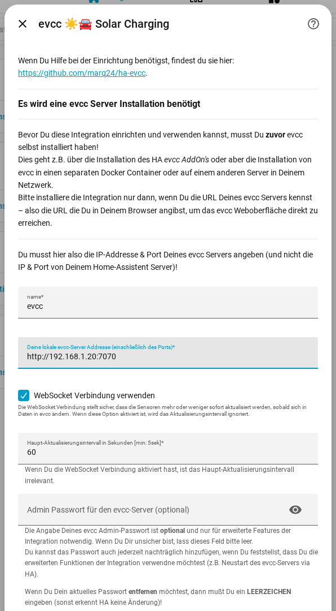

Je Ladepunkt (hier „Garage“) entstehen u. a. *Max. Ladestrom*
(`select.evcc_garage_max_current`), *Modus* (`select.evcc_garage_mode`),
*Phasen in Verwendung* (`sensor.evcc_garage_phases_active`), *Ladeleistung*
(`sensor.evcc_garage_charge_power`) sowie *Netzbezug* bzw. *Ladeenergie*.

## Schritt 3: die Wallbox als Verbraucher in SLEMS

*Einstellungen* → *Geräte & Dienste* → **SLEMS** → *Verbraucher hinzufügen*.

1. **Verbraucher**
   - *Typ*: **Wallbox (Elektroauto)**.
   - *Leistungssensor*: **Ladeleistung** des Ladepunkts.
   - *Energiesensor*: **Netzbezug** des Ladepunkts (Zählerstand der Wallbox);
     hat deine Wallbox keinen eigenen Zähler, **Ladeenergie**.
   - *Im Smart Meter enthalten*: an.
   - *Steuerung*: **Stromvorgabe (A)**.

   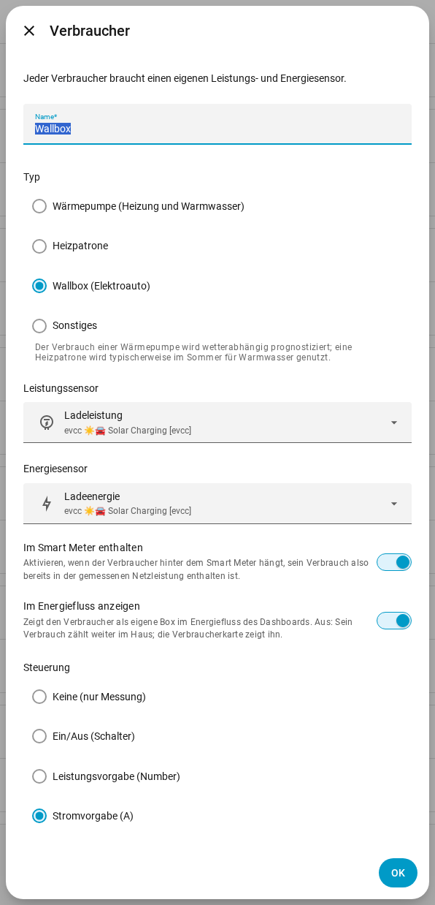

2. **Steuerung**
   - *Steuer-Entity*: **Max. Ladestrom** des Ladepunkts.
   - *Mindeststrom* / *Höchststrom*: wie in evcc (meist 6 / 16 A).
   - *Phasen*: wie die Wallbox angeschlossen ist (meist 3).
   - *Entity der aktiven Phasen*: **Phasen in Verwendung**. Schaltet evcc
     zwischen 1 und 3 Phasen um, folgt SLEMS dem.
   - *Start/Stopp-Entity*: Betriebsart A: **Modus** des Ladepunkts;
     Betriebsart B: leer lassen.
   - *Mindestlaufzeit* / *Mindestpause*: 5 Minuten sind vorgegeben, damit die
     Wallbox bei Wolken nicht ständig startet und stoppt.

   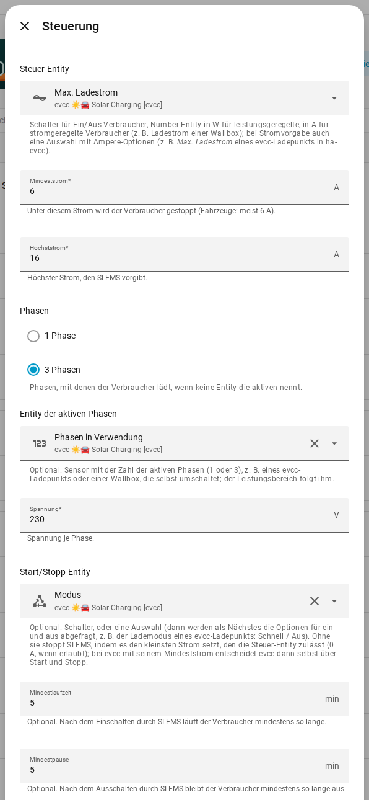

3. **Optionen für Start und Stopp** (nur Betriebsart A): *Option für ein*:
   **now**, *Option für aus*: **off**.

   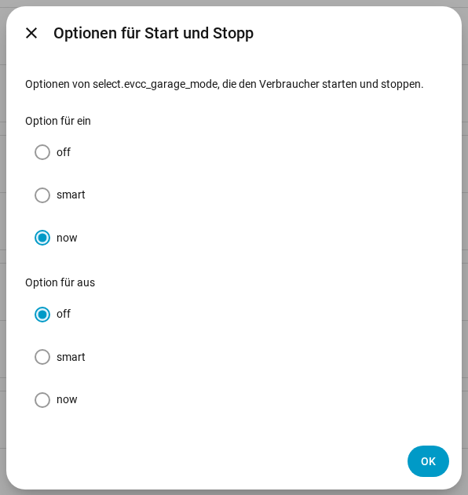

## Schritt 4: prüfen und einstellen

Im SLEMS-Dashboard unter *Verbraucher* zeigt die Karte der Wallbox die gemessene
und die geplante Leistung mit Strom und Phasen, z. B. *10.440 W (15 A, 3
Phasen)*.

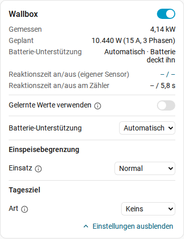

- **Batterie-Unterstützung**: Für eine Wallbox ist *Automatisch* vorgegeben. Die
  Batterien decken das Laden nur mit dem Spielraum, den sie bis zur nächsten
  Ladung aus PV übrig haben; den Rest liefert das Netz. *Nie* lädt das Auto ohne
  Überschuss nur aus dem Netz, *Immer* auch aus den Batterien. Siehe
  [Batterie-Unterstützung](../README.de.md#batterie-unterstützung).
- **Tagesziel** statt Ladeplan in evcc (Betriebsart A): z. B. *Energie* 10 kWh
  bis 07:00 mit Quelle *Netz*. SLEMS lädt zuerst mit Überschuss und rechtzeitig
  aus dem Netz, was noch fehlt.
- **Einspeisebegrenzung**: Mit der Rolle *Unterstützend* nimmt die Wallbox
  Mittagsspitzen auf, wenn ein Auto angesteckt ist.

## Was SLEMS genau tut

- Es plant die Wallbox in Watt (Strom × 230 V × aktive Phasen) und sendet ganze
  Ampere, abgerundet, damit die Ladung im geplanten Rahmen bleibt. Ein Ampere sind
  230 W je Phase; bei 3 Phasen beginnt das Laden erst ab 6 A = 4,1 kW Überschuss,
  bei 1 Phase ab 1,4 kW.
- Unter dem Mindeststrom stoppt es: Betriebsart A setzt den Modus auf `off`,
  Betriebsart B setzt den kleinsten Strom, und evcc entscheidet selbst.
- Ist das Auto voll oder nicht angesteckt, nimmt die Wallbox nichts ab; SLEMS
  erkennt das wie bei anderen Verbrauchern und gibt die Leistung den Batterien.

## Fehlersuche

- **evcc meldet nach der Anmeldung einen Fehler oder fragt erneut nach dem
  Passwort**: evcc im Browser über dieselbe Adresse öffnen, die evcc selbst nutzt
  (IP statt `localhost`), und die Verbindung erneut herstellen.
- **Die Felder für Entities erscheinen nach der Anmeldung nicht**: den Dialog
  schließen und erneut öffnen.
- **Die Batterieleistung in evcc hat das falsche Vorzeichen**: Es muss der Sensor
  *Batterieleistung gesamt (Entladen positiv)* sein.
- **SLEMS startet die Wallbox nicht**: Reicht der Überschuss für den
  Mindeststrom (3 Phasen: 4,1 kW)? Läuft noch die Mindestpause? Steht die
  Batterie-Unterstützung auf *Nie* und es gibt keinen Überschuss?
