# Connecting a wallbox with evcc to SLEMS

[Deutsch](wallbox-evcc.de.md)

This guide connects a wallbox controlled by [evcc](https://evcc.io) to SLEMS.
evcc knows the wallbox and the vehicle; SLEMS decides how much power the car gets
and where it comes from: the PV surplus, the batteries (only as far as they can
spare it) or the grid.

## What does the connection bring?

evcc on its own charges the car well from the PV surplus, but it does not know
the plans of SLEMS. Together:

- **Battery and car do not work against each other.** Without coordination evcc
  sees the home battery charging as surplus or its discharging as import, and
  two controllers fight over the same watts. With SLEMS there is one controller
  at the grid connection that shares the surplus between batteries, car and
  other consumers.
- **The battery first, then the car if it works out.** From the PV forecast SLEMS
  knows whether the batteries will still be full today. Once that is secured the
  car gets its share; otherwise the batteries go first. evcc alone only works
  with fixed state of charge thresholds.
- **The battery only helps with energy it can spare.** With battery support
  **automatic** the car charges from the battery only as much as is left until
  the next charge from PV, and the house still gets through the night. The grid
  delivers the rest.
- **Daily targets with a forecast.** E.g. "10 kWh by 07:00": SLEMS charges from
  the surplus first and only as late as needed from the grid what is still
  missing.
- **Absorbing midday peaks.** With a feed-in cap the plugged-in car takes the
  peaks before PV is curtailed.
- **Everything in one picture.** The energy flow, day chart and forecasts of
  SLEMS include the wallbox; its charging does not distort the forecast of the
  house consumption.

evcc stays in charge of what it does best: the wallbox itself, the vehicle and
switching between 1 and 3 phases.

> Tested with evcc 0.316 and a demo charger, not yet with a real wallbox. Please
> report your experience in an [issue](https://github.com/gojux/SLEMS/issues).

## How the parts work together

```
Home Assistant / SLEMS ──(grid, PV, batteries; read only)──▶ evcc
SLEMS ──(max. current, mode; through ha-evcc)──▶ evcc ──▶ wallbox
```

- **evcc reads** the grid power, the PV power and the sum of the batteries from
  the SLEMS sensors in Home Assistant, so evcc and SLEMS work with the same
  values. evcc does **not** control the batteries; SLEMS does.
- **SLEMS controls** the loadpoint through the Home Assistant integration
  [ha-evcc](https://github.com/marq24/ha-evcc): its maximum charging current
  (whole amperes, rounded down) and, if wanted, its mode (`now` to charge, `off`
  to stop).

There are two ways to run it:

| | **A: SLEMS controls** | **B: evcc decides, SLEMS caps** |
|---|---|---|
| Start and stop | SLEMS through the evcc mode (`now` / `off`) | evcc itself (e.g. mode **Smart**) |
| Charging current | SLEMS | SLEMS caps the maximum current, evcc controls below it |
| Battery support and forecasts of SLEMS | fully in effect | only as a cap |
| Charging plans and vehicle logic of evcc | do not use (use a daily target in SLEMS) | still usable |

**Which one?**

- **A** if SLEMS should optimise the whole household: batteries, feed-in cap,
  prices and several consumers, the car being one of them. Only one controller
  acts, and SLEMS can plan the charging (daily target, the car as a buffer
  before the feed-in cap) and stop it completely.
- **B** if the car comes first and you want the operation of evcc: modes and
  charging plans in the evcc app, targets by state of charge ("80 % by
  7:00"), "charge fast now" with one button. In exchange two systems act on the
  same meter: evcc decides on start and stop itself, SLEMS only caps. If SLEMS
  assigns nothing, the smallest current remains (e.g. 6 A, 1.4 kW single phase,
  4.1 kW three phase); if evcc charges anyway, e.g. by its charging plan, the
  energy comes from the grid or the home battery. Battery and car may take
  turns on the surplus, as both controllers react to the same grid power.

Targets by state of charge, charging right away and targets from plugging in
are on the [roadmap](../README.md#roadmap) for mode A.

## Prerequisites

- SLEMS with current control (A) and the consumer type **wallbox**.
- evcc 0.316 or later, set up in its web interface, with your wallbox as a
  loadpoint.
- Home Assistant is reachable from evcc, and you open evcc in the browser at the
  same address evcc uses itself (e.g. `http://192.168.1.20:7070`, not
  `localhost`); otherwise the login to Home Assistant fails.
- [HACS](https://hacs.xyz) to install ha-evcc.

## Step 1: evcc reads the values of SLEMS

In evcc through **More** (bottom right) → **Configuration**.

### Grid meter

1. **Grid** → **Add grid meter**.
2. **Manufacturer**: **Home Assistant**. evcc discovers Home Assistant in the
   network; otherwise enter its address.
3. **Prepare connection** → **Connect to …**. A new tab opens the Home Assistant
   login; log in to allow evcc access, then return to evcc.

   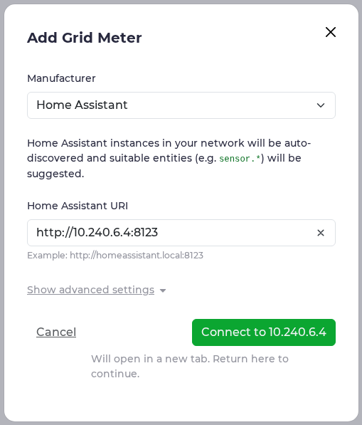
   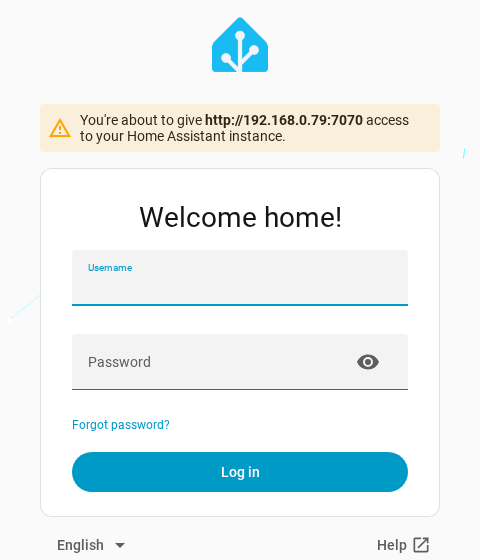

4. If the fields do not appear, open the dialog again (steps 1–2). **Power
   Entity**: **SLEMS Grid power** (`sensor.slems_grid_power`; positive = import,
   as evcc expects).
5. **validate** shows the current power; then **Save**.

   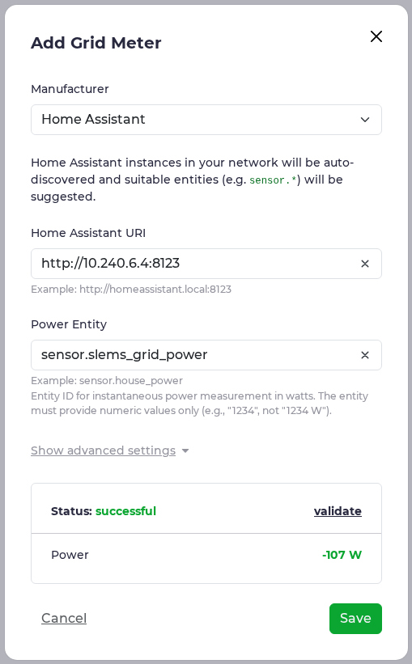

### Solar

**Solar & battery** → **Add solar or battery** → **Add solar meter**, title e.g. "PV",
manufacturer **Home Assistant**, **Power Entity**: **SLEMS PV power**
(`sensor.slems_pv_power`). **validate**, **Save**.

### Home battery

**Add solar or battery** → **Add battery meter**:

1. Title e.g. "Home battery (SLEMS)", manufacturer **Home Assistant**.
2. **Power Entity**: **SLEMS Battery power total (discharge positive)**. evcc
   expects a positive value while discharging; the sensor **Battery power total**
   has the opposite sign and does not fit. The entity ID depends on the language
   of Home Assistant (e.g. `sensor.slems_battery_power_total_discharge_positive`).

   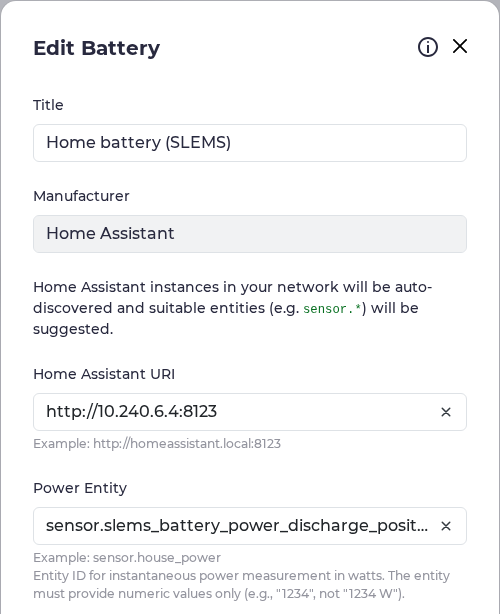

3. **Show advanced settings** → **Battery State of Charge**: **SLEMS Battery state of
   charge total** (`sensor.slems_battery_state_of_charge_total`).
4. **Leave all script fields empty** (**Normal Mode Script**, **Hold Mode Script**,
   grid charge …). With them evcc would control the battery itself, and SLEMS and
   evcc would work against each other.

   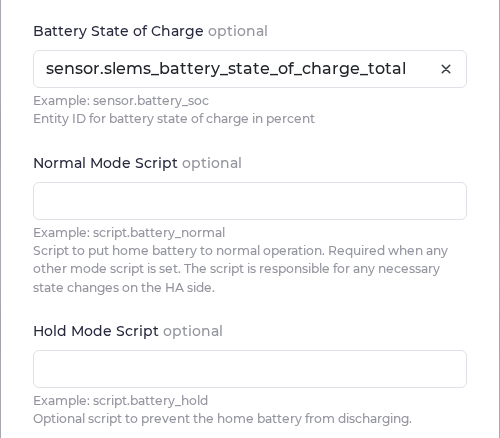

5. **validate**, **Save**.

   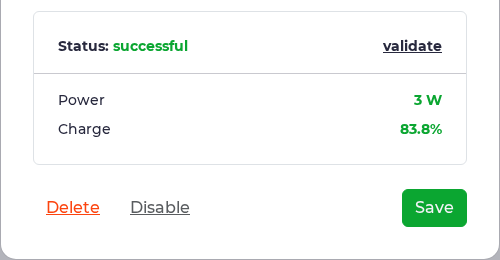

Finally restart evcc (note at the top of the page or **System** → **Restart**) so
the meters become active.

**Battery settings of evcc:** in mode A the priority and buffer settings do not
matter, since SLEMS decides about start and stop. In mode B evcc uses them for
its Smart mode. Do not use **battery boost** or the discharge lock: they need the
control scripts, and the battery is controlled by SLEMS.

## Step 2: ha-evcc in Home Assistant

1. Install the repository **evcc ☀️🚘 Solar Charging** (marq24/ha-evcc) in HACS
   and restart Home Assistant.
2. **Settings** → **Devices & services** → **Add integration** → **evcc**.
3. **Your local evcc-Server URL**: the address of evcc with its port, e.g.
   `http://192.168.1.20:7070`. Keep WebSocket on. SLEMS does not need the admin
   password.

   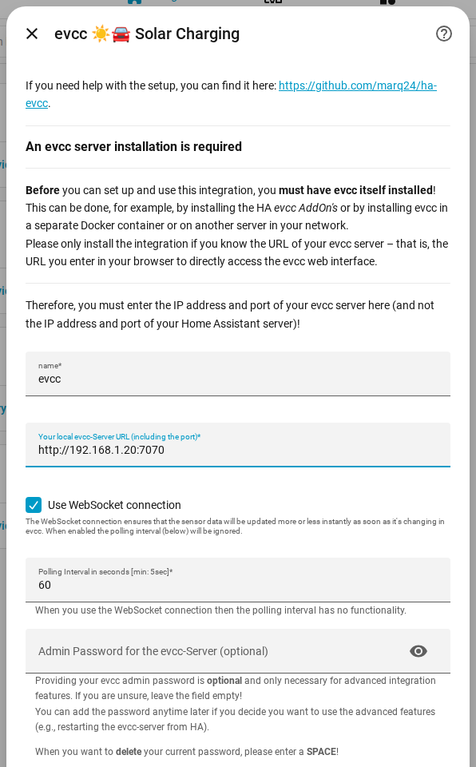

Per loadpoint (here "Garage") it creates among others the maximum charging
current (`select.evcc_garage_max_current`), the mode
(`select.evcc_garage_mode`), the active phases
(`sensor.evcc_garage_phases_active`), the charging power
(`sensor.evcc_garage_charge_power`) and the imported or charged energy.

## Step 3: the wallbox as a consumer in SLEMS

**Settings** → **Devices & services** → **SLEMS** → **Add consumer**.

1. **Consumer**
   - **Type**: **Wallbox (electric vehicle)**.
   - **Power sensor**: the **charging power** of the loadpoint.
   - **Energy sensor**: the **imported energy** of the loadpoint (meter reading of
     the wallbox); without a meter in the wallbox the **charged energy**.
   - **Included in smart meter**: on.
   - **Control**: **Current set point (A)**.

   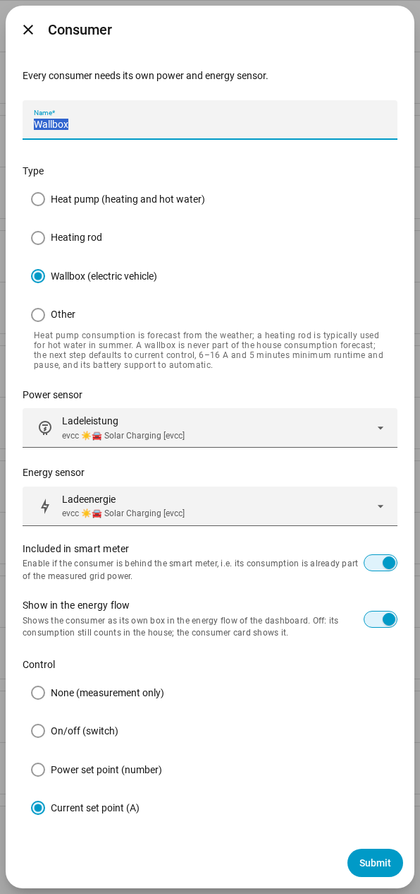

2. **Control**
   - **Control entity**: the **maximum charging current** of the loadpoint.
   - **Minimum current** / **Maximum current**: as in evcc (usually 6 / 16 A).
   - **Phases**: as the wallbox is connected (usually 3).
   - **Active phases entity**: the **active phases** of the loadpoint. If evcc
     switches between 1 and 3 phases, SLEMS follows.
   - **Start/stop entity**: mode A: the **mode** of the loadpoint; mode B: leave
     empty.
   - **Minimum runtime** / **Minimum pause**: 5 minutes are preset, so the wallbox
     does not start and stop with every cloud.

   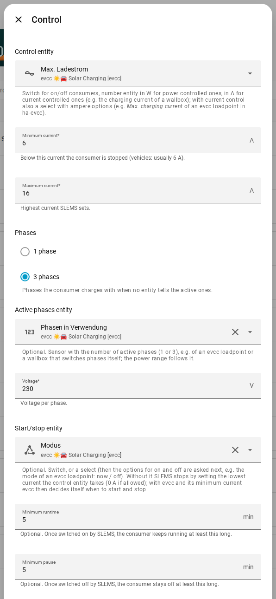

3. **Options for start and stop** (mode A only): **Option for on**: **now**,
   **Option for off**: **off**.

   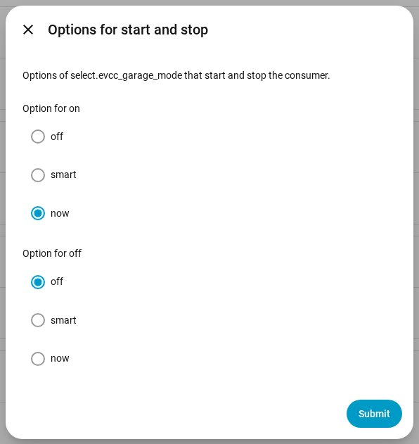

## Step 4: check and fine-tune

In the SLEMS dashboard under **Consumers** the wallbox card shows the measured and
the planned power with current and phases, e.g. **10,440 W (15 A, 3 phases)**.

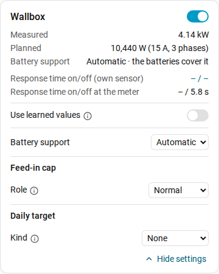

- **Battery support**: **automatic** is preset for a wallbox. The batteries cover
  the charging only with the budget they can spare until the next charge from
  PV; the grid delivers the rest. **Never** charges the car without surplus from
  the grid only, **always** also from the batteries. See
  [battery support](../README.md#battery-support).
- **Daily target** instead of an evcc charging plan (mode A): e.g. **energy**
  10 kWh until 07:00 with the source **grid**. SLEMS charges with surplus first and
  in time from the grid what is still missing.
- **Feed-in cap**: with the role **supporting** the wallbox absorbs midday peaks
  while a car is plugged in.

## What SLEMS does exactly

- It plans the wallbox in watts (current × 230 V × active phases) and sends whole
  amperes, rounded down, so the charging stays within the planned power. One
  ampere is 230 W per phase; with 3 phases charging only starts from 6 A =
  4.1 kW surplus, with 1 phase from 1.4 kW.
- Below the minimum current it stops: mode A sets the mode to `off`, mode B sets
  the lowest current and evcc decides itself.
- If the car is full or not plugged in, the wallbox draws nothing; SLEMS
  recognises this as for other consumers and gives the power to the batteries.

## Troubleshooting

- **evcc shows an error after the login or asks for its password again**: open
  evcc in the browser at the address evcc uses itself (IP instead of
  `localhost`) and connect again.
- **The entity fields do not appear after the login**: close the dialog and open
  it again.
- **The battery power in evcc has the wrong sign**: it must be the sensor
  **Battery power total (discharge positive)**.
- **SLEMS does not start the wallbox**: is the surplus enough for the minimum
  current (3 phases: 4.1 kW)? Is the minimum pause still running? Is the battery
  support **never** while there is no surplus?
